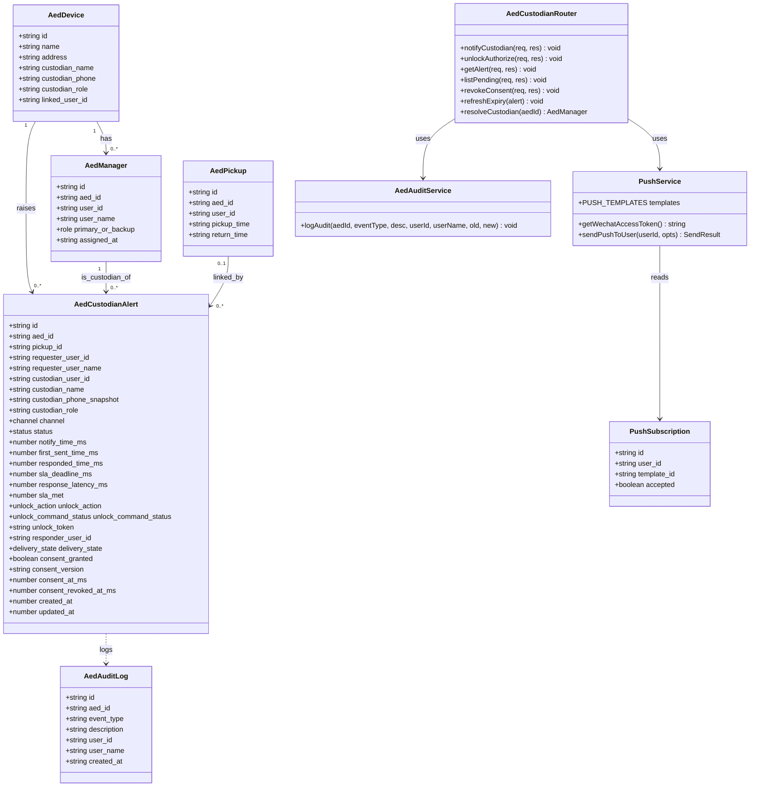
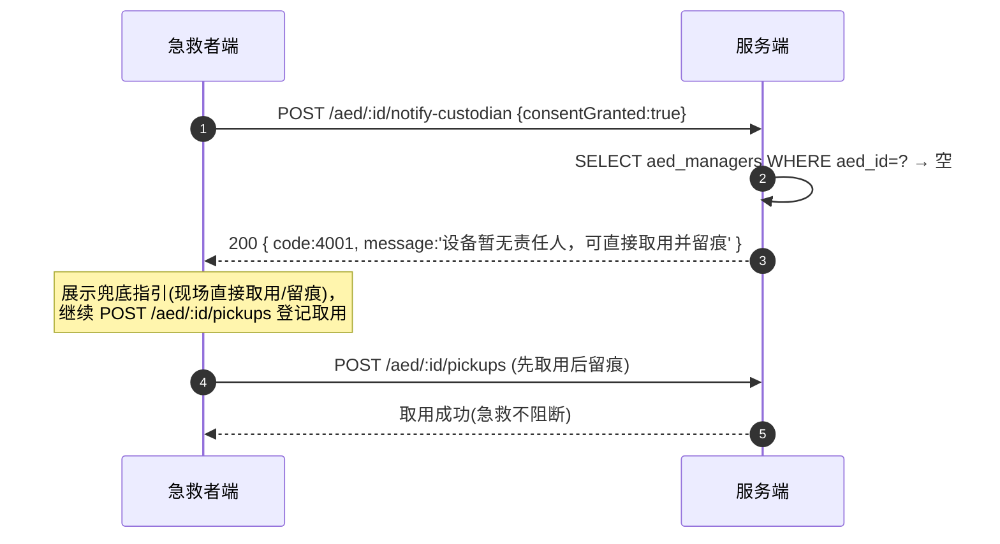
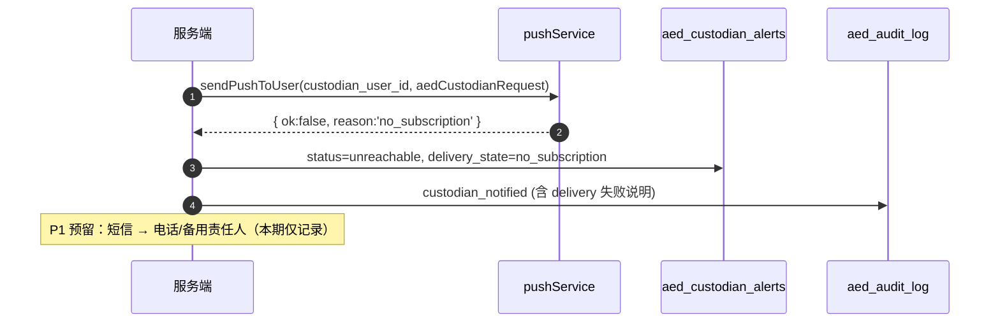
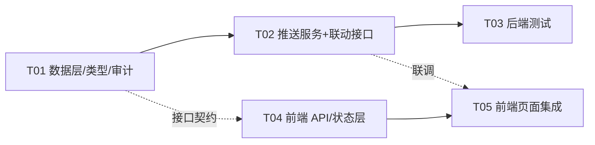

# 系统设计：AED 责任人实时联动 + 「确认授权」（MVP）

> 对应 PRD：`deliverables/software-company/aed-linkage-prd.md`（v1.0）
> 作者：高见远（架构师） | 状态：待主理人确认后交工程师执行
> 语言：中文 | 关键结构用表格 / Mermaid

---

## 0. 设计口径锁定（严格遵循用户/主理人已锁定决策，不再质疑）

| # | 锁定项 | 设计中如何落地 |
|---|---|---|
| 1 | 解锁 MVP 语义 = **责任人远程「确认授权」**，不做物理开锁；接口仍叫 `unlock`，用 `commandStatus` 表达指令生命周期，预留 `unlock_command_status` + `unlock_token` | 见 §3 接口契约、§2 表结构；UI 文案统一为「确认授权」，禁止「已远程开锁」 |
| 2 | KPI `response_latency = responded_time_ms − notify_time_ms`，**服务端 UTC epoch 毫秒**；P95 ≤ 120s；SLA 固定 120s | 新表 `aed_custodian_alerts` 落 `notify_time_ms / responded_time_ms / sla_deadline_ms / response_latency_ms / sla_met` |
| 3 | 授权模型：**仅已绑定 `aed_managers`（primary/backup）** 可确认授权；复用 `authMiddleware`；本期不引入短信/OTP | 见 §3.2 鉴权逻辑；unlock 强校验 `aed_managers.user_id` |
| 4 | 急救兜底：不阻断取用，允许「先取用后留痕」；`NO_CUSTODIAN` 不阻断 | 见 §3.1 错误码 4001；前端展示兜底指引 |
| 5 | PIPL：本期实现同意流程（同意字段 + 前端同意 UI + 撤回机制），只发送最小必要字段 | 见 §5 |
| 6 | 首通道用现有微信订阅消息，但**必须新增按 `user_id` 定向推送**；短信/外呼列 P1 | 见 §4 |

> ⚠️ 文案纪律（写入代码注释与 UI 验收）：**任何界面/接口响应不得出现「已远程开锁 / 开锁成功」**。生态位是「责任人已确认授权，请取用」。

---

## Part A：系统设计

### 1. 实现方案 + 框架选型

**在现有栈内实现，不引入新框架/新依赖。**

| 关注点 | 方案 | 理由 |
|---|---|---|
| 技术难点 ① 定向推送 | 从 `routes/push.ts` 抽取 `getWechatAccessToken()` + 新增 `sendPushToUser(userId, ...)` 到共享服务 `services/pushService.ts` | 现有 `POST /api/push/send` 是「向全部 accepted 订阅群发」，无法按 `user_id` 定向，**不能直接复用**；抽离后广播与定向共用同一套 token/发送逻辑，零重复 |
| 技术难点 ② 责任人身份锚定 | 以 `aed_managers(aed_id, user_id, role)` 为唯一身份锚点；`custodian_*` 仅作**信息快照** | 现状 `custodian_name/phone/role` 是自由文本、无外键；`aed_devices.linked_user_id` 仅读未用。设备↔真实用户的唯一关联就是 `aed_managers` |
| 技术难点 ③ KPI 时间戳口径 | 新表统一用 **UTC epoch 毫秒整数**（`INTEGER`），与既有 `datetime('now')` 文本表**并存不改造** | `datetime('now')` 无时区标注、解析有歧义；新表用 ms 消除歧义 |
| 技术难点 ④ 超时置 `expired` | **读时惰性过期**（lazy expiry）：所有读/写该 alert 的接口先执行 `refreshExpiry(alert)`，超 `sla_deadline_ms` 且未响应 → 置 `expired` + 写审计 | Express + better-sqlite3 无后台调度器；惰性过期无需引入定时器/依赖，测试可控。可选叠加 `setInterval` 兜底（见 T02 备注） |
| 技术难点 ⑤ PIPL 同意 | 在 alert 上落同意字段 + `POST .../revoke-consent` 撤回接口 + 前端同意弹窗 | 最小闭环，不引入同意中心 |
| 架构模式 | 沿用现有 **Router + 服务函数** 分层（Express Router → 服务函数 → `better-sqlite3` 同步查询） | 与 `routes/*.ts` 现有风格一致，无新范式 |

**分层约定**

```
routes/*.ts           HTTP 边界：鉴权、校验、组装响应（success/error）
services/*.ts          可复用能力：pushService（推送）、aedAudit（审计）
types/index.ts         领域类型 + Zod 输入校验 + 常量（错误码）
types/rows.ts          DB 行类型（snake_case）
db.ts                  canonical schema + 迁移数组 + 类型化查询 helper
```

### 2. 数据模型

#### 2.1 与现有表的关系

```
aed_devices (1) ──< aed_managers (N)      ← 设备↔真实用户唯一锚点（primary/backup）
aed_devices (1) ──< aed_custodian_alerts (N) ← 新增：每次「通知责任人」的求助记录
aed_managers.user_id  ──────────────► aed_custodian_alerts.custodian_user_id（责任人身份）
aed_pickups.id        ──(可选)───────► aed_custodian_alerts.pickup_id
users.id              ──────────────► requester_user_id / custodian_user_id / responder_user_id
aed_devices.linked_user_id            ← 本期不改语义，仅作为「设备默认责任人」未来的扩展位
aed_devices.custodian_name/phone/role ← 仅作快照来源（写入 alert.custodian_*_snapshot）
```

- `custodian_user_id` 来自 `aed_managers.user_id`；若设备无 `aed_managers` → 直接返回 `NO_CUSTODIAN`（不落 alert）。
- `custodian_name/phone_snapshot` 在写入时**快照**，避免责任人信息后续变更导致审计失真。
- `aed_devices.linked_user_id` 本期仍不参与判定（保持「仅读」），仅在 §10 列为可选增强。

#### 2.2 新表 DDL（完整）

**表名**：`aed_custodian_alerts`（PRD 建议名，最终采用）

```sql
CREATE TABLE IF NOT EXISTS aed_custodian_alerts (
  id                      TEXT PRIMARY KEY,               -- 'ca_' + Date.now() + '_' + rand(6)
  aed_id                  TEXT NOT NULL,                  -- 设备
  pickup_id               TEXT NOT NULL DEFAULT '',       -- 关联 aed_pickups.id（可空）
  requester_user_id       TEXT NOT NULL DEFAULT '',       -- 急救者 users.id
  requester_user_name     TEXT NOT NULL DEFAULT '',
  requester_user_phone    TEXT NOT NULL DEFAULT '',        -- 急救者电话（当前 users 无 phone 列，通常为空）
  custodian_user_id       TEXT NOT NULL DEFAULT '',       -- 责任人 users.id（来自 aed_managers），无则不会落库
  custodian_name          TEXT NOT NULL DEFAULT '',       -- 快照
  custodian_phone_snapshot TEXT NOT NULL DEFAULT '',      -- 快照
  custodian_role          TEXT NOT NULL DEFAULT '',       -- primary | backup（快照）
  channel                 TEXT NOT NULL DEFAULT 'push',   -- push | sms | phone | multi
  status                  TEXT NOT NULL DEFAULT 'pending',-- pending|sent|acknowledged|rejected|expired|unreachable
  notify_time_ms          INTEGER NOT NULL,               -- ★ KPI 起点（服务端 ms）
  first_sent_time_ms      INTEGER,                        -- 首通道成功发出时刻
  responded_time_ms       INTEGER,                        -- ★ KPI 终点（服务端 ms）
  sla_deadline_ms         INTEGER NOT NULL,               -- = notify_time_ms + 120000
  response_latency_ms     INTEGER,                        -- = responded_time_ms - notify_time_ms
  sla_met                 INTEGER,                        -- 0/1/NULL（NULL=未响应）
  unlock_action           TEXT NOT NULL DEFAULT 'none',   -- none | authorize | deny
  unlock_command_status   TEXT NOT NULL DEFAULT 'not_issued', -- not_issued | issued | acked（未来 dispatched/failed）
  unlock_token            TEXT NOT NULL DEFAULT '',       -- 一次性授权令牌（authorize 时签发）
  responder_user_id       TEXT NOT NULL DEFAULT '',       -- 实际点「确认授权/拒绝」的 manager
  delivery_state          TEXT NOT NULL DEFAULT 'pending',-- pending | delivered | failed | no_subscription
  consent_granted         INTEGER NOT NULL DEFAULT 0,     -- PIPL 同意（1 已同意）
  consent_version         TEXT NOT NULL DEFAULT '',       -- 同意条款版本，如 'v1'
  consent_at_ms           INTEGER,                        -- 同意时刻
  consent_revoked_at_ms   INTEGER,                        -- 撤回时刻
  notes                   TEXT NOT NULL DEFAULT '',
  created_at              INTEGER NOT NULL,               -- ms
  updated_at              INTEGER NOT NULL,               -- ms
  FOREIGN KEY (aed_id) REFERENCES aed_devices(id)
);

CREATE INDEX IF NOT EXISTS idx_custodian_alerts_aed       ON aed_custodian_alerts(aed_id, notify_time_ms DESC);
CREATE INDEX IF NOT EXISTS idx_custodian_alerts_custodian ON aed_custodian_alerts(custodian_user_id, status);
CREATE INDEX IF NOT EXISTS idx_custodian_alerts_status    ON aed_custodian_alerts(status);
CREATE INDEX IF NOT EXISTS idx_custodian_alerts_requester ON aed_custodian_alerts(requester_user_id);
```

**字段与 PRD 的映射**：PRD §3.3 字段全部保留（改名 `notify_time_ms` 等一致），新增 `response_latency_ms / sla_met / delivery_state / responder_user_id / requester_user_phone / consent_*` 以支撑 KPI 统计与 PIPL 闭环。

#### 2.3 迁移方式（沿用现有 `_migrations` 机制）

本仓库**没有独立迁移文件**，迁移写死在 `db.ts`：① canonical schema 块（`CREATE TABLE IF NOT EXISTS ...`）保证新库；② `migrations[]` 数组（`{id, description, sql}`）+ `_migrations` 表保证老库。

**T01 需在 `src/db.ts` 做三处改动：**

1. 在 `initDb()` 的 canonical schema 大 `db.exec(\`...\`)` 内、`aed_certifications` 之后，追加 §2.2 的 `CREATE TABLE`（不含索引也可，索引走迁移）。
2. 在 `migrations[]` 数组**末尾追加**（紧接 `029_add_video_comment_count`）：
   ```ts
   {
     id: '030_add_custodian_alerts',
     description: 'create aed_custodian_alerts table + indexes for custodian linkage',
     sql: `CREATE TABLE IF NOT EXISTS aed_custodian_alerts ( ...§2.2 全量... );
           CREATE INDEX IF NOT EXISTS idx_custodian_alerts_aed ON aed_custodian_alerts(aed_id, notify_time_ms DESC);
           CREATE INDEX IF NOT EXISTS idx_custodian_alerts_custodian ON aed_custodian_alerts(custodian_user_id, status);
           CREATE INDEX IF NOT EXISTS idx_custodian_alerts_status ON aed_custodian_alerts(status);
           CREATE INDEX IF NOT EXISTS idx_custodian_alerts_requester ON aed_custodian_alerts(requester_user_id);`
   }
   ```
   （`better-sqlite3` 的 `db.exec` 支持多语句；老库 `_migrations` 无 `030` → 执行；新库 canonical 已建表 → `IF NOT EXISTS` 幂等。）
3. 更新 `clearAll()` 的 `DELETE FROM ...` 列表，**追加** `DELETE FROM aed_custodian_alerts;`（放在 `aed_audit_log` 之前）。
   `resetSchema()` 会 DROP 全部表，无需改。

> 迁移 id 命名沿用 `NNN_snake_case`（当前最大 029 → 取 **030**）。

#### 2.4 新增行类型（`src/types/rows.ts`）

```ts
export interface AedCustodianAlertRow {
  id: string
  aed_id: string
  pickup_id: string
  requester_user_id: string
  requester_user_name: string
  requester_user_phone: string
  custodian_user_id: string
  custodian_name: string
  custodian_phone_snapshot: string
  custodian_role: string
  channel: 'push' | 'sms' | 'phone' | 'multi'
  status: 'pending' | 'sent' | 'acknowledged' | 'rejected' | 'expired' | 'unreachable'
  notify_time_ms: number
  first_sent_time_ms: number | null
  responded_time_ms: number | null
  sla_deadline_ms: number
  response_latency_ms: number | null
  sla_met: number | null
  unlock_action: 'none' | 'authorize' | 'deny'
  unlock_command_status: 'not_issued' | 'issued' | 'acked'
  unlock_token: string
  responder_user_id: string
  delivery_state: 'pending' | 'delivered' | 'failed' | 'no_subscription'
  consent_granted: number
  consent_version: string
  consent_at_ms: number | null
  consent_revoked_at_ms: number | null
  notes: string
  created_at: number
  updated_at: number
}
```

#### 2.5 新增领域类型 / 校验 / 常量（`src/types/index.ts`）

```ts
// ---- AED 责任人联动 ----
export const CustodianAlertStatus = z.enum([
  'pending','sent','acknowledged','rejected','expired','unreachable',
])
export type CustodianAlertStatus = z.infer<typeof CustodianAlertStatus>

export const UnlockAction = z.enum(['none','authorize','deny'])
export type UnlockAction = z.infer<typeof UnlockAction>

export const UnlockCommandStatus = z.enum(['not_issued','issued','acked'])
export type UnlockCommandStatus = z.infer<typeof UnlockCommandStatus>

/** 对外返回的求助记录（时间戳为 ms，展示层自行转本地时区） */
export const AedCustodianAlert = z.object({
  id: z.string(),
  aedId: z.string(),
  pickupId: z.string(),
  status: CustodianAlertStatus,
  channel: z.string(),
  requesterUserId: z.string(),
  requesterUserName: z.string(),
  custodianUserId: z.string(),
  custodianName: z.string(),
  custodianRole: z.string(),
  notifyTimeMs: z.number(),
  firstSentTimeMs: z.number().nullable(),
  respondedTimeMs: z.number().nullable(),
  slaDeadlineMs: z.number(),
  responseLatencyMs: z.number().nullable(),
  slaMet: z.boolean().nullable(),
  unlockAction: UnlockAction,
  unlockCommandStatus: UnlockCommandStatus,
  deliveryState: z.string(),
  consentGranted: z.boolean(),
  createdAt: z.number(),
  updatedAt: z.number(),
})
export type AedCustodianAlert = z.infer<typeof AedCustodianAlert>

// ---- 请求体校验 ----
export const CustodianNotifyInput = z.object({
  pickupId: z.string().optional(),
  missionId: z.string().optional(),
  notes: z.string().optional(),
  consentGranted: z.boolean(),                 // PIPL：必须显式 true
  consentVersion: z.string().optional(),        // 默认 'v1'
})
export type CustodianNotifyInput = z.infer<typeof CustodianNotifyInput>

export const CustodianActionInput = z.object({
  alertId: z.string().min(1, 'alertId 不能为空'),
  action: z.enum(['authorize', 'deny']),        // PRD 的 confirm=authorize 映射到此
  notes: z.string().optional(),
})
export type CustodianActionInput = z.infer<typeof CustodianActionInput>

export const ConsentRevokeInput = z.object({
  reason: z.string().optional(),
})
export type ConsentRevokeInput = z.infer<typeof ConsentRevokeInput>

// ---- 业务错误码（与 HTTP 200 一并返回，前端据 code 分支） ----
export const AlertCode = {
  NO_CUSTODIAN: 4001,       // 设备无责任人（不阻断急救）
  ALERT_NOT_FOUND: 4002,
  NOT_CUSTODIAN: 4003,      // 调用者非该设备责任人
  ALREADY_RESPONDED: 4004,  // 已响应，且与本次动作不同
  ALERT_EXPIRED: 4005,
  CONSENT_REQUIRED: 4006,   // 未同意 PIPL
  DEVICE_NOT_FOUND: 4007,
  PICKUP_NOT_FOUND: 4008,
} as const
export type AlertCode = (typeof AlertCode)[keyof typeof AlertCode]
```

> **响应约定**：可预期业务分支统一 `res.status(200).json(error(msg, AlertCode.X))`，前端用 `requestFull` 读 `code`。鉴权失败由 `authMiddleware` 返回 HTTP 401；`NOT_CUSTODIAN` 既有鉴权语义也返回 HTTP 403（code=4003）。

#### 2.6 类图（数据结构与接口）

> 完整版另存 `deliverables/software-company/class-diagram.mermaid`。



### 3. 接口契约

> 所有接口挂载在 `/api/aed`（复用现有 `aedRouter`）。响应统一 `{ code, data, message }`。

#### 3.1 `POST /api/aed/:id/notify-custodian` — 通知责任人

| 项 | 值 |
|---|---|
| 鉴权 | `authMiddleware`（登录即可，急救者） |
| 入参 | body 经 `validate(CustodianNotifyInput)`：`{ pickupId?, missionId?, notes?, consentGranted: boolean, consentVersion? }` |
| 成功响应 | `200 { code:0, data:{ alertId, status, channel, custodian:{name,role}, notifyTimeMs, slaDeadlineMs, commandStatus:'not_issued', consentGranted:true, deliveryState }, message }` |
| 业务分支 | 见下表 |

**处理流程**
1. `callerId = auth.userId || auth.openid`。
2. `consentGranted !== true` → `error('需先同意信息共享', 4006)`。
3. 设备不存在 → `res.status(404).json(error('AED 设备不存在', 4007))`。
4. 查责任人：`SELECT * FROM aed_managers WHERE aed_id=? AND role='primary'`；为空则查 `role='backup'`；都空 → **`error('设备暂无责任人，可直接取用并留痕', 4001)`**（HTTP 200，不阻断）。
5. 计算 KPI 起点：
   - `now = Date.now()`；
   - 若传 `pickupId`，取 `aed_pickups.pickup_time`（`datetime('now')` UTC 文本）解析为 ms（`Date.parse(pickup_time.replace(' ','T') + 'Z')`）；
   - `notify_time_ms = pickupId ? Math.min(now, pickupMs) : now`。
6. 插入 `aed_custodian_alerts`（`status='pending'`, `sla_deadline_ms = notify_time_ms + 120000`, `channel='push'`, 快照 custodian 信息, `consent_granted=1`, `consent_at_ms=now`）。
7. 定向推送 `sendPushToUser(custodian_user_id, { templateId: PUSH_TEMPLATES.aedCustodianRequest, page: 'pages/aed/custodian-alert?alertId=..&aedId=..', data })`：
   - 成功 → `status='sent'`, `first_sent_time_ms=now`, `delivery_state='delivered'`；
   - 无订阅 → `status='unreachable'`, `delivery_state='no_subscription'`（P1 短信降级点，本期仅记录）；
   - 发送失败 → `status='unreachable'`, `delivery_state='failed'`。
8. `logAudit(aed_id, 'custodian_notified', ...)`（写 `aed_audit_log`）。
9. 返回 `alertId`（供轮询/订阅）。

#### 3.2 `POST /api/aed/:id/unlock` — 责任人「确认授权」（预留指令位）

| 项 | 值 |
|---|---|
| 鉴权 | `authMiddleware` + **强校验责任人**：`callerId` 必须在 `aed_managers(aed_id, user_id)` 中（primary/backup 均可） |
| 入参 | body 经 `validate(CustodianActionInput)`：`{ alertId, action:'authorize'\|'deny', notes? }` |
| 成功响应 | `200 { code:0, data:{ alertId, status, unlockAction, commandStatus, unlockToken?, respondedTimeMs, responseLatencyMs, slaMet }, message }` |
| 语义 | `authorize` → `status='acknowledged'`, `unlock_action='authorize'`, `unlock_command_status='issued'`, 签发 `unlockToken`；`deny` → `status='rejected'`, `unlock_action='deny'`, `unlock_command_status='not_issued'`。**物理执行由未来 IoT 网关凭 `unlockToken` 承接，本期不伪造执行结果。** |

**处理流程**
1. alert = `SELECT * FROM aed_custodian_alerts WHERE id=? AND aed_id=?`；无 → `404 error('求助记录不存在', 4002)`。
2. 校验责任人：`SELECT 1 FROM aed_managers WHERE aed_id=? AND user_id=?`；无 → `403 error('非该设备责任人', 4003)`。
3. **惰性过期**：若 `status ∈ {pending,sent,unreachable}` 且 `now > sla_deadline_ms` → 置 `expired` 并 `logAudit('custodian_unreachable')`（**不提前返回**，允许事后授权，见 §10 假设）。
4. **幂等**：
   - `responded_time_ms` 非空 且 `unlock_action === action` → `200 { code:0, data:{..., idempotent:true } }`（**不覆盖** `responded_time_ms`，不重复计数）；
   - `responded_time_ms` 非空 且 `unlock_action !== action` → `409 error('该求助已响应', 4004)`。
5. 落响应：`responded_time_ms=now`；`response_latency_ms = now - notify_time_ms`；`sla_met = (response_latency_ms<=120000 && status!=='expired') ? 1 : 0`；`responder_user_id=callerId`；按 action 写 `unlock_action/status/unlock_command_status`；`authorize` 时 `unlock_token = 'ut_' + random(16)`。
6. 审计：`custodian_acknowledged` 或 `custodian_rejected`；`authorize` 额外 `unlock_issued`。
7. 返回；`unlockToken` **仅 authorize 返回**。

#### 3.3 `GET /api/aed/:id/custodian-alerts/:alertId` — 状态回读

| 项 | 值 |
|---|---|
| 鉴权 | `authMiddleware`（急救者或责任人皆可） |
| 成功响应 | `200 { code:0, data: AedCustodianAlert, message }`（**不返回**责任人手机号） |
| 分支 | alert 不存在/不属于该设备 → `404 error(...,4002)` |

处理：先 `refreshExpiry`（惰性置 expired），再返回。字段含 `status + 各时间戳 + slaDeadlineMs`，供急救者端显示「已通知 / 同意取用 / 被拒绝 / 超时」，并用 `slaDeadlineMs` 做倒计时。

#### 3.4 `GET /api/aed/custodian-alerts/pending` — 责任人待处理求助（收件箱）

| 项 | 值 |
|---|---|
| 鉴权 | `authMiddleware` |
| 成功响应 | `200 { code:0, data: AedCustodianAlert[], message }` |
| 查询 | `WHERE custodian_user_id=callerId AND status IN ('pending','sent','unreachable')`，先逐条 `refreshExpiry`，`ORDER BY notify_time_ms DESC` |

用途：推送只是「唤起」，责任人端需要按自身身份拉取待办（push 的 page 参数只带 alertId，作为直连）。

#### 3.5 `POST /api/aed/:id/custodian-alerts/:alertId/revoke-consent` — 撤回同意（PIPL）

| 项 | 值 |
|---|---|
| 鉴权 | `authMiddleware`（仅**急救者本人**或该设备责任人可撤回） |
| 入参 | `validate(ConsentRevokeInput)`：`{ reason? }` |
| 成功响应 | `200 { code:0, data:{ alertId, consentGranted:false, revokedAtMs }, message }` |
| 效果 | 置 `consent_granted=0`, `consent_revoked_at_ms=now`；后续推送/展示携带的个人信息停止；写审计 `custodian_consent_revoked` |

#### 3.6 错误码总表

| HTTP | code | 含义 | 前端动作 |
|---|---|---|---|
| 401 | — | 未登录/登录过期（`authMiddleware`） | 跳登录 |
| 404 | 4007 | 设备不存在 | 返回列表 |
| 404 | 4002 | 求助记录不存在 | 提示已失效 |
| 200 | 4001 | `NO_CUSTODIAN` 设备无责任人 | **兜底指引：直接取用并留痕**，不阻断 |
| 400 | — | 参数校验失败（`validate`）| 提示 |
| 200 | 4006 | 未同意 PIPL | 弹同意框 |
| 403 | 4003 | 非该设备责任人 | 提示无权限 |
| 409 | 4004 | 已响应且动作不同 | 刷新状态 |
| 200 | 4005 | `ALERT_EXPIRED`（信息性） | 展示超时，走兜底 |

### 4. 推送设计（按 `user_id` 定向）

**新增 `src/services/pushService.ts`**（T02）：

```ts
export const PUSH_TEMPLATES = {
  newMission: 'tpl_new_mission',
  taskUpdate: 'tpl_task_update',
  drillReminder: 'tpl_drill_reminder',
  aedMaintenance: 'tpl_aed_maint',
  aedCustodianRequest: 'tpl_aed_custodian_request',  // ★ 新增 AED 责任人求助模板
} as const

export interface SendResult {
  ok: boolean
  reason?: 'no_subscription' | 'send_failed' | 'exception'
  errcode?: number
}

export async function getWechatAccessToken(): Promise<string>   // 从 routes/push.ts 迁出
export async function sendPushToUser(
  userId: string,
  opts: { templateId: string; page?: string; data: Record<string, { value: string }> }
): Promise<SendResult>
```

`sendPushToUser` 逻辑：
1. `SELECT * FROM push_subscriptions WHERE user_id=? AND template_id=? AND accepted=1`；
2. 无记录 → `{ ok:false, reason:'no_subscription' }`；
3. 逐条发送（复用现有 `subscribe/send` 分支）：dev 模式（token 以 `dev_` 开头）→ 记日志直接算成功；否则 `fetch` 微信接口；
4. 收到 `43101/40003` → `UPDATE push_subscriptions SET accepted=0` 并跳过；
5. 全部失败 → `{ ok:false, reason:'send_failed', errcode }`。

**`routes/push.ts` 改造（T02）**：删除私有 `getWechatAccessToken`，改从 `pushService` 导入；`POST /send` 广播行为保持不变，降低回归风险。

**AED 求助推送数据体（最小必要字段，PIPL）**：
```ts
data: {
  thing1: { value: 'AED 求助' },                    // 时间/标题
  thing2: { value: device.name },                   // 设备名
  thing3: { value: requesterName },                 // 急救者姓名（已获同意）
  thing4: { value: locationText },                  // 位置（地址文本）
  // 手机号仅在 consentGranted 时附带；当前 users 无 phone 列 → 暂空
}
```
> 模板字段名以微信后台申请到的 `aedCustodianRequest` 模板为准，T02 中集中在 `pushService.ts` 一处维护。

**降级点（P1 预留，本期仅记录状态）**：
| 触发 | 本期动作 | P1 动作 |
|---|---|---|
| `no_subscription` / `send_failed` | `status='unreachable'`, `delivery_state` 记录原因 | 升级短信（`channel='sms'`），仍无响应 → 通知 `aed_managers.role='backup'` 或电话外呼 |
| 超时 `expired` | 惰性置 `expired` + 审计 `custodian_unreachable` | 触发多通道升级 |

### 5. PIPL 同意流程设计（最小闭环）

**法律面**：把急救者的姓名/位置（未来含电话）共享给责任人用于现场联络，属个人信息处理 → 需取得急救者同意 + 提供撤回。

**字段**（已并入 §2.2）：`consent_granted / consent_version / consent_at_ms / consent_revoked_at_ms`。

**接口**：
- 通知前必须 `consentGranted===true`（否则 `CONSENT_REQUIRED`）。
- 撤回：`POST /api/aed/:id/custodian-alerts/:alertId/revoke-consent`（§3.5）。

**前端 UI**（T05）：
1. 点「通知责任人」→ 先弹**同意弹窗**（`uni.showModal` 或自定义组件），文案示例：
   > 「为帮助现场急救联络，将把你的**姓名**与**位置**共享给该 AED 责任人。你可随时在求助详情中撤回。是否同意？」
2. 同意 → 调 `notify-custodian`（`consentGranted:true, consentVersion:'v1'`）；拒绝 → 中止并提示「已取消，可直接取用 AED」。
3. 求助进行中/结束的卡片提供「撤回信息共享」入口 → 调 revoke 接口，成功后隐藏急救者姓名等信息共享状态。

**最小必要字段**：仅传 `requesterName`（姓名）、`locationText`（位置）、（若存在）`phone`；其余一律不传。

### 6. 时序图（Mermaid）

> 完整版另存 `deliverables/software-company/sequence-diagram.mermaid`。

```mermaid
sequenceDiagram
    autonumber
    participant R as 急救者端(detail.vue)
    participant S as 服务端 /api/aed
    participant DB as aed_custodian_alerts
    participant P as pushService(定向)
    participant C as 责任人端(custodian-alert.vue)
    participant A as aed_audit_log
    participant G as IoT 网关(未来, 虚线)

    Note over R: 点击「通知责任人」→ 先弹 PIPL 同意框
    R->>S: POST /aed/:id/notify-custodian {consentGranted:true}
    Note over S: 校验同意 → 取 aed_managers(primary→backup)<br/>notify_time_ms = min(now, pickup_time)<br/>sla_deadline = notify + 120000
    S->>DB: INSERT alert(status=pending)
    S->>P: sendPushToUser(custodian_user_id, aedCustodianRequest)
    alt 推送成功
        P-->>C: 微信订阅消息(设备/位置/倒计时)
        S->>DB: status=sent, first_sent_time_ms, delivery_state=delivered
    else 责任人无订阅/发送失败
        S->>DB: status=unreachable, delivery_state=no_subscription|failed
    end
    S->>A: custodian_notified
    S-->>R: { alertId, status, slaDeadlineMs }

    loop 每 3s 轮询直到 deadline
        R->>S: GET /aed/:id/custodian-alerts/:alertId
        S->>S: refreshExpiry(alert)
        S-->>R: { status: sent|acknowledged|rejected|expired }
    end

    alt 责任人确认授权
        C->>S: POST /aed/:id/unlock {alertId, action:authorize}
        Note over S: 校验 aed_managers → responded_time_ms=now<br/>latency=responded-notify; sla_met?
        S->>DB: status=acknowledged, command_status=issued, unlock_token=ut_*
        S->>A: custodian_acknowledged + unlock_issued
        S-->>C: { status:acknowledged, commandStatus:issued, unlockToken }
        R->>S: (确认后) POST /aed/:id/pickups 取用登记
        S->>A: pickup
    else 责任人拒绝
        C->>S: POST /aed/:id/unlock {alertId, action:deny}
        S->>DB: status=rejected, command_status=not_issued
        S->>A: custodian_rejected
        S-->>R: status=rejected + 兜底指引
    else 超时未响应(>120s)
        S->>S: refreshExpiry → status=expired
        S->>A: custodian_unreachable
        Note over S,P: P1: 升级 短信/电话/备用责任人
    end

    G-->>S: (未来) 凭 unlock_token 拉取/回执 unlock 指令
```

**异常分支 B：设备无责任人（不阻断急救）**



**异常分支 C：推送不可达 → 降级**



### 7. 前端改造

**7.1 `src/api/index.ts`**：新增 `requestFull`，返回完整 `{code,data,message}`，让页面能按业务码分支。

```ts
export interface FullResponse<T> { code: number; data?: T; message: string }
export async function requestFull<T>(options: RequestOptions): Promise<FullResponse<T>>
// 逻辑与 request 相同，但返回整个 body（含 code），不抛业务异常
```

**7.2 `src/api/aed-custodian.ts`（新建）**：封装新接口

```ts
export interface CustodianAlert { /* 与后端 AedCustodianAlert 对齐（camelCase, ms 时间戳） */ }
export interface NotifyResult { alertId:string; status:string; channel:string;
  custodian:{name:string;role:string}; notifyTimeMs:number; slaDeadlineMs:number;
  commandStatus:string; consentGranted:boolean; deliveryState:string }
export interface ActionResult { alertId:string; status:string; unlockAction:string;
  commandStatus:string; unlockToken?:string; respondedTimeMs:number;
  responseLatencyMs:number; slaMet:boolean; idempotent?:boolean }

export function notifyCustodian(aedId:string, body:{pickupId?:string;missionId?:string;notes?:string;consentGranted:boolean;consentVersion?:string}): Promise<FullResponse<NotifyResult>>
export function confirmAuthorization(aedId:string, body:{alertId:string;action:'authorize'|'deny';notes?:string}): Promise<FullResponse<ActionResult>>
export function fetchCustodianAlert(aedId:string, alertId:string): Promise<CustodianAlert>
export function fetchPendingAlerts(): Promise<CustodianAlert[]>
export function revokeConsent(aedId:string, alertId:string, reason?:string): Promise<void>
```

**7.3 `src/api/aed.ts`**：`detail.vue` 改用 `fetchAedById`（真实接口）；保留 Mock 仅作 **离线兜底**（请求失败时回退），并新增 `mapApiDeviceToView(raw)` 把后端字段映射到现有视图模型（后端无 `photo/discovered/verified/avatar` → 用占位/本地 store 补齐）。

**7.4 `src/api/push.ts`**：`PUSH_TEMPLATES` 增加 `aedCustodianRequest: 'tpl_aed_custodian_request'`。

**7.5 `src/pages/aed/detail.vue`**（急救者侧）：
- 数据源：`onMounted` 改 `await fetchAedById(id)`，失败回退 Mock。
- 「通知」按钮（当前 `notifyOwner` → 演习 modal）改为：
  1. 弹 PIPL 同意框；
  2. `requestFull(notifyCustodian(...))`，按 `code` 分支：
     - `0` → 进入等待态，`setInterval` 每 3s 调 `fetchCustodianAlert` 直到 `deadline`；
     - `4001` → 兜底引导「直接取用并留痕」（并可直接调 `POST /aed/:id/pickups`）；
     - `4006` → 重新弹同意框。
  3. 等待卡片：倒计时（`slaDeadlineMs - Date.now()`）、状态文案（**已通知 / 责任人已确认授权，请取用 / 已被拒绝 / 超时**）、`acknowledged` 后显示「确认取用」按钮；`rejected/expired` 显示兜底指引；提供「撤回信息共享」。
  - `onUnmounted` 清理 `setInterval`。
- **禁止**任何「已远程开锁」文案。

**7.6 `src/pages/aed/custodian-alert.vue`（新建，责任人侧）**：
- 入口：推送 `page` 跳转 `/pages/aed/custodian-alert?alertId=..&aedId=..`，或「我的待处理求助」入口拉 `fetchPendingAlerts`。
- 展示：求助方姓名、设备名/地址、倒计时；按钮「**确认授权**」/「拒绝」→ `confirmAuthorization`；成功后展示 `commandStatus`（`issued`），文案「已确认授权，请对方取用 AED」。**不出现物理开锁措辞**。
- 若当前用户非责任人，接口 403 → 提示无权限。

**7.7 `src/pages.json`**：新增页面
```json
{ "path": "pages/aed/custodian-alert", "style": { "navigationStyle": "custom", "navigationBarTitleText": "" } }
```

**7.8 `src/stores/`**：新增 `custodian-alert.ts` 收敛急救者会话状态（当前 alertId/status/deadline/轮询句柄）与责任人收件箱加载，避免页面堆逻辑。

### 8. 依赖包列表

**无新增依赖。**

```
# 后端：express / better-sqlite3 / zod / jsonwebtoken 均为现有依赖
# 前端：uni-app / pinia 均为现有依赖
# 说明：短信/外呼（P1）届时再评估供应商，本期不引入
```

### 9. 共享知识 / 跨文件约定（工程师必读）

| 约定 | 内容 |
|---|---|
| 响应格式 | 一律 `{ code, data, message }`；成功 `code=0`；`success()/error()`（`types/index.ts`）复用 |
| 时间戳 | **新表所有时间字段用 UTC epoch 毫秒 `INTEGER`**（`notify_time_ms/responded_time_ms/...`）；展示层转本地时区。既有 `datetime('now')` 文本表**不改造** |
| 字段命名 | DB 行 snake_case（`types/rows.ts`）；接口/领域对象 camelCase（`types/index.ts` + 前端） |
| 审计写法 | 统一经 `services/aedAudit.ts#logAudit(aedId,eventType,description,userId,userName,oldValue?,newValue?)`（由 `routes/aed.ts` 内联函数抽出，行为不变）；事件类型：`custodian_notified / custodian_acknowledged / custodian_rejected / custodian_unreachable / unlock_issued / custodian_consent_revoked` |
| ID 前缀 | alert=`ca_`、unlock token=`ut_`、audit=`al_`（沿用 `Date.now()+rand` 防撞模式） |
| 迁移 | 追加到 `db.ts` `migrations[]`，id 从 `030` 起；同时写入 canonical schema 块；`clearAll()` 补 DELETE |
| 鉴权 | 责任人身份只认 `aed_managers(aed_id, user_id)`；`caller = auth.userId || auth.openid` |
| 错误码 | 一律用 `AlertCode` 常量，禁止散落 magic number |
| 推送 | 定向发送只经 `pushService.sendPushToUser`；模板 id 集中在 `pushService.PUSH_TEMPLATES` |
| 文案纪律 | UI/响应禁止「已远程开锁」；统一「确认授权」；授权成功文案 = 「责任人已确认授权，请取用 AED」 |
| 惰性过期 | 任何读写 alert 前先 `refreshExpiry`；SLA 固定 120000ms |
| 测试 | vitest；`__tests__/setup.ts` 提供 `app/seedTestData/db`，`resetSchema()` 每用例重建；登录用 `POST /api/auth/wechat-login {code}` 拿 token |

### 10. 待明确事项（需回退 PM / 用户拍板）

| # | 问题 | 本设计采用的默认 | 影响 |
|---|---|---|---|
| Q1 | 责任人响应阈值是否固定 120s？ | 固定 120000ms（本期） | `sla_deadline_ms` 计算；差异化 SLA 需改配置 |
| Q2 | 超时后**迟到**的「确认授权」是否仍受理？ | **受理**（置 acknowledged，`sla_met=0`），急救安全优先 | 与 PRD「超时置 expired」字面略有出入，需 PM 确认 |
| Q3 | 急救者电话 | 当前 `users` 表**无 phone 列**，`requester_user_phone` 暂为空；仅传姓名+位置 | 若要传电话需先给 `users` 加列（另立任务） |
| Q4 | 责任人可能存在「自由文本 custodian_*」（无 `aed_managers`） | 视为 `NO_CUSTODIAN`，不落 alert | 若需兼容文本责任人，需短信通道（P1） |
| Q5 | 多责任人（primary+backup）同时通知？ | 本期**只通知 primary**；backup 仅在 P1 升级时通知 | 影响 `custodian_user_id` 唯一性 |
| Q6 | 同意是否需**持久化用户级**偏好（免重复弹窗）？ | 本期**按次同意**（存 alert 上） | 体验略繁琐，可作 P1 优化 |
| Q7 | 微信模板 `aedCustodianRequest` 需在小程序后台申请 | 先用占位 id `tpl_aed_custodian_request`，承接后替换 | 真机推送依赖此模板 |

---

## Part B：任务分解

> 硬约束：**≤5 个任务**；每任务 **≥3 个相关文件**；按依赖排序；T01 为基础设施/数据层。

#### 任务列表

| Task ID | 任务名 | 源文件（新建/修改） | 依赖 | 优先级 |
|---|---|---|---|---|
| **T01** | **后端数据层与共享基础**（schema + 迁移 + 类型 + 审计 helper） | `急救侠-server/src/db.ts`（改：canonical 加表、`migrations` 加 `030_add_custodian_alerts`、`clearAll` 补删）<br/>`急救侠-server/src/types/rows.ts`（加 `AedCustodianAlertRow`）<br/>`急救侠-server/src/types/index.ts`（加领域类型/`CustodianNotifyInput`/`CustodianActionInput`/`ConsentRevokeInput`/`AlertCode`）<br/>`急救侠-server/src/services/aedAudit.ts`（**新建**：抽出 `logAudit`，改由 `routes/aed.ts` 导入） | 无 | P0 |
| **T02** | **后端定向推送服务 + 联动接口** | `急救侠-server/src/services/pushService.ts`（**新建**：`getWechatAccessToken` / `sendPushToUser` / `PUSH_TEMPLATES.aedCustodianRequest`）<br/>`急救侠-server/src/routes/push.ts`（改：删私有 token 逻辑，改用服务）<br/>`急救侠-server/src/routes/aed.ts`（改：追加 §3.1–3.5 五个接口 + 复用 `aedAudit.logAudit`）<br/>`急救侠-server/src/app.ts`（确认 `/api/aed` 挂载即可，无需新增；如需兜底清理可加过期 sweep 启动钩子） | T01 | P0 |
| **T03** | **后端测试（联动闭环回归）** | `急救侠-server/src/__tests__/aed-custodian.test.ts`（**新建**：通知/无责任人/授权/拒绝/幂等/非责任人/超时/回读/撤回同意/推送降级）<br/>`急救侠-server/src/__tests__/setup.ts`（改：为 `seedTestData` 补 `aed_managers`/责任人用户，或新增 seed helper）<br/>`急救侠-server/src/__tests__/push.test.ts`（改：补 `sendPushToUser` 定向用例） | T02 | P0 |
| **T04** | **前端 API 与状态层** | `急救侠-uniapp/src/api/index.ts`（加 `requestFull`）<br/>`急救侠-uniapp/src/api/aed-custodian.ts`（**新建**：5 个接口封装 + 类型）<br/>`急救侠-uniapp/src/api/aed.ts`（去 Mock 主路径 + `mapApiDeviceToView` + 保留离线兜底）<br/>`急救侠-uniapp/src/api/push.ts`（加 `aedCustodianRequest` 模板）<br/>`急救侠-uniapp/src/stores/custodian-alert.ts`（**新建**：会话态 + 收件箱） | 无（接口契约以 §3 为准，可与 T02 并行；联调需 T02） | P0 |
| **T05** | **前端页面集成（急救者 + 责任人）** | `急救侠-uniapp/src/pages/aed/detail.vue`（改：真实取数 + 同意 UI + 通知 + 状态轮询 + 兜底指引 + 撤回入口）<br/>`急救侠-uniapp/src/pages/aed/custodian-alert.vue`（**新建**：责任人「确认授权/拒绝」页）<br/>`急救侠-uniapp/src/pages.json`（注册新页面） | T04 | P0 |

#### 任务依赖图



- **T01 是唯一的公共前置**（schema + 类型 + 审计 helper），其余任务仅依赖 T01 或其直接上游，避免长线性链。
- T04 不依赖 T02 的代码，只依赖 §3 契约，可与 T02 并行开发；T05 联调需要 T02 就绪。

#### 每任务验收要点（供 Engineer 自检）

**T01**
- [ ] `initDb()` 后新库存在 `aed_custodian_alerts` 及 4 个索引；老库执行 `030` 迁移成功且 `_migrations` 有记录。
- [ ] `resetSchema()` 后表仍存在（DROP + 重建）。
- [ ] `clearAll()` 不因新表 FK 报错。
- [ ] `logAudit` 抽离后 `routes/aed.ts` 原有审计行为不变（原 5 处调用仍写 `aed_audit_log`）。

**T02**
- [ ] `sendPushToUser` 无订阅返回 `reason:'no_subscription'`；dev 模式可发送；`43101/40003` 置 `accepted=0`。
- [ ] 5 个接口：契约与 §3 完全一致；`NO_CUSTODIAN` 返回 200/code=4001 且**不落 alert**；unlock 幂等不覆盖 `responded_time_ms`；非责任人 403/4003；超时惰性置 `expired`；`authorize` 返回 `unlockToken` 且 `commandStatus=issued`；写法**不含**「开锁」文案。
- [ ] 每个状态跃迁写 `aed_audit_log`。

**T03**
- [ ] `vitest run` 全绿且无 flaky（沿用 `setup.ts` 隔离）。
- [ ] 覆盖 §3 全部错误码分支 + 推送降级。

**T04**
- [ ] `requestFull` 正确返回 `code`；`aed-custodian.ts` 类型与后端字段一一对应；`detail.vue` 主路径调用 `fetchAedById`；`PUSH_TEMPLATES` 含新模板。

**T05**
- [ ] 急救者：同意→通知→倒计时→状态回读→（授权后可取用 / 拒绝/超时见兜底）全链路可用。
- [ ] 责任人：收到 push 后进入 `custodian-alert` 页可「确认授权/拒绝」，状态回写。
- [ ] 全局无「已远程开锁」文案；`pages.json` 已注册新页。

---

*本文档仅为设计，未改动任何源码。完成后回报主理人：文档路径 + 任务摘要 + 待 PM 澄清项（§10 Q2/Q3/Q5 最需拍板）。*
