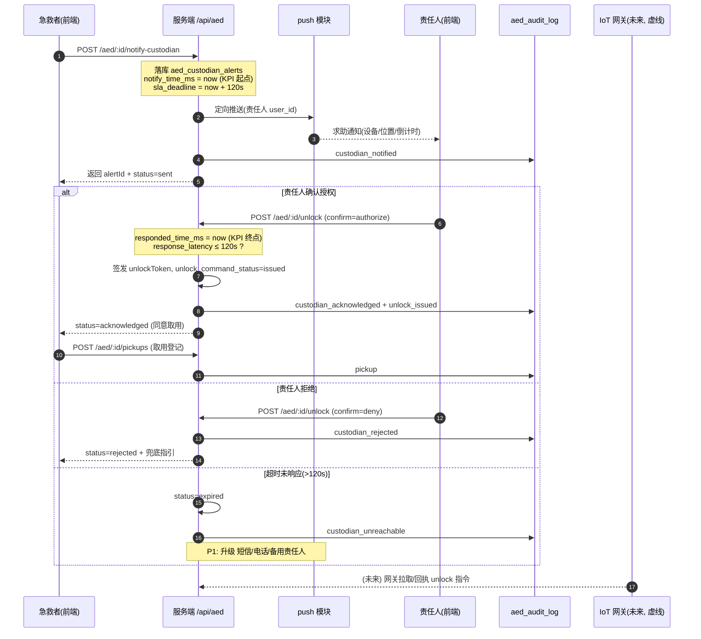

# PRD：AED 责任人实时联动 + 远程解锁闭环

> 路线图对应：`NEXT_STEPS.md` **P2 第 7 条**（《项目建议书》Section 07 核心差异化创新）
> 版本：v1.0（MVP） | 作者：许清楚（产品经理） | 状态：待架构师/主理人确认
> 语言：中文

---

## 1. 项目信息

| 项 | 内容 |
|---|---|
| Project Name | `aed_custodian_linkage` |
| Language | 中文 |
| 技术栈（现状，不改） | 后端 Express + better-sqlite3 + TypeScript；前端 uni-app（H5 / 小程序 / App） |
| 需求复述 | 补齐服务端「**通知 AED 责任人 → 责任人一键远程解锁/授权**」的实时链路，并记录响应时间戳以支撑「**2 分钟内响应确认**」KPI，全链路审计留痕。 |

### 1.1 现状调研结论（基于真实代码，非假设）

**已具备**

- `aed_devices` 含 `custodian_name / custodian_phone / custodian_role`（迁移 `016/017/018`）、`linked_user_id`（迁移 `022`，**当前仅读取、未使用**）。
- `aed_pickups` 表：`id / aed_id / user_id / user_name / pickup_time(default now) / return_time / mission_id / notes`；取用 → `PUT /api/aed/:id/pickups/:pickupId` 归还；取还均写 `aed_audit_log`。
- `aed_audit_log`：`event_type / description / user_id / user_name / old_value / new_value / created_at`，由 `logAudit()` 统一写入（`routes/aed.ts:12`）。
- `aed_managers` 表（`role: primary|backup`，含 `user_id`/`user_name`）——**唯一的设备↔真实用户关联**，是「责任人身份」的天然锚点。
- `push` 模块：`POST /api/push/register`（`authMiddleware`，写 `push_subscriptions(user_id, template_id, accepted)`）；`POST /api/push/send`（`authMiddleware` + `is_leader`，向**全部** accepted 订阅发微信订阅消息，无凭据时走 dev mock）。限流：send 为 15 分钟 5 次。

**确认缺失 / 局限（决定 MVP 边界）**

1. `routes/aed.ts` **无** `notify-custodian`、**无** `unlock` 接口 —— 本次要新建。
2. 推送能力是「**广播式微信订阅消息**」：**无按用户定向发送的封装**、**无短信通道**、**无电话外呼**、`PUSH_TEMPLATES` 里**无 AED 责任人模板**。
3. **无 IoT 硬件、无电子锁、无网关对接**——「远程解锁」当前无物理执行主体。
4. 前端 `pages/aed/detail.vue` 的 `notifyOwner` → `stores/aed.ts#notifyCustodian()` 目前**只弹一个 `uni.showModal` 演习提示**（甚至不是拨号）；且该页用的是 `api/aed.ts` 的 **Mock 数据**（`getAedById`），未接后端 `fetchAedById`。
5. 无「通知/响应」相关表；`custodian_*` 是**自由文本**，未与 `users` 建立外键关联。

> 结论：本功能的 MVP **只能是「软件语义的授权闭环」**，物理开锁必须显式排除（见 §5 决策点）。

---

## 2. 产品定义

### 2.1 产品目标

1. **把「找到 AED 但拿不出来」变成「2 分钟内有人授权你取用」**：建立急救者 → 服务端 → 责任人的实时通知与确认授权链路。
2. **让响应过程可度量、可追溯**：每一次通知与响应都有时间戳与审计事件，形成可上报政府/机构的 SLA 数据。
3. **为未来 IoT 预留而不预支**：定义清晰的「解锁指令 + 事件」语义，使接入智能 AED 柜时无需返工数据模型与接口。

### 2.2 用户故事

| # | 角色 | 故事 |
|---|---|---|
| US-1 | 急救者（现场群众/志愿者） | 作为急救者，我到达 AED 点但柜体打不开时，希望能**一键通知责任人**，并在等待时**看到「已通知 / 对方已确认」的实时状态**，这样我不会盲目砸柜或放弃。 |
| US-2 | AED 责任人 | 作为责任人，我希望能收到**明确的求助通知**（含设备与位置、谁在求助），并**一键「确认授权」或「拒绝」**，这样我在非现场也能快速放行且事后有据。 |
| US-3 | AED 责任人（未响应场景） | 作为责任人，如果我 2 分钟没响应，系统应**自动升级为多通道提醒**（短信/电话/备用责任人），避免单点失效。 |
| US-4 | 后台 / 审计方（机构管理员、政府监管） | 作为管理者，我希望能查看每台设备的**通知-响应明细与超时率**，用于考核责任落实与对外报告。 |

---

## 3. KPI（必须可测量）

### 3.1 主指标

> **责任人响应确认时长 P95 ≤ 120 秒**

### 3.2 口径定义（**唯一权威口径，禁止各处重定义**）

```
响应时长(response_latency_seconds) = responded_time − notify_time
达标 = response_latency_seconds ≤ 120 且 status ∈ {acknowledged, rejected}
```

- **起点 `notify_time`**：服务端**收到** `POST /api/aed/:id/notify-custodian` 并成功落库的**服务器时间**。
  若同一求助先有取用登记（`aed_pickups.pickup_time`），则取 `min(pickup_time, notify_time)` 为起点（更有利于还原"急救者开始等待"的真实时刻）。
- **终点 `responded_time`**：责任人在其客户端完成「**确认授权 / 拒绝**」操作、服务端**落库**的时间。
- **统计维度**：按设备、按责任人、按小时/日聚合；同时统计
  - **无响应率** = `status = expired`（超时未响应）占比；
  - **多通道升级率** = 触发 ≥2 通道的求助占比。
- **口径纪律**：`notify_time` / `responded_time` 一律取**服务端时间**（不信任客户端时间）；时区统一为 **UTC epoch 毫秒**存储、展示层再转本地时区（现有 `datetime('now')` 为无时区的 UTC 字符串，存在歧义，建议新表用 ms 整数）。

### 3.3 落库字段（支撑 KPI，供架构师设计表）

新增表 **`aed_custodian_alerts`**（建议名）：

| 字段 | 类型 | 说明 |
|---|---|---|
| `id` | TEXT PK | `ca_` + `Date.now()` + 随机后缀（复用 `push.ts:44` 防撞模式） |
| `aed_id` | TEXT | 设备 |
| `pickup_id` | TEXT NULL | 关联 `aed_pickups.id`（若本次求助同时登记取用） |
| `requester_user_id` / `requester_user_name` | TEXT | 急救者 |
| `custodian_user_id` | TEXT NULL | 责任人的 `users.id`（来自 `aed_managers`）；未关联时为 NULL |
| `custodian_name` / `custodian_phone_snapshot` | TEXT | 快照，防止责任人信息后续变更导致审计失真 |
| `channel` | TEXT | `push` / `sms` / `phone` / `multi`（实际触达通道） |
| `status` | TEXT | `pending` → `sent` → `acknowledged` / `rejected` / `expired` / `unreachable` |
| `notify_time_ms` | INTEGER | **KPI 起点** |
| `first_sent_time_ms` | INTEGER NULL | 首个通道成功发出时刻 |
| `responded_time_ms` | INTEGER NULL | **KPI 终点** |
| `sla_deadline_ms` | INTEGER | = `notify_time_ms + 120000` |
| `unlock_action` | TEXT | `none` / `authorize` / `deny`（责任人动作） |
| `unlock_command_status` | TEXT | 见 §5：`not_issued` / `issued` / `acked`（未来 IoT 用 `dispatched`/`failed`） |
| `unlock_token` | TEXT NULL | 一次性解锁/授权令牌（防重放） |
| `notes` | TEXT | 备注 |
| `created_at` / `updated_at` | INTEGER | ms |

**审计复用**：以上关键动作同时写 `aed_audit_log`（`event_type`：`custodian_notified` / `custodian_acknowledged` / `custodian_rejected` / `custodian_unreachable` / `unlock_issued`），保证「全链路留痕」有统一出口。

---

## 4. 需求池（P0 / P1 / P2）

### P0（Must have —— 本次 MVP 必做）

| ID | 需求 | 验收要点 |
|---|---|---|
| P0-1 | **通知责任人接口** `POST /api/aed/:id/notify-custodian` | 落库一条 `aed_custodian_alerts`（`notify_time_ms` 必填）；同步写审计；**返回 `alertId` 供后续轮询/订阅状态**；无责任人时返回明确错误码（见 P0-5）。 |
| P0-2 | **责任人远程「确认授权」接口** `POST /api/aed/:id/unlock`（语义见 §5） | 仅**被指派的责任人**可调用；落 `responded_time_ms` + `unlock_action`；幂等（同一 alert 重复点击不重复计数）；写审计。 |
| P0-3 | **推送通知责任人**（首通道 = App 推送） | 复用 `push_subscriptions`；**必须新增按 user_id 定向发送的封装**（现有 `Send` 是广播，不能直接复用）；责任人未关注订阅时降级（P1-1）。 |
| P0-4 | **响应状态回读** `GET /api/aed/:id/custodian-alerts/:alertId`（或并入 `lifecycle`） | 返回 `status` 与各时间戳，供急救者端显示「已通知 / 已确认」。 |
| P0-5 | **异常分支（P0 必做最小集）** | ①责任人未响应→超时置 `expired`；②拒绝→`rejected` 并提示急救者走兜底指引（如现场其他 AED / 破柜流程）；③**设备无责任人**→接口返回可识别错误码（如 `NO_CUSTODIAN`），前端提示「直接取用并留痕」，不阻断急救；④责任人离线→推送失败即转 P1 降级并记 `unreachable`。 |
| P0-6 | **全链路审计** | 上述每个状态跃迁都进 `aed_audit_log`，字段含操作人、新旧值。 |
| P0-7 | **权限与鉴权** | 通知接口须登录（`authMiddleware`）或至少携带可追溯身份；解锁接口须**强校验责任人身份**（见 §6 待确认 Q1/Q2）。 |

### P1（Should have —— 紧随其后）

| ID | 需求 |
|---|---|
| P1-1 | **多通道降级**：推送未触达（`push_subscriptions` 无记录 / `accepted=0`）→ 自动升级短信；仍无响应 → 2 分钟内触发电话外呼或通知 **备用责任人（`aed_managers.role='backup'`）**。 |
| P1-2 | **责任人订阅引导**：在责任人管理页引导开启 AED 求助模板订阅（新增 `PUSH_TEMPLATES.aedCustodianRequest`），提高首通道命中率。 |
| P1-3 | **急救者端实时状态**：详情页把 Mock `notifyCustodian` 换成真实接口调用 + 状态轮询/订阅，显示倒计时与责任人反馈。 |
| P1-4 | **监管看板指标**：把 §3 的响应时长/超时率接入 `admin` / 机构视图。 |

### P2（Nice to have）

| ID | 需求 |
|---|---|
| P2-1 | 智能 AED 柜「开柜指令」下发（依赖 §5-C 预留的 `unlock_command_status`，需 IoT 网关）。 |
| P2-2 | 责任人授权信誉/考核体系（响应率纳入责任人评级）。 |

---

## 5. ⚠️ 关键决策点：「远程解锁」在 MVP 到底意味着什么？

**背景**：当前**无任何 IoT 硬件对接**（§1.1-缺失 3），「物理开锁」没有执行主体。若不定义清楚，将出现「做了个假解锁按钮」或「把未来硬件能力写成本期必做」两种失败。

**选项**

- (A) 语义降级为「责任人**远程确认授权**」：记录授权 + 通知急救者取用，**不涉及物理开锁**。
- (B) 目标设备为带电子锁智能柜时，责任人触发「开柜指令」——但**当前无对接硬件**，MVP 无法真实验证。
- (C) 预留 `unlock` 指令接口 + 事件记录，物理执行由**未来 IoT 网关**承接。

### ✅ 推荐结论：**(A) 交付 + (C) 预留**（明确否定 (B) 本期实施）

**理由**

1. **可交付**：A 完全落在现有能力内（登录 + 数据库 + 推送），无需等待硬件即可端到端上线并验证 KPI，符合「先闭环链路、后接硬件」的路线。
2. **不返工**：按 C 的方式预留 `unlock_command_status` 与 `unlock_token`，将来接入智能柜只需**新增一个 gateway 消费者**，接口与数据模型零改动。
3. **规避风险**：B 在没有硬件的当前阶段无法验收，若写成 P0 会造成「假实现」；且急救场景下**误开锁**的安全责任重大，需硬件+合规评估后再开放。

### 对四方面的影响

| 面 | 影响 |
|---|---|
| **UX** | 按钮文案**不叫「解锁」，叫「确认授权」**；责任人端展示「请求方 + 设备 + 位置 + 倒计时」；急救者端状态为「已通知 / 同意取用 / 被拒绝」。绝不出现「已远程开锁」这类不实文案（避免法律与信任风险）。 |
| **数据模型** | 新增 `aed_custodian_alerts`，其中 `unlock_action` 表达责任人意愿、`unlock_command_status` 表达指令生命周期（MVP 只用到 `issued`/`acked`，未来扩展 `dispatched`/`failed`）。 |
| **接口设计** | `POST /api/aed/:id/unlock` **语义 = 签发一次授权（并预留指令位）**，响应体含 `unlockToken` + `commandStatus`；未来 IoT 网关凭 `unlockToken` 执行物理开锁。接口名保持 `unlock` 以满足未来兼容，但**契约中明确物理执行由 `commandStatus` 表达**。 |
| **上线范围** | MVP 上线 = 通知 + 授权 + 时间戳 + 审计 + 异常分支；**物理开锁不在本期范围**，在文档与 UI 中明确标注。 |

---

## 6. 关键待确认问题

1. **谁有权限「确认授权/解锁」？** 是否仅限 `aed_managers`（primary/backup）中的用户？还是也允许 `custodian_phone` 对应的未注册人员通过短信验证码临时授权？
2. **如何鉴权责任人身份？** 责任人目前可能是**自由文本**（`custodian_name/phone`），未与 `users` 关联；是否要求在指派责任人时必须绑定真实 `users.id`（即写入 `aed_managers` / `linked_user_id`）？是否需要与现有 `authMiddleware` + `is_leader`/`organization_members.role` 角色体系结合？——**这是接口鉴权设计的前置条件。**
3. **多通道的具体供应商**：短信 / 电话外呼是否已有可用服务商与预算？（当前代码库**完全没有**短信/外呼依赖，P1-1 需要外部接入。）
4. **无责任人设备的兜底策略**：是否允许急救者「先取用后留痕」（P0-5 ③），还是必须等待？涉及急救时效与资产责任的权衡，需业务方拍板。
5. **超时阈值是否固定 120s**：是否区分设备类型/场景（户外 24h vs 商场营业时间）做差异化 SLA？
6. **合规**：向责任人发送姓名/电话/位置是否涉及个人信息保护（PIPL）合规要求，是否需要授权同意流程？
7. **KPI 统计时区与存储格式**：新表是否统一改用 UTC epoch 毫秒（推荐），与既有 `datetime('now')` 字符串表如何共存？

---

## 7. 主流程时序图（Mermaid）



---

## 8. MVP 边界声明

- ✅ 本期交付：通知接口、授权接口（软件语义）、响应时间戳与 KPI 落库、全链路审计、异常分支最小集、权限校验。
- ❌ 本期不做：**物理开锁 / 电子锁 / IoT 网关对接**、短信与电话外呼的真实接入（仅预留降级点）、监管看板 UI、责任人信誉体系。
- 🔒 契约约束：接口/字段命名需为未来 IoT 留位（`unlock_command_status` / `unlock_token`），但**不得**在当前实现中伪造物理执行结果。

---

*本文档为架构师设计接口的输入，重点在数据/字段/接口语义。完成后请架构师据此产出接口契约与迁移方案。*
