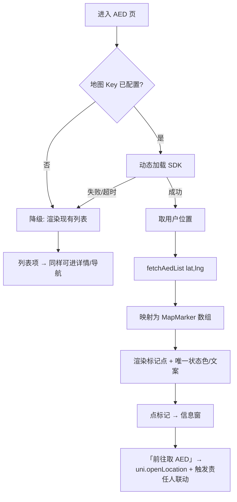

# PRD：AED 实时地图（兑现建议书「AED 实时地图」）

> 路线图对应：`deliverables/software-company/product-backlog.md` **F1**（建议书 §04 核心功能 + §07 联动第一步）
> 版本：v1.0 | 状态：**PRD 可先定稿，代码等「高德 Key」到位再开工** | 语言：中文
> 决策前提：用户 2026-09-13 拍板 **「高德/腾讯」** 这一支（即**接受"需申请 Key + 商用授权评估"**）

---

## 1. 项目信息

| 项 | 内容 |
|---|---|
| Project Name | `aed_map` |
| 技术栈（现状，不改） | 前端 uni-app，**主目标 H5**（nginx 静态站 + 内置 API 代理；冒烟脚本打的是 H5 产物） |
| 需求复述 | 把建议书 §04 承诺的「**AED 实时地图** —— 精确显示周边 AED 位置与**开放状态**」做成**真的地图**，替换当前"列表 + 假图" |

### 1.1 现状调研结论（基于真实代码，非假设）

**❌ 现状：没有任何真地图**
- **全仓无地图 SDK** —— grep `<map|createMapContext|leaflet|amap|AMap|mapbox` 在 `急救侠-uniapp/src` **零命中**。
- **新闻里的"地图卡"是 CSS 假图** —— `pages/news/index.vue:107-119`：`feed-map-grid` 背景 + 标记点用
  `left: (30 + i*25)%` / `top: (20 + i*20)%` **按序号硬算位置，完全不用 lat/lng** ⇒ 纯装饰。
- **AED 侧是"距离排序列表 + 跳系统地图"** —— `api/aed.ts:144 fetchAedList(lat, lng)`；`stores/aed.ts:70 uni.openLocation`。

**✅ 好消息：数据层已经齐了，缺口纯在"渲染层"（无需迁移、无需改表）**

`急救侠-server/src/db.ts:105-132` 的 `aed_devices` **已有**：

| 字段 | 用途 |
|---|---|
| `lat` / `lng` / `distance` (REAL) | 地图打点基础 |
| **`status`** (TEXT, 默认 `'available'`) | **"开放状态"** —— 枚举见 §1.2 |
| **`open_hours`** (TEXT) | 开放时段 |
| `indoor` (INTEGER) / `floor` (TEXT) / `finding_instructions` (TEXT) | 室内/楼层/找路指引 |
| `name` / `address` / `battery_level` / `model` | 信息窗内容 |

### 1.2 ⚠️ 必须先解决：`status` 语义已被**两处混用**，地图需要**唯一权威映射**

- **枚举定义**（权威）：`api/aed.ts:28` / `:62` ⇒ `'available' | 'in_use' | 'maintenance'`（三值封闭集）。
- **但现有标签实现不一致** —— `pages/aed/detail.vue:241-245` 的 `statusLabel`：
  只特判 `maintenance`，其余**按 `verified` / `discovered` 分支**，
  ⇒ **`in_use` 这个值根本渲染不出来**，且把两个不同概念（设备状态 vs 数据可信度）塞进了同一个"状态"标签。
- ⇒ **本 PRD 要求**：定义**唯一**的「状态 → 颜色 + 文案」映射函数（见 §4 P0-2），
  **detail 页与地图共用同一份**，并显式覆盖三值（`available` / `in_use` / `maintenance`）。**不新增第四种含义。**

---

## 2. 产品定义

### 2.1 产品目标
让公众在紧急时**一眼看到附近哪台 AED 是可用的、怎么走**，把「有设备、无施救者」变成「看得见、找得到」。

### 2.2 用户故事
- 作为**施救者**，我打开地图就能看到周边 AED 的**位置与是否可用**，并一键导航。
- 作为**施救者**，我在弱网/地图加载失败时，**仍能用现有的列表**找到 AED（不能白屏）。
- 作为**运维**，我在**没有配置 Key** 的环境里也能正常跑（地图降级，不崩）。

### 2.3 关键约束
> ⚠️ **急救场景**：地图是**辅助**，不是唯一路径。**任何情况下都不能因为地图挂了就找不到 AED。**
> ⇒ 现有列表**必须保留为降级路径**（它是"保底"，不是"待删除的旧实现"）。

---

## 3. 关键设计决策（我已按下表设计，**请确认**）

| # | 决策 | 我的设计 | 理由 |
|---|---|---|---|
| **D1** | **厂商：高德（AMap）** | H5 用高德 JS API（`@amap/amap-jsapi-loader` 动态加载） | 本项目**主目标是 H5**；高德 JS API 是国内 H5 最通用、文档最全的一支。腾讯更贴小程序（本项目不做小程序） |
| **D2** | **厂商必须可换 ⇒ 薄适配层** | 所有 SDK 调用收敛在**一个** `utils/map/adapter.ts`；页面只依赖**自有的** `MapMarker` 模型（`{id, lat, lng, label, status, tone}`） | 换高德↔腾讯只改这一层；**页面与测试不依赖任何厂商 API** |
| **D3** | **Key 未配置 / SDK 加载失败 ⇒ 降级到列表** | 地图容器渲染失败时**回落到现有列表**；**绝不白屏、绝不阻塞页面** | Key 是外部依赖（见下）；且弱网下 SDK 加载本就会失败 |
| **D4** | **Key 不进仓库，走环境变量** | H5 由构建期注入（如 `VITE_AMAP_KEY`）+ `securityJsCode`（若用）；**仓库内不出现任何真实 Key** | 与项目既有「`.env` 不入库」纪律一致 |
| **D5** | **状态映射唯一化** | 抽出 `aedStatusLabel(status)` 与 `aedStatusTone(status)`，**detail 页与地图共用**，显式覆盖三值 | 修 §1.2 的既有不一致 |

> ### ⛔ **D1/D4 引入的硬阻塞：Key 必须由你去申请**
> F1 是三项里**唯一被外部依赖阻塞**的（见 backlog §7.1）。**代码可以写，但跑不起来。**
> 你需要办两件事：
> 1. **申请高德 Key**（Web 端 JS API，绑定域名——生产域名与本地调试域名都要加）；
> 2. **评估商用授权**（高德/腾讯对商用场景有授权要求，**这是商务事项，不是代码事项**）。
>
> ⚠️ **不要**在没有 Key 降级路径的情况下先合入地图 —— 那会让 AED 页在无 Key 环境白屏。

---

## 4. 需求池

### P0（MVP 必做）
1. **地图组件**（H5）：以用户位置为中心，渲染周边 AED 标记点。
2. **唯一状态映射**：`aedStatusLabel` / `aedStatusTone`（覆盖 `available` / `in_use` / `maintenance`），**detail 页同步改用**。
3. **信息窗**：`name` / `address` / `status` / `open_hours` / `indoor`+`floor`（"在 X 楼"）；按钮「前往取 AED」。
4. **降级路径**：无 Key / SDK 加载失败 → 自动回落现有列表（**必须保留列表**）。
5. **"前往取 AED"**：复用既有 `uni.openLocation`（`stores/aed.ts:70`）→ 既触发**责任人联动**又给导航。

### P1
6. 标记点聚合（AED 密集区）+ 用户位置与 AED 的距离显示（`distance` 字段已在）。
7. 地图内筛选：只看"可用"。

### P2
8. 室内导航（需 `indoor`/`floor` 数据质量提升，另议）。
9. 替换 `pages/news/index.vue:107-119` 的 CSS 假图为真地图（**若新闻确实需要地图卡**；否则建议**删掉假图**，见 §6）。

---

## 5. KPI（必须可测量）

| 指标 | 口径 |
|---|---|
| 地图可用性 | Key 已配置环境下地图**成功渲染率**（失败即回落列表，需分别计数） |
| **降级正确性** | 无 Key / SDK 失败时，**列表仍出现**（以测试断言，非人工观察） |
| 状态映射一致性 | `aedStatusLabel` 对**三个枚举值**均有确定输出；detail 页与地图输出**逐字一致** |
| 泄漏防护 | 仓库内**零**真实 Key（`git grep` 断言 + CI） |

---

## 6. 关键待确认问题

1. **地图出现在哪些页面**？我建议**先在 AED 列表页**加地图（主场景），**不动**新闻的假图；
   **建议直接删掉** `news` 的 CSS 假图（它误导性地"看起来像地图"），除非新闻确实需要。
2. **Key 的归属域名**：生产域名定了吗？（无域名则连 Key 都申请不了 —— 与 `aliyun-action-sheet.md` **A3/B4 同一前置**）
3. **商用授权**由谁评估？（商务/法务）
4. 是否需要**离线/预缓存**瓦片？（我倾向**不做**，YAGNI）

---

## 7. 主流程（Mermaid）

---

## 8. MVP 边界声明

- ❌ **不做**：路线规划/转向导航（交给地图 App 或 SDK 自带）、室内地图、实时人流、离线瓦片、其他地图厂商。
- 🔒 **契约约束**：`in_use` **必须**有渲染结果（修 §1.2 既有缺口）；地图降级**必须**保留列表。
- ⛔ **阻塞**：**无高德 Key 前不合并地图代码**（或必须同时合并降级路径并测试它）。
