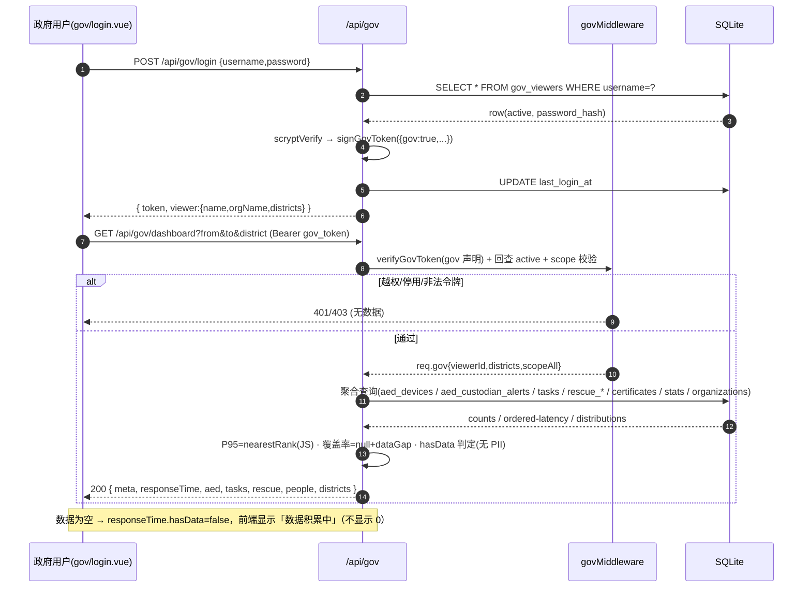
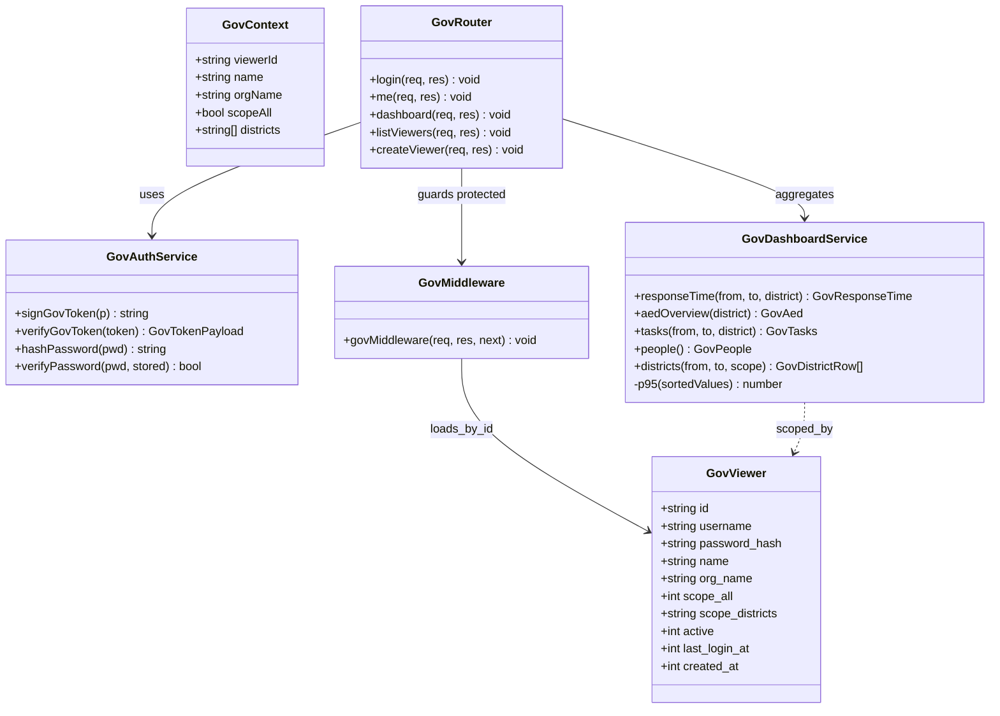
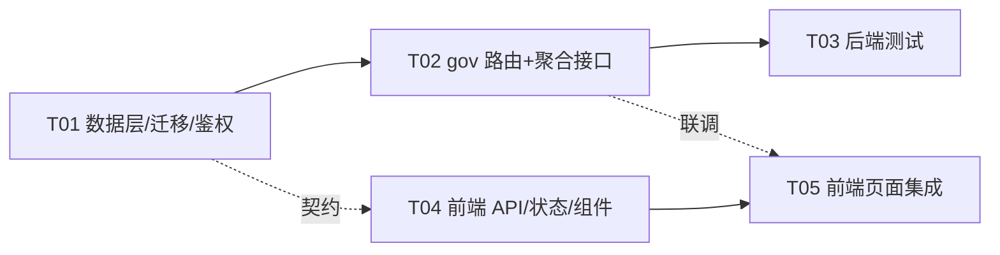

# 系统设计：政府数据监管看板（P2-8）

> 对应 PRD：`deliverables/software-company/gov-dashboard-prd.md`（v1.0）
> 作者：高见远（架构师） | 状态：待主理人确认后交工程师执行
> 语言：中文 | 关键结构用表格 / Mermaid
> 说明：P2-7 已落地，`aed_custodian_alerts` 表与字段（`notify_time_ms/responded_time_ms/sla_deadline_ms/response_latency_ms/sla_met/status/channel`）已在 `db.ts` 中，可直接作为响应时间类指标数据源。

---

## 0. 设计口径锁定（严格遵循已锁定决策）

| # | 锁定项 | 本设计如何落地 |
|---|---|---|
| 1 | 政府鉴权：**独立 `gov_viewers` 白名单表 + `govMiddleware`**，与用户角色体系解耦 | §2.1 建表、§3 独立 JWT（含 `gov` 声明）、独立登录 + 独立管理端点 |
| 2 | 可见边界：**仅区域/全市聚合，下不下发明细；绝不下发任何 PII** | §4 响应结构无任何姓名/手机号/用户 id；§4.5 断言清单 |
| 3 | 区域维度：相关表新增**可空 `district`**（至少 `aed_devices`，按需 `tasks`/`rescue_records`）；**有值才统计** | §2.2 迁移；**明确口径：无 district 归一化归入「未分区」，不排除**（保证数量守恒） |
| 4 | 覆盖率 M2/M3 分母缺失 → **MVP 只标注不实现** | §4 `aed.coverage = { per10k:null, perKm2:null, dataGap:true }` + `meta.dataGaps` |
| 5 | 冷启动：`aed_custodian_alerts` 无数据时展示「数据积累中」，**不得显示误导性 0** | §4 `responseTime.hasData=false` 且各指标返回 `null`（非 0）；前端据 `hasData` 渲染 |
| 6 | 默认时间窗口 **30 天**（可传参） | §4.1 参数 `from/to`，缺省 `to=now, from=now-30d` |

> **区域口径（唯一权威，禁止各处重定义）**：`district` 取值：NULL 或 `''` → 视为「未分区」，聚合时归入 `__UNASSIGNED__` 分组（**不排除**）。`district` 传参语义：缺省=全部；`__UNASSIGNED__`=仅未分区；其它值=精确匹配。

---

## Part A：系统设计

### 1. 实现方案 + 框架选型

**在现有栈内实现，不引入新框架/新依赖。**

| 关注点 | 方案 | 理由 |
|---|---|---|
| 技术难点 ① 独立政府鉴权 | 独立 `gov_viewers` 表 + 独立 `middleware/govAuth.ts`（`signGovToken`/`verifyGovToken`/`govMiddleware`），JWT 增加 `gov:true` 声明 | 与 `authMiddleware`（`openid/userId`）**互不通用**：普通用户 token 无 `gov` 声明 → 政府接口拒绝；政府 token 也不进入业务鉴权 |
| 技术难点 ② 密码存储 | 用 **Node 内置 `crypto.scryptSync`** 存 `salt:hash`，不引 bcrypt | 「最小可行且安全」且**零新增依赖**；避免复刻 `users.password` 的明文存储 |
| 技术难点 ③ P95 计算 | SQLite 无 percentile → SQL 取**有序延迟数组**，JS 用 **nearest-rank**：`v[Math.max(0, Math.ceil(0.95*n)-1)]` | 精确、确定；MVP 数据量可接受 |
| 技术难点 ④ 混合时间格式 | 存量文本时间列格式不一（`datetime('now')`=`'YYYY-MM-DD HH:MM:SS'`，`Date.toISOString()`=`'...T...Z'`）→ 统一用 SQLite `date()/strftime()` **归一后再比较** | `date()`/`strftime()` 对两种格式均可解析，避免字符串直比出错 |
| 技术难点 ⑤ 冷启动/覆盖率缺口 | 后端显式返回 `null` + `meta.dataGaps`；前端据 `hasData` 渲染「数据积累中 / 待接入人口数据」 | 不伪造 0，避免误导与合规风险 |
| 技术难点 ⑥ 区域维度 | 迁移新增可空 `district`；查询用 `GROUP BY COALESCE(NULLIF(district,''),'__UNASSIGNED__')` | 缺口可增量补；口径单一 |
| 图表渲染 | **不引图表库**：分布用纯 CSS 条形；趋势折线用 uni-app `<canvas>`（`uni.createCanvasContext`）；明细用表格 | 无新增依赖；跨端（H5/小程序/App）可用 |
| 架构模式 | 沿用 Router + 服务函数 分层；`govRouter` 内部按公开/受保护/管理员三段注册中间件 | 与 `routes/*.ts` 一致 |

### 2. 数据模型

#### 2.1 `gov_viewers` 表 DDL（+索引）

```sql
CREATE TABLE IF NOT EXISTS gov_viewers (
  id               TEXT PRIMARY KEY,                 -- 'gv_' + Date.now()
  username         TEXT NOT NULL,                    -- 登录名（唯一）
  password_hash    TEXT NOT NULL DEFAULT '',         -- scrypt: 'saltHex:hashHex'
  name             TEXT NOT NULL DEFAULT '',         -- 显示名（可含职务，非 PII 个人信息主体）
  org_name         TEXT NOT NULL DEFAULT '',         -- 所属政府部门/单位
  scope_all        INTEGER NOT NULL DEFAULT 0,       -- 1 = 可见全部区域
  scope_districts  TEXT NOT NULL DEFAULT '[]',       -- JSON 数组，可见 district 白名单
  allowed_ips      TEXT NOT NULL DEFAULT '',         -- 逗号分隔；空=不限（P1 预留，本期不校验）
  active           INTEGER NOT NULL DEFAULT 1,       -- 1 启用 / 0 停用
  last_login_at    INTEGER,                          -- ms
  created_at       INTEGER NOT NULL,
  updated_at       INTEGER NOT NULL
);
CREATE UNIQUE INDEX IF NOT EXISTS idx_gov_viewers_username ON gov_viewers(username);
```

- `gov_viewers` **不设外键**，完全独立于 `users`/`organizations`；政府账号由平台管理员维护（§3.3）。
- `scope_all=1` 或 `scope_districts` 含目标区域 → 可查询；否则 `403`（§3.2）。

#### 2.2 `district` 字段迁移（3 表）

在 `aed_devices` / `tasks` / `rescue_records` 新增**可空** `district TEXT`：

```sql
ALTER TABLE aed_devices     ADD COLUMN district TEXT;   -- NULL = 未分区
ALTER TABLE tasks           ADD COLUMN district TEXT;
ALTER TABLE rescue_records  ADD COLUMN district TEXT;
```

**迁移落地（沿用 `db.ts` 的 `_migrations` 机制）**：为**每一条 ALTER 单独一个迁移 id**（避免多语句 `exec` 首条失败导致后续被跳过）：

| 迁移 id | 内容 |
|---|---|
| `031_add_gov_viewers` | §2.1 建表 + 唯一索引 |
| `032_add_district_aed` | `ALTER TABLE aed_devices ADD COLUMN district TEXT` |
| `033_add_district_tasks` | `ALTER TABLE tasks ADD COLUMN district TEXT` |
| `034_add_district_rescue` | `ALTER TABLE rescue_records ADD COLUMN district TEXT` |

**T01 在 `src/db.ts` 的改动**：
1. canonical schema 大 `db.exec()` 内：在 `aed_custodian_alerts` 之后追加 §2.1 `gov_viewers` 建表 + 唯一索引；在 `aed_devices`/`tasks`/`rescue_records` 的 `CREATE TABLE` 中末尾各加一行 `district TEXT,`（或 `district TEXT`）。
2. `migrations[]` 数组末尾（紧接 `030_add_custodian_alerts`）追加 031–034 四条。
3. `clearAll()` 的 `DELETE` 列表追加 `DELETE FROM gov_viewers;`。
   `resetSchema()` 会 DROP 全部表后 `initDb()` 重建，无需改。

> 新库：canonical 已含 `gov_viewers` 与 `district`；迁移 `031–034` 因「已存在」被 try/catch 跳过（与本仓库既有 00x 列迁移同模式）。老库：canonical `IF NOT EXISTS` 不改动已有表 → 由 031–034 补齐。**每个 ALTER 独立 id 保证部分已应用的库也能补齐剩余列。**

#### 2.3 与现有表的关系

```
gov_viewers（独立，无外键）
   │ scope_districts / scope_all  → 决定可查 district 范围
   ▼
/api/gov/dashboard（只读聚合）
   ├── aed_devices(.district / .status)               → M1
   ├── aed_custodian_alerts(stats/timestamps/channel) → M4/M5/M6/M13
   ├── aed_pickups(pickup_time/return_time)           → M9
   ├── tasks(.status/.type/.created_at/.district)     → M7
   ├── rescue_records / rescue_cases                  → M8
   ├── certificates(status/user_id) + users.city      → M10
   ├── stats / volunteer_locations                    → M11
   └── organizations / organization_members           → M12
（未来）区域人口/面积基线表 → M2/M3（本期不建，仅标注 dataGap）
```

#### 2.4 新增行类型（`src/types/rows.ts`）

```ts
export interface GovViewerRow {
  id: string
  username: string
  password_hash: string
  name: string
  org_name: string
  scope_all: number
  scope_districts: string        // JSON string
  allowed_ips: string
  active: number
  last_login_at: number | null
  created_at: number
  updated_at: number
}
// 通用聚合行
export interface NamedCountRow { key: string; cnt: number }
```

#### 2.5 新增领域类型 / 校验（`src/types/index.ts`）

```ts
export const GovLoginInput = z.object({
  username: z.string().min(1, '用户名不能为空'),
  password: z.string().min(1, '密码不能为空'),
})
export type GovLoginInput = z.infer<typeof GovLoginInput>

export const GovViewerInput = z.object({
  username: z.string().min(1),
  password: z.string().min(6, '密码至少 6 位'),
  name: z.string().optional(),
  orgName: z.string().optional(),
  scopeAll: z.boolean().optional(),
  scopeDistricts: z.array(z.string()).optional(),
})
export type GovViewerInput = z.infer<typeof GovViewerInput>

export const GovViewerUpdateInput = z.object({
  name: z.string().optional(),
  orgName: z.string().optional(),
  scopeAll: z.boolean().optional(),
  scopeDistricts: z.array(z.string()).optional(),
  active: z.boolean().optional(),
  password: z.string().min(6).optional(),  // 重置密码
})
export type GovViewerUpdateInput = z.infer<typeof GovViewerUpdateInput>

/** 政府看板聚合响应（无任何 PII 字段） */
export interface GovDashboard {
  meta: GovMeta
  responseTime: GovResponseTime
  aed: GovAed
  tasks: GovTasks
  rescue: GovRescue
  people: GovPeople
  districts: GovDistrictRow[]
}
// 详细字段见 §4.3（此处略，实现时按 §4.3 定义）
```

### 3. 鉴权设计（`middleware/govAuth.ts`，新建）

**方案：复用 JWT 机制，但用「独立声明 + 独立白名单校验」，与业务 `authMiddleware` 解耦。**

```ts
// config.ts 追加（可选）
export const GOV_JWT_SECRET = process.env.GOV_JWT_SECRET || JWT_SECRET   // 未配置则回落同一密钥
export const GOV_TOKEN_TTL = process.env.GOV_TOKEN_TTL || '12h'

export interface GovTokenPayload { gov: true; govViewerId: string; name: string }
export interface GovContext {
  viewerId: string; name: string; orgName: string
  scopeAll: boolean; districts: string[]   // 已解析的 JSON
}

export function signGovToken(p: { govViewerId: string; name: string }): string {
  return jwt.sign({ gov: true, ...p }, GOV_JWT_SECRET, { expiresIn: GOV_TOKEN_TTL })
}
export function verifyGovToken(token: string): GovTokenPayload {
  const p = jwt.verify(token, GOV_JWT_SECRET) as any
  if (!p || p.gov !== true) throw new Error('非政府访问令牌')
  return p as GovTokenPayload
}

export function govMiddleware(req: Request, res: Response, next: NextFunction) {
  const auth = req.headers.authorization
  if (!auth || !auth.startsWith('Bearer ')) return res.status(401).json(error('未登录'))
  let payload: GovTokenPayload
  try { payload = verifyGovToken(auth.slice(7)) }
  catch { return res.status(401).json(error('令牌无效或已过期')) }

  const v = get<GovViewerRow>('SELECT * FROM gov_viewers WHERE id = ? AND active = 1', payload.govViewerId)
  if (!v) return res.status(403).json(error('政府账号未授权或已停用'))
  ;(req as any).gov = {
    viewerId: v.id, name: v.name, orgName: v.org_name,
    scopeAll: v.scope_all === 1, districts: JSON.parse(v.scope_districts || '[]'),
  } as GovContext
  next()
}
```

**关键安全点**
- 普通用户 token（`{openid,userId}`）**无 `gov:true`** → `verifyGovToken` 抛错 → 401，**天然隔离**。
- 每次请求**回查 `gov_viewers.active`** → 停用即时生效（不依赖 token 过期）。
- 密码：`scryptSync(password, salt, 64)` 存 `saltHex:hashHex`；校验用 `timingSafeEqual`。
- 登录端点限流（复用 `express-rate-limit`，沿用 `app.ts` 的测试豁免模式）。
- 可选 `GOV_JWT_SECRET` 独立密钥，进一步与业务 token 隔离。

### 3.1 政府账号创建/管理（最小可行）

- **无自助注册**。平台管理员通过 `/api/gov/viewers`（`authMiddleware` + `is_leader`）创建/停用/重置密码。
- （可选）启动引导：`initDb()` 后若 `gov_viewers` 为空且设了 `GOV_BOOTSTRAP_USER/GOV_BOOTSTRAP_PASSWORD` → 创建首个账号。默认不启用。

### 4. 接口契约

> 挂载：`/api/gov`。统一响应 `{ code, data, message }`（`success/error`）。**所有响应禁止含 PII。**

#### 4.1 `POST /api/gov/login`（公开）

| 项 | 值 |
|---|---|
| 入参 | `validate(GovLoginInput)`：`{ username, password }` |
| 成功 | `200 { code:0, data:{ token, viewer:{ id, name, orgName, scopeAll, districts } }, message:'登录成功' }` |
| 失败 | 用户名/密码错 → `401 error('用户名或密码错误')`；账号停用 → `403 error('账号已停用')` |
| 副作用 | `UPDATE gov_viewers SET last_login_at=? WHERE id=?` |

#### 4.2 `GET /api/gov/me`（`govMiddleware`）

- 返回 `success({ viewerId, name, orgName, scopeAll, districts })`，供前端做「区域选择器」的可见范围。

#### 4.3 `GET /api/gov/dashboard`（`govMiddleware`）— 核心聚合

**请求参数（query）**

| 参数 | 类型 | 默认 | 说明 |
|---|---|---|---|
| `from` | number(ms) | `now - 30d` | 窗口起（含） |
| `to` | number(ms) | `now` | 窗口止（含） |
| `district` | string | 缺省=全部 | 精确匹配；`__UNASSIGNED__`=未分区 |
| `window` | number(天) | — | 便捷别名：给出时覆盖 `from`（`from=now-window*86400000`） |

**scope 校验**：若 `viewer.scopeAll !== true`：`district` 必须 ∈ `viewer.districts`（缺省时按 `viewer.districts` 逐区聚合，返回 `districts[]` 仅含授权区）；越权 → `403 error('无权访问该区域')`。

**响应结构（无 PII）**

```jsonc
{
  "meta": {
    "from": 1730000000000, "to": 1732592000000, "windowDays": 30,
    "district": null, "generatedAt": 1732592000000,
    "dataGaps": ["coverage_denominator:人口/面积基线缺失，M2/M3 仅标注",
                 "district_dimension:district 待录入/回填"]
  },
  "responseTime": {
    "hasData": false,            // 冷启动：无样本 → false，前端显示「数据积累中」
    "sampleSize": 0,             // 已响应样本数（分母），用于前端判断
    "p95Ms": null,               // hasData=false 时为 null，绝不显示 0
    "slaRate": null,             // ≤120s 达标率，null 表示无样本
    "noResponseRate": null,      // status='expired' 占比
    "alertTotal": 0,             // 窗口内全部告警数
    "trend": [ { "date": "2026-05-01", "p95Ms": 90000, "count": 5 } ],
    "channelDistribution": [ { "channel": "push", "count": 5, "ratio": 1.0 } ]
  },
  "aed": {
    "total": 12, "available": 10, "availabilityRate": 0.8333,
    "pickups": 7, "activePickups": 1,
    "coverage": { "per10k": null, "perKm2": null, "dataGap": true }
  },
  "tasks": {
    "total": 20, "completed": 12, "completionRate": 0.6,
    "typeDistribution": [ { "type": "cpr", "count": 14 } ],
    "hourlyDistribution": [ { "hour": 9, "count": 3 } ]
  },
  "rescue": { "records": 8, "cases": 4 },
  "people": {
    "certifiedVolunteers": 30, "onlineVolunteers": 3,
    "organizations": 2, "orgMembers": 18
  },
  "districts": [
    { "district": "南山区", "aedCount": 6, "aedAvailableRate": 0.83,
      "responseP95Ms": 88000, "slaRate": 0.9, "alertTotal": 10,
      "taskCount": 9, "taskCompletionRate": 0.66, "coveragePer10k": null },
    { "district": "__UNASSIGNED__", "aedCount": 3, "aedAvailableRate": 1.0,
      "responseP95Ms": null, "slaRate": null, "alertTotal": 0,
      "taskCount": 4, "taskCompletionRate": 0.5, "coveragePer10k": null }
  ]
}
```

#### 4.4 SQL 级口径（逐指标）

**约定**：`NOW` = `Date.now()`；`fromMs/toMs` = 请求窗口；日期口径用 `date(x)`/`strftime` 归一；`distFilter` 为按需拼接的过滤片段（`AND district = ?` 或 `AND (district IS NULL OR district='')`）。

**M1 AED 总数 / 可用率**
```sql
SELECT COUNT(*) AS total,
       SUM(CASE WHEN status='available' THEN 1 ELSE 0 END) AS available
FROM aed_devices
WHERE 1=1 {distFilter};
-- availabilityRate = total>0 ? available/total : null
```

**M4 响应时间 P95**（nearest-rank，JS 计算）
```sql
SELECT response_latency_ms AS v
FROM aed_custodian_alerts
WHERE status IN ('acknowledged','rejected')
  AND response_latency_ms IS NOT NULL
  AND notify_time_ms BETWEEN ? AND ?
  {AND aed_id IN (SELECT id FROM aed_devices WHERE district = ?)}   -- 按 district 时
ORDER BY v ASC;
-- JS: n=rows.length; p95 = n>0 ? rows[Math.max(0, Math.ceil(0.95*n)-1)].v : null
```

**M5 SLA 达标率（≤120s）**
```sql
SELECT COUNT(*) AS n,
       SUM(CASE WHEN sla_met=1 THEN 1 ELSE 0 END) AS ok
FROM aed_custodian_alerts
WHERE notify_time_ms BETWEEN ? AND ?
  AND responded_time_ms IS NOT NULL AND sla_met IS NOT NULL
  {AND aed_id IN (SELECT id FROM aed_devices WHERE district = ?)};
-- slaRate = n>0 ? ok/n : null
```

**M6 责任人无响应率**
```sql
SELECT COUNT(*) AS total,
       SUM(CASE WHEN status='expired' THEN 1 ELSE 0 END) AS expired
FROM aed_custodian_alerts
WHERE notify_time_ms BETWEEN ? AND ?
  {AND aed_id IN (SELECT id FROM aed_devices WHERE district = ?)};
-- noResponseRate = total>0 ? expired/total : null
-- hasData = total>0（冷启动判定）
```

**M13 通道分布 / 响应趋势**（趋势 P95 按天分组，JS 计算）
```sql
-- 通道
SELECT channel AS key, COUNT(*) AS cnt FROM aed_custodian_alerts
WHERE notify_time_ms BETWEEN ? AND ? {aedFilter} GROUP BY channel;
-- 趋势（取日期+延迟，JS 按天分组算 P95）
SELECT date(notify_time_ms/1000,'unixepoch') AS d, response_latency_ms AS v
FROM aed_custodian_alerts
WHERE notify_time_ms BETWEEN ? AND ? {aedFilter}
ORDER BY d ASC;
```

**M7 任务数量 / 完成率 / 类型 / 时段**
```sql
-- 总量+完成率
SELECT COUNT(*) AS total, SUM(CASE WHEN status='completed' THEN 1 ELSE 0 END) AS completed
FROM tasks
WHERE date(created_at) >= date(?) AND date(created_at) <= date(?)   -- ? = new Date(fromMs).toISOString()
  {distFilter};
-- 类型分布
SELECT type AS key, COUNT(*) AS cnt FROM tasks WHERE date(created_at) BETWEEN date(?) AND date(?) {distFilter} GROUP BY type;
-- 时段分布（0-23）
SELECT CAST(strftime('%H', created_at) AS INTEGER) AS hour, COUNT(*) AS cnt
FROM tasks WHERE date(created_at) BETWEEN date(?) AND date(?) {distFilter}
GROUP BY hour ORDER BY hour;
```

**M8 救援记录 / 案例数**
```sql
SELECT COUNT(*) AS cnt FROM rescue_records
WHERE date(date) BETWEEN date(?) AND date(?);          -- rescue_records.date 为 TEXT
SELECT COUNT(*) AS cnt FROM rescue_cases
WHERE date(date) BETWEEN date(?) AND date(?);
-- 注：rescue_records/rescue_cases 的 district 本期新增但多为空 → 区域维度按 __UNASSIGNED__ 归集
```

**M9 取用次数 / 未归还数**
```sql
SELECT COUNT(*) AS cnt FROM aed_pickups
WHERE date(pickup_time) BETWEEN date(?) AND date(?)
  {AND aed_id IN (SELECT id FROM aed_devices WHERE district = ?)};
SELECT COUNT(*) AS cnt FROM aed_pickups WHERE return_time IS NULL;   -- 快照，不受窗口/区域限制
```

**M10 持证志愿者数**（快照）
```sql
SELECT COUNT(DISTINCT user_id) AS cnt FROM certificates WHERE status='active';
-- 区域近似：JOIN users 用 city（区域仅到市级）→ district 级不实现，标注 dataGap
```

**M11 在线志愿者数**
```sql
SELECT COUNT(*) AS cnt FROM volunteer_locations
WHERE updated_at >= datetime('now','-10 minutes');     -- 心跳优先
-- 兜底：SELECT online_volunteers FROM stats WHERE id=1;
-- 若心跳=0 且 stats 有值 → 取 stats（响应附 source 说明，合理）
```

**M12 机构数 / 成员数**（快照，全局）
```sql
SELECT COUNT(*) AS cnt FROM organizations;
SELECT COUNT(*) AS cnt FROM organization_members;
```

**district 明细**（`districts[]`）
```sql
-- 区域集合（三表并集，含未分区）
SELECT DISTINCT COALESCE(NULLIF(district,''),'__UNASSIGNED__') AS d FROM aed_devices
UNION SELECT DISTINCT COALESCE(NULLIF(district,''),'__UNASSIGNED__') FROM tasks;
-- 逐区 aed：SELECT COALESCE(NULLIF(district,''),'__UNASSIGNED__') d,
--   COUNT(*) total, SUM(status='available') available FROM aed_devices GROUP BY d;
-- 逐区任务：SELECT ... d, COUNT(*) total, SUM(status='completed') completed FROM tasks ... GROUP BY d;
-- 逐区 P95：按 §M4 加 GROUP BY 区域，JS 分组算 P95。
```

**M2/M3 覆盖率**：**本期固定 `null` + `dataGap:true`**（分母缺失），不执行任何除法，不显示 0。

#### 4.5 PII 断言（工程师自查）

- 响应体**不得**出现：`custodian_name`、`custodian_phone_snapshot`、`requester_user_name`、`requester_user_phone`、任何 `*_user_id`、`users.name`、`users.avatar`、`certificates.user_id`（仅允许 `COUNT(DISTINCT ...)`）。
- 只允许输出：计数、比率、分布、`district` 名称、时间戳、`channel` 枚举。
- 代码评审红线：任何 `SELECT *` 直出、任何 `SELECT ... name/phone` 进响应体 → 拒绝。

#### 4.6 `/api/gov/viewers`（管理员管理，`authMiddleware` + `is_leader`）

| 方法 | 路径 | 说明 |
|---|---|---|
| GET | `/api/gov/viewers` | 列出政府账号（**不返回 password_hash**） |
| POST | `/api/gov/viewers` | 创建：`validate(GovViewerInput)`；scrypt 存密码；返回 `{ id }` |
| PUT | `/api/gov/viewers/:id` | 更新 scope/name/active/重置密码：`validate(GovViewerUpdateInput)` |
| DELETE | `/api/gov/viewers/:id` | 停用（软删：`active=0`） |

> `is_leader` 校验在 `govRouter` 内**内联实现**（复刻 `routes/admin.ts` 的 `adminMiddleware` 模式），避免改动 `admin.ts`。

### 5. 指标实现映射表（PRD 13 项）

| # | 指标 | 本期实现？ | 数据源 / 口径 | 备注 |
|---|---|---|---|---|
| M1 | AED 总数 / 可用率 | ✅ | `aed_devices` §4.4-M1 | 快照 |
| M2 | 覆盖率（每万人） | ⚠️ **只标注** | 分母缺失 → `null` + `dataGap` | 不实现除法 |
| M3 | 覆盖率（每平方公里） | ⚠️ **只标注** | 同上 | 不实现除法 |
| M4 | 响应时间 P95 | ✅ | `aed_custodian_alerts.response_latency_ms` §4.4-M4 | 冷启动 null |
| M5 | SLA 达标率 | ✅ | `aed_custodian_alerts.sla_met` §4.4-M5 | 冷启动 null |
| M6 | 无响应率 | ✅ | `aed_custodian_alerts.status='expired'` §4.4-M6 | 冷启动 null |
| M7 | 任务数 / 完成率 + 类型/时段分布 | ✅ | `tasks` §4.4-M7 | 区域分布：district 已加，依赖录入 |
| M8 | 救援记录 / 案例数 | ✅ | `rescue_records`/`rescue_cases` §4.4-M8 | 区域维多为未分区 |
| M9 | 取用 / 未归还 | ✅ | `aed_pickups` §4.4-M9 | 未归还为快照 |
| M10 | 持证志愿者数 | ✅（全局） | `certificates` §4.4-M10 | 区域仅市级 → district 级标注 |
| M11 | 在线志愿者数 | ✅ | `volunteer_locations` / `stats` §4.4-M11 | 心跳优先 |
| M12 | 机构数 / 成员数 | ✅ | `organizations` §4.4-M12 | 全局快照 |
| M13 | 通道触达分布 | ✅ | `aed_custodian_alerts.channel` §4.4-M13 | 辅助 |

### 6. 前端

**6.1 新页面 `src/pages/gov/dashboard.vue`**（政府看板）
- 顶部筛选：区域选择器（数据来自 `GET /api/gov/me` 的 `districts`/`scopeAll`）+ 时间窗口（7/30/90 天）。
- 顶部指标条：响应 P95 / SLA 达标率 / 无响应率 / 在线志愿者 / 持证人数（`null` → 显示「数据积累中」）。
- 区块：响应趋势（canvas 折线）、AED 概览（数字 + 覆盖率格显示「待接入人口数据 ⚠️」）、任务/救援（CSS 条形 + 表）、人员/机构。
- 明细表：区域 | AED数 | 覆盖率(占位) | 响应P95 | 任务数 | 完成率。

**6.2 登录页 `src/pages/gov/login.vue`**（政府账号登录）
- 表单 username/password → `POST /api/gov/login` → 存 token（`uni.setStorageSync('gov_token', token)`）→ 跳 dashboard。

**6.3 接口层 `src/api/gov.ts`（新建）**
```ts
export interface GovViewer { id:string; name:string; orgName:string; scopeAll:boolean; districts:string[] }
export interface GovDashboard { /* 与后端 §4.3 字段一一对齐 */ }
export function govLogin(username:string, password:string): Promise<{ token:string; viewer:GovViewer }>
export function fetchGovMe(): Promise<GovViewer>
export function fetchGovDashboard(params:{ from?:number; to?:number; window?:number; district?:string }): Promise<GovDashboard>
// 管理员
export function listGovViewers(): Promise<GovViewer[]>
export function createGovViewer(data:{...}): Promise<{ id:string }>
export function updateGovViewer(id:string, data:{...}): Promise<void>
```
> token 读取：`gov.ts` 内使用独立 header `Authorization: Bearer <gov_token>`（**不复用业务 `getAuthHeader` 的 `jwt_token`**）。可在 `api/index.ts` 增加可选 `tokenKey` 参数，或 `gov.ts` 内直接 `uni.request`。

**6.4 状态层 `src/stores/gov.ts`（新建）**：`viewer`、`dashboard`、`windowDays`、`district`、`loading`、`loadDashboard()`、`login()`。

**6.5 组件**：`src/components/GovStat/index.vue`（指标卡，支持 `null → 数据积累中`）、`src/components/GovBarChart/index.vue`（CSS/Canvas 图表）。

**6.6 `pages.json` 注册**
```json
{ "path": "pages/gov/login", "style": { "navigationBarTitleText": "政府登录" } },
{ "path": "pages/gov/dashboard", "style": { "navigationBarTitleText": "政府数据监管看板" } }
```

**6.7 图表方案（无新依赖）**
| 呈现 | 实现 |
|---|---|
| 分布（类型/时段/通道） | 纯 CSS 水平条形（宽度=占比%） |
| 趋势折线 | `<canvas>` + `uni.createCanvasContext('trend')`，画 P95/计数折线 |
| 明细 | `<view>` 表格 |
| 地图 | 本期不做（P1），用区域明细表替代 |

### 7. 时序图（Mermaid）

> 另存 `deliverables/software-company/gov-dashboard-sequence.mermaid`



### 8. 类图（数据结构与接口）



### 9. 依赖包列表

**无新增依赖。**
```
# 后端：express / better-sqlite3 / zod / jsonwebtoken / express-rate-limit 均为现有依赖
#      密码哈希用 Node 内置 crypto.scryptSync（无需 bcrypt）
# 前端：uni-app / pinia 为现有依赖；图表用原生 canvas/CSS（不引图表库）
```

### 10. 共享知识 / 跨文件约定（工程师必读）

| 约定 | 内容 |
|---|---|
| 响应格式 | 一律 `{ code, data, message }`；`success()/error()`（`types/index.ts`）复用 |
| 时间基准 | 入参窗口用 **UTC epoch ms**；存量文本时间列用 SQLite `date()/strftime()` 归一后比较（勿字符串直比） |
| district 口径 | `COALESCE(NULLIF(district,''),'__UNASSIGNED__')`；未分区**不排除**；传参 `__UNASSIGNED__` 精确取未分区 |
| 冷启动 | 无样本时相关指标返回 `null`，`hasData=false`；**禁止返回 0** 冒充 |
| 脱敏 | 响应零 PII（§4.5 断言清单）；只出计数/比率/分布/district/channel |
| 鉴权 | 政府接口仅认 `govMiddleware`（`gov:true` 声明 + `gov_viewers.active`）；业务 `authMiddleware` 与政府 token 互不通用 |
| 密码 | scrypt `saltHex:hashHex`；校验用 `timingSafeEqual`；禁止明文 |
| 迁移 | 每条 ALTER 独立 id（031–034）；canonical schema 同步；`clearAll()` 补 `DELETE FROM gov_viewers` |
| ID 前缀 | gov viewer=`gv_` |
| 前端 token | `gov_token`（与业务 `jwt_token` 分离）；`api/gov.ts` 独立注入 header |
| 测试 | vitest；`__tests__/setup.ts` 提供 `app/seedTestData/db`；`resetSchema()` 每用例重建 |

### 11. 待明确事项

| # | 问题 | 本设计默认 | 影响 |
|---|---|---|---|
| Q1 | 区域维度落法：字段录入 vs lat/lng 反查 | **新增 `district` 可空字段 + 录入/回填**（本期只加字段，回填另立任务） | 决定按区域指标能否有数据 |
| Q2 | 人口/面积基线谁维护 | 本期**不建**，M2/M3 返回 null+dataGap | 覆盖率不可用属已知缺口 |
| Q3 | 认证方式是否需 SSO/IP 白名单 | 本期**用户名+密码+JWT**，`allowed_ips` 列预留不校验（P1） | 有合规要求的机构可能需 SSO |
| Q4 | 可见到「区级」还是「设备级」 | **仅区级聚合**（硬红线） | 接口粒度已定 |
| Q5 | 冷启动呈现 | `null` + 「数据积累中」 | 已定 |
| Q6 | 默认窗口/自动报告 | 默认 30 天；自动报告列 P1 | — |
| Q7 | 未分区口径 | **归入「未分区」不排除** | 已定；如 PM 要求排除需改 SQL |
| Q8 | 政府账号由谁创建 | 平台管理员（`is_leader`）经 `/api/gov/viewers`；可选 env 引导首个账号 | 需运维配合 |

---

## Part B：任务分解

> 硬约束：**≤5 个任务**；每任务 **≥3 个相关文件**；按依赖排序；T01 为基础设施/数据层。

#### 任务列表

| Task ID | 任务名 | 源文件（新建/修改） | 依赖 | 优先级 |
|---|---|---|---|---|
| **T01** | **后端数据与鉴权基座**（gov_viewers 表 + district 迁移 + 类型 + govAuth 中间件） | `急救侠-server/src/db.ts`（改：canonical 加 `gov_viewers` + 三表 `district` 列；`migrations` 加 031–034；`clearAll` 补 `DELETE FROM gov_viewers`）<br/>`急救侠-server/src/types/rows.ts`（加 `GovViewerRow`/`NamedCountRow`）<br/>`急救侠-server/src/types/index.ts`（加 `GovLoginInput`/`GovViewerInput`/`GovViewerUpdateInput`/`GovDashboard` 等）<br/>`急救侠-server/src/middleware/govAuth.ts`（**新建**：`signGovToken`/`verifyGovToken`/`govMiddleware`/`hashPassword`/`verifyPassword`）<br/>`急救侠-server/src/config.ts`（加 `GOV_JWT_SECRET`/`GOV_TOKEN_TTL`） | 无 | P0 |
| **T02** | **后端 gov 路由与聚合接口** | `急救侠-server/src/routes/gov.ts`（**新建**：`login`/`me`/`dashboard`/`viewers` 管理；含 §4.4 聚合 SQL + P95 计算 + 脱敏）<br/>`急救侠-server/src/app.ts`（挂载 `/api/gov`，含登录限流）<br/>`急救侠-server/src/routes/gov-dashboard.ts`（**可选**：把聚合逻辑抽为服务函数，若 gov.ts 过大则拆分；否则并入 gov.ts） | T01 | P0 |
| **T03** | **后端测试（指标与鉴权回归）** | `急救侠-server/src/__tests__/gov.test.ts`（**新建**：登录成功/失败、非政府 token 拒绝、停用拒绝、scope 越权 403、dashboard 各指标、冷启动 hasData=false、覆盖率 null、PII 断言、viewers 管理）<br/>`急救侠-server/src/__tests__/setup.ts`（改：加 `seedGovViewer()` helper / 或在 gov.test.ts 内自建）<br/>`急救侠-server/src/__tests__/gov-metrics.test.ts`（**新建**：P95/达标率/无响应率/分布 的 SQL 口径单测） | T02 | P0 |
| **T04** | **前端 API / 状态 / 展示组件** | `急救侠-uniapp/src/api/gov.ts`（**新建**：登录/me/dashboard + 管理员接口 + 独立 `gov_token` header）<br/>`急救侠-uniapp/src/stores/gov.ts`（**新建**：viewer/dashboard/筛选/loading）<br/>`急救侠-uniapp/src/components/GovStat/index.vue`（**新建**：指标卡，`null→数据积累中`）<br/>`急救侠-uniapp/src/components/GovBarChart/index.vue`（**新建**：CSS 条形 + canvas 折线） | 无（契约以 §4 为准，可与 T02 并行；联调需 T02） | P0 |
| **T05** | **前端页面集成** | `急救侠-uniapp/src/pages/gov/dashboard.vue`（**新建**：看板四区块 + 筛选 + 区域明细表 + 冷启动/覆盖率占位）<br/>`急救侠-uniapp/src/pages/gov/login.vue`（**新建**：政府登录）<br/>`急救侠-uniapp/src/pages.json`（注册两页） | T04 | P0 |

#### 任务依赖图



- 唯一公共前置为 **T01**；T04 仅依赖 §4 契约，可与 T02 并行开发；T05 联调需 T02 就绪。

#### 每任务验收要点

**T01**
- [ ] 新库/`resetSchema()` 后存在 `gov_viewers` 及唯一索引；三表含 `district` 列。
- [ ] 老库执行 031–034 迁移成功且 `_migrations` 逐条记录；重复执行幂等不报错。
- [ ] `clearAll()` 不因新表报错。
- [ ] `hashPassword/verifyPassword` round-trip 正确；`verifyGovToken` 对业务 token 抛错。

**T02**
- [ ] `POST /login` 正确签发含 `gov:true` 的 token；token 不含 PII。
- [ ] `GET /dashboard` 契约与 §4.3 一致；`from/to/district` 生效；越权 scope → 403。
- [ ] **冷启动**：`aed_custodian_alerts` 空 → `responseTime.hasData=false` 且 `p95Ms/slaRate/noResponseRate=null`（断言 **不为 0**）。
- [ ] 覆盖率恒为 `null` + `dataGap`。
- [ ] **PII 断言**：响应 JSON 中不含任何姓名/手机/`*_user_id`（测试断言）。
- [ ] `/viewers` 管理仅 `is_leader` 可访问。

**T03**
- [ ] `vitest run` 全绿且无 flaky。
- [ ] 覆盖 §4.4 各指标口径（含边界：空表、未分区、越权、停用）。

**T04**
- [ ] `api/gov.ts` 用独立 `gov_token` header；类型与 §4.3 一一对应；组件对 `null` 渲染「数据积累中」。

**T05**
- [ ] 登录 → dashboard 全链路可用；区域/时间筛选生效；覆盖率列显示「待接入人口数据」；无 PII 展示。
- [ ] `pages.json` 已注册两页。

---

*本文档仅为设计，未改动任何源码。完成后回报主理人：文档路径 + 任务摘要 + 待明确事项（Q1/Q3 最需拍板）。*
