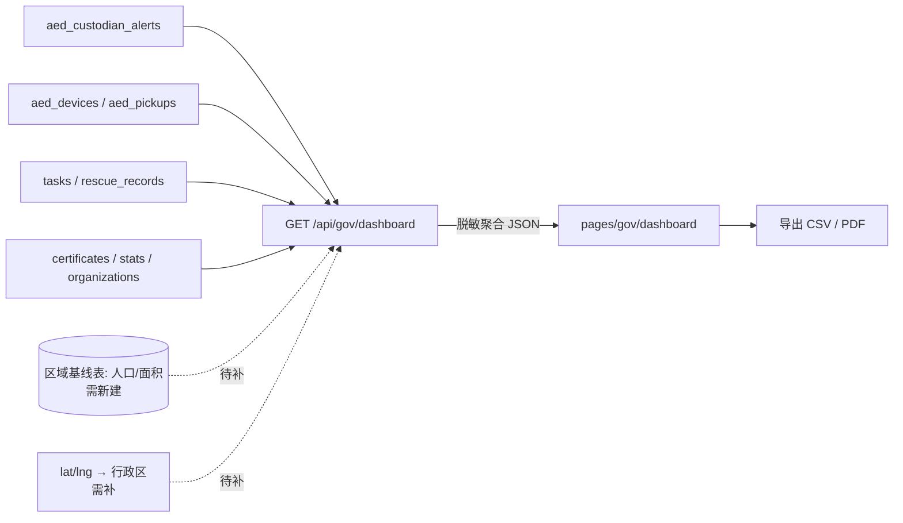

# PRD：政府数据监管看板（P2-8）

> 路线图对应：`NEXT_STEPS.md` **P2 第 8 条**（项目建议书 Section 06「政府合作模式」承诺）
> 版本：v1.0（MVP） | 作者：许清楚（产品经理） | 状态：待架构师/主理人确认
> 语言：中文

---

## 1. 项目信息

| 项 | 内容 |
|---|---|
| Project Name | `gov_dashboard` |
| 需求复述 | 交付**政府专属数据监管看板**，包含「**响应时间、AED 覆盖率、任务数据**」三类关键指标，支持政府部门对试点效果**独立评估与监管**。 |
| 建议书原文 | Section 06：「提供政府专属数据看板，包含响应时间、覆盖率、任务数据等关键指标」；「所有任务数据、响应时间、志愿者覆盖率均可通过政府数据报告面板实时查看」；「与省级卫健委数据平台互通」；「确立数据共享协议，保障数据主权与隐私合规」。 |
| 现状 | 现有 `pages/org/dashboard.vue` + `routes/org.ts` + `routes/admin.ts` 均为**面向机构/平台管理员**（证书、成员、机构数），**不构成政府监管视图**；无 `gov` 路由。 |

### 1.1 数据源盘点（决定指标能否落地）

| 数据源表 | 关键字段 | 能支撑什么 | 缺口 |
|---|---|---|---|
| **`aed_custodian_alerts`**（P2-7 已落地） | `notify_time_ms` / `responded_time_ms` / `sla_deadline_ms` / `response_latency_ms` / `sla_met` / `status` / `channel` / `aed_id` / `requester_user_id` / `custodian_user_id` | **响应时间 P95、SLA 达标率、无响应率、通道分布**（口径已落库，直接可算） | 冷启动：需真实调用产生数据 |
| `aed_devices` | `id` / `name` / `address`(自由文本) / `lat` / `lng` / `status` / `custodian_name/phone/role` | AED 总数、可用率、地图分布 | **无 `district`/`region` 行政区字段**；「按区域聚合」与「每万人/每平方公里」需补数据 |
| `aed_pickups` | `pickup_time` / `return_time` / `aed_id` / `user_id` / `mission_id` | 取用次数、在用/已归还 | 无区域字段 |
| `tasks` | `type` / `address` / `lat` / `lng` / `status` / `volunteers_needed` / `volunteers_responded` / `created_at` | 任务数量、完成率、类型/时段分布 | 区域仅 `address` 文本 + 坐标 |
| `rescue_records` / `rescue_cases` | `type` / `date` / `location` / `result` | 救援记录数、结果分布 | 区域为文本 |
| `users` / `volunteers` | `city` / `rescue_count` / `points` / `tier` | 志愿者数、持证/活跃 | 区域仅到 **市** 级（`city`） |
| `certificates` | `status` / `expiry_date` / `user_id` | 持证人数、到期预警 | — |
| `organizations` / `organization_members` | — | 机构数、成员数 | — |
| `stats`（单例） | `networked_aeds` / `certified_rescuers` / `monthly_rescues` / `online_volunteers` / `aeds_within_1km` | 全局快照 | **非区域维度，仅供总览** |
| **行政区人口/面积基线** | — | 覆盖率分母 | ❌ **库中完全不存在，需外部补数据** |

> 结论：**响应时间类指标可直接落地**；**覆盖率的分母（人口/面积）与「按区域」维度必须补数据**——本 PRD 明确标注，不硬凑。

---

## 2. 受众与场景

| 受众 | 关注 | 支撑的决策 |
|---|---|---|
| 区/市级**卫健委** | AED 覆盖率、响应时长、持证人员 | 考核设备布点与责任落实，评估试点成效 |
| **应急管理局** | 任务/救援数量与完成率、志愿者网络活跃度 | 评估应急力量覆盖与社会响应能力 |
| 项目主管部门（PPP 合作方） | 需对外可证明的**客观指标**（用于验收/汇报） | 依据数据决定是否扩大试点/续约 |

主要场景：**周期评估（周/月）+ 汇报导出**，非实时指挥；对「实时大屏」不作本期要求。

---

## 3. 指标口径（本 PRD 核心）

> 通用：所有时间窗口默认「最近 30 天」，可切换（7/30/90/自定义）；时间基准统一 **UTC epoch ms**（与 P2-7 一致）；区域维度默认「全局」，支持按 `district` 下钻（**依赖 §1.1 缺口补齐**）。

| # | 指标 | 口径（分子 / 分母） | 数据来源（表.字段） | 时间窗口 | 当前可得出？ |
|---|---|---|---|---|---|
| M1 | **AED 总数 / 可用率** | 分母 `COUNT(aed_devices)`；分子 `status='available'` | `aed_devices.status` | 快照 | ✅ 可得 |
| M2 | **AED 覆盖率（每万人）** | `区域内 AED 数` ÷ `区域常住人口(万人)` | 分子 `aed_devices`；**分母：外部人口数据** | 快照 | ⚠️ **需补数据**（人口基线 + 区域字段） |
| M3 | **AED 覆盖率（每平方公里）** | `区域内 AED 数` ÷ `区域面积(km²)` | 分子 `aed_devices`；**分母：外部面积数据** | 快照 | ⚠️ **需补数据**（面积基线 + 区域字段） |
| M4 | **响应时间 P95** | 对 `response_latency_ms` 取 P95；仅含 `status ∈ {acknowledged, rejected}` 且 `response_latency_ms NOT NULL` | `aed_custodian_alerts.response_latency_ms`（按 `notify_time_ms` 入窗） | 30d 默认 | ✅ **可得**（口径已在 P2-7 落库） |
| M5 | **SLA 达标率（≤120s）** | `COUNT(sla_met=1)` ÷ `COUNT(已有时间戳的告警)` | `aed_custodian_alerts.sla_met` | 30d | ✅ 可得 |
| M6 | **责任人无响应率** | `COUNT(status='expired')` ÷ `COUNT(全部告警)` | `aed_custodian_alerts.status` | 30d | ✅ 可得 |
| M7 | **任务数量 / 完成率** | 数量 `COUNT(tasks)`；完成率 `COUNT(status='completed')` ÷ `COUNT(*)` | `tasks.status` / `created_at` / `type` | 30d | ✅ 总量与完成率可得；**按区域/时段分布**部分可得（时段可；区域需补） |
| M8 | **救援记录 / 案例数** | `COUNT(rescue_records)` / `COUNT(rescue_cases)` | 同上表 | 30d（按 `date`） | ✅ 可得 |
| M9 | **取用次数 / 未归还数** | `COUNT(aed_pickups)`；未归还 `return_time IS NULL` | `aed_pickups` | 30d | ✅ 可得 |
| M10 | **持证志愿者数** | `COUNT(DISTINCT user_id) WHERE status='active'` | `certificates` | 快照 | ✅ 可得（**区域仅到市级**，用 `users.city` 近似） |
| M11 | **在线志愿者数** | `stats.online_volunteers` 或 `volunteer_locations` 心跳（`updated_at` 近 N 分钟） | `stats` / `volunteer_locations` | 实时/快照 | ✅ 可得 |
| M12 | **机构数 / 成员数** | `COUNT(organizations)` / `COUNT(organization_members)` | 同表 | 快照 | ✅ 可得 |
| M13 | **通道触达分布** | 按 `channel` 分组的告警占比 | `aed_custodian_alerts.channel` | 30d | ✅ 可得（辅助指标） |

**明确「需补数据」清单（不得硬凑）**
1. **行政区划维度**：`aed_devices`/`tasks`/`rescue_*` 均无 `district`，只有坐标或自由文本地址 → 需**新增区域字段**或**按 lat/lng 反查行政区**。
2. **人口 / 面积基线**：覆盖率分母必需，库中无 → 需外部数据（统计局）并建一张基线表。
3. **区域级任务/救援分布**：依赖第 1 项。

---

## 4. 需求池（P0 / P1 / P2）

### P0（Must have）

| ID | 需求 | 验收要点 |
|---|---|---|
| P0-1 | **政府看板聚合接口** `GET /api/gov/dashboard` | 入参 `district?` + `from/to`；返回 M1、M4–M13 的聚合 JSON（覆盖率 M2/M3 先返回 `null` + `dataGap` 标注）；只读、无写操作。 |
| P0-2 | **响应时间区块**：P95 + SLA 达标率 + 无响应率 + 趋势折线 | 直接基于 `aed_custodian_alerts`；数据为空时展示「数据积累中」而非 0。 |
| P0-3 | **AED 概览区块**：设备总数、可用率、取用/未归还、地图分布 | 基于 `aed_devices`/`aed_pickups`。 |
| P0-4 | **任务/救援区块**：任务数、完成率、类型与时段分布 | 基于 `tasks`/`rescue_records`。 |
| P0-5 | **人员/机构区块**：持证志愿者数、在线志愿者、机构数 | 基于 `certificates`/`stats`/`organizations`。 |
| P0-6 | **看板页面** `pages/gov/dashboard.vue`（或 H5 监管页） | 仅政府角色可见；含区域/时间筛选。 |
| P0-7 | **独立政府角色与鉴权** | 见 §5：需新增角色/白名单，不能仅靠现有 `is_leader`。 |
| P0-8 | **合规脱敏** | 接口**不下发**个人姓名/手机号等 PII（责任人、急救者一律只出聚合计数）。 |

### P1（Should have）

| ID | 需求 |
|---|---|
| P1-1 | **数据导出**：CSV / 打印友好的 PDF 周报（供汇报与验收）。 |
| P1-2 | **区域下钻**：区 → 街道/网格（依赖 §3 缺口 1 补齐）。 |
| P1-3 | **任务/救援热力地图**（基于 lat/lng）。 |
| P1-4 | **覆盖率补齐**：接入人口/面积基线后启用 M2/M3。 |
| P1-5 | 志愿者活跃度榜 / 证书到期预警清单。 |

### P2（Nice to have）

| ID | 需求 |
|---|---|
| P2-1 | 与**省级卫健委数据平台**对接（API/数据中台推送）。 |
| P2-2 | 实时大屏模式。 |
| P2-3 | 自动周期报告（定时生成并投递）。 |

---

## 5. 权限与合规

**现状**：`middleware/auth.ts` 只提供 Bearer JWT + `optionalAuth`；角色仅有 `users.is_leader`（`adminMiddleware`）。**没有政府角色**，`organization_members.role` 是机构内角色（admin/manager/member），与政府无关。

**建议**（供架构师定夺，见 Q3）：
- 新增**独立政府访问主体**，二选一：
  - (a) 复用 `users` 表新增 `is_gov` / `gov_scope` 字段 + 新中间件 `govMiddleware`；
  - (b) 新增独立 `gov_viewers` 白名单表（账号/机构/可见区域范围）。
- **数据可见范围**：政府视角**只给聚合数据**，禁止下钻到个人身份；责任人与急救者姓名/手机号一律脱敏或不返回（PIPL / 数据主权要求）。
- **数据主权**：按 PPP 协议，共享范围与频率需书面约定（建议只在汇总层共享，原始明细不出域）。

---

## 6. 待确认问题

1. **区域维度怎么落**？`aed_devices` 无行政区字段（仅坐标 + 自由文本地址）——是**新增 `district` 字段并在录入时选择**，还是**按 lat/lng 反查行政区**（需引入边界数据）？这决定 M2/M3 与所有「按区域」指标能否成立。
2. **人口/面积基线数据谁提供、如何维护**？覆盖率分母目前完全缺失（Q1 同源问题）。
3. **政府访问主体与认证方式**？新增独立政府角色（`is_gov`/`gov_scope`）还是复用自己的白名单表？是否需要 SSO / IP 白名单？
4. **数据可见边界**：政府侧允许看到「区级聚合」，还是允许到街道级/设备级明细？（合规红线，直接决定接口粒度）
5. **冷启动展示**：`aed_custodian_alerts` 当前可能无真实数据，M4–M6 在数据不足时如何呈现（N/A + 「数据积累中」提示，避免被误读为「响应时间为 0」）？
6. **默认时间窗口与导出频次**：默认 30 天是否合适？是否需要固定周期的自动报告？

---

## 7. 主看板布局草图

```
┌───────────────────────────────────────────────────────────────┐
│ 急救侠 · 政府数据监管看板        [区域: 全部 ▾] [近30天 ▾]  [导出] │
├───────────────────────────────────────────────────────────────┤
│ 响应时间(P95)   SLA达标率    无响应率    在线志愿者   持证人数      │
│   XX 秒          XX%          XX%         XXX         XXXX       │
├──────────────────────────────┬────────────────────────────────┤
│ 响应时间趋势（折线·近30天）    │ AED 覆盖（地图/网格散点）        │
│                              │  [覆盖率 每万人: 待接入数据 ⚠️]   │
├──────────────────────────────┼────────────────────────────────┤
│ 任务量 / 完成率（柱+率）       │ 类型分布 / 时段分布（饼/柱）      │
├──────────────────────────────┴────────────────────────────────┤
│ 区域明细表：区域 | AED数 | 覆盖率 | 响应P95 | 任务数 | 完成率     │
│            （覆盖率列在缺数据时显示「待接入人口数据」）           │
└───────────────────────────────────────────────────────────────┘
```

**数据流**



---

## 8. MVP 边界声明

- ✅ 本期交付：政府聚合接口 + 看板页 + 响应时间/任务/AED/人员机构四区块 + 独立政府鉴权 + 脱敏。
- ❌ 本期不做：省级卫健委平台对接、实时大屏、自动报告、覆盖率分母（**因数据缺失，先占位并显式标注**）。
- ⚠️ 前置依赖：行政区字段与人口/面积基线（Q1/Q2）——未解决前，M2/M3 及一切「按区域」指标**只标注不实现**，不伪造数值。

---

*本文档为架构师设计接口的输入，重点在指标口径与数据可得性判断。*
