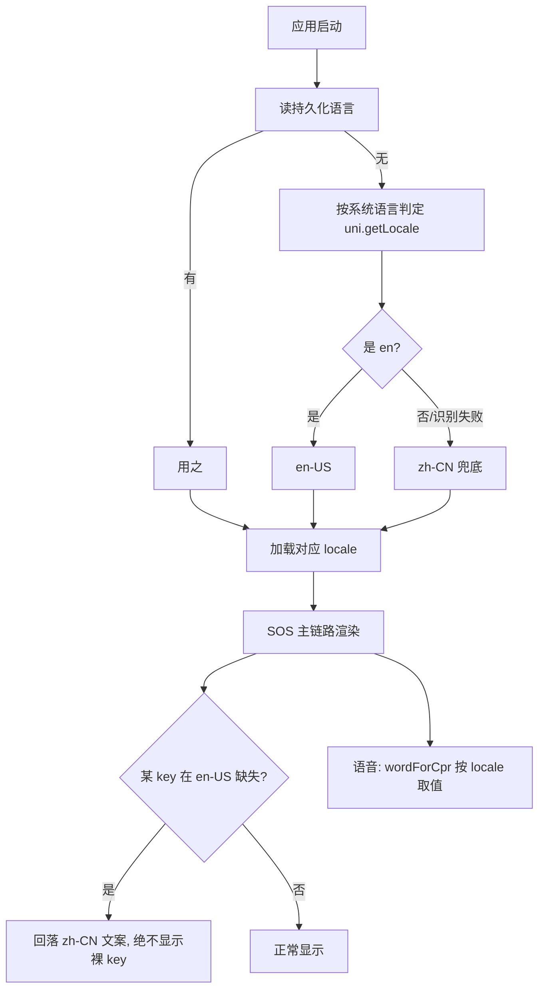

# PRD：急救主链路中英双语（i18n，限定范围）

> 路线图对应：`deliverables/software-company/product-backlog.md` **F2**（建议书 §05 旅游城市方案：「国际旅客安全」）
> 版本：v1.0 | 状态：待主理人确认范围清单 | 语言：中文
> 决策前提：用户 2026-09-13 拍板 **「只做急救主链路」**（不做全站）

---

## 1. 项目信息

| 项 | 内容 |
|---|---|
| Project Name | `i18n_emergency_flow` |
| 技术栈（现状，不改） | uni-app + Vue3（`vue-i18n` 适用于 Vue3；H5 与小程序均可） |
| 需求复述 | 让**急救主链路**支持中英双语，解决国际旅客在急救场景下的**语言障碍** |

### 1.1 现状调研结论（基于真实代码，非假设）

**❌ 零 i18n 基建**
- 全仓 grep `vue-i18n|useI18n|\$t\(|locale` **只命中 `lang="ts"` / `lang="scss"`**（属性名误命中）
  ⇒ **无任何 i18n 依赖、无 locale 文件、文案全部硬编码中文**。
- （对照：建议书 §05 明确承诺「平台支持**中英双语界面**，SOS 呼救全程无需语言沟通，解决**语言障碍下的急救盲区**」。）

**⚠️ 一个非显然的发现：要翻译的不只是"文字"，还有"语音"**
- `pages/rescue/index.vue:312` 的 `wordForCpr(n)` **逐字朗读中文数字**（`'零','一','二'…`），
  由 `voice.speak()` 在按压节拍里**念出来**（`:317`）。
- ⇒ **英文用户听到的将是中文数字**，除非一并本地化。
  **"双语"必须在语音层面也成立，否则承诺只兑现了一半。**

### 1.2 关键范围界定（"急救主链路"到底是什么）

以建议书的**三层模型**为准绳，范围**只包含"从呼救到取到设备"这一段**：

| 层 | 页面 / 组件 | 在范围内 |
|---|---|---|
| 公众呼救层 | `pages/rescue/index.vue`（SOS + CPR 引导 + 确认弹层） | ✅ |
| 公众呼救层 | `pages/guide/index.vue`（急救指引） | ✅ |
| AED 联动层 | `pages/aed/index.vue` / `detail.vue`（找设备、取用、信息窗） | ✅ |
| 演习 | `pages/drill/index.vue`（与技术链路同源） | ✅ |
| 组件 | `SosButton` / `StepTimer` / `Metronome` / `BottomSheet` / `VoiceManager` | ✅ |
| 语音内容 | `utils/voice.ts` 的急救口令与计数 | ✅ |
| —— | 其余 **20+ 页面**（社区/新闻/动物/步道/组织/学习/看板…） | ❌ **不做** |

> **建议书原文的落点**是「**SOS 呼救**全程无需语言沟通」⇒ 范围**天然就是主链路**，与你的决定一致。

---

## 2. 产品定义

### 2.1 产品目标
国际旅客在心脏骤停现场，能用**自己的语言**看懂提示、听懂按压节拍、找到 AED。

### 2.2 用户故事
- 作为**不懂中文的外国游客**，我希望 SOS 与 CPR 指引是英文的，且**按压节拍用英文报数**。
- 作为**中文用户**，我希望界面**不受影响**（默认中文，不因新增双语而变复杂）。
- 作为**开发者**，我希望**漏译会直接让测试变红**，而不是上线后才发现某句话还是中文。

### 2.3 关键约束
> ⚠️ **急救界面容错为 0**：**宁可显示中文兜底，也绝不能显示裸 key**（如 `rescue.sos.title`）。
> ⚠️ **不增加操作步骤**：语言切换不得挡住 SOS 主流程；紧急时刻**默认语言可直接用**。

---

## 3. 关键设计决策（我已按下表设计，**请确认**）

| # | 决策 | 我的设计 | 理由 |
|---|---|---|---|
| **D1** | **库**：`vue-i18n`（Vue3 版，Composition API） | locale 文件 `/src/locales/{zh-CN,en-US}.ts` | Vue3 生态标准；uni-app H5 兼容 |
| **D2** | **兜底语言 = 中文（`zh-CN`）**，`fallbackLocale` 设为 `zh-CN` | 缺 key ⇒ **回落中文文案**，**绝不渲染裸 key** | 急救场景"显示中文"远好于"显示 key" |
| **D3** | **语言来源**：启动按系统语言自动判定；用户可手动切换；**持久化** | 持久化用 `uni.setStorageSync` | 与项目既有存储习惯一致 |
| **D4** | ⚠️ **不得依赖后端返回的中文 `message`** | 主链路的**关键提示一律前端本地化**；后端 `message` 仅作 debug | 后端所有 `error('...')` **都是中文**（如 `routes/*.ts`）⇒ 若 UI 直接展示，英文用户会突然看到中文 |
| **D5** | **语音一并本地化** | `wordForCpr` 与 `voice.ts` 口令按 locale 取值；**无对应语音时降级为静音/节拍音，不念错语言** | 见 §1.1 的发现 |
| **D6** | **漏译由测试强制** | 断言「`zh-CN` 的每个 key 在 `en-US` **必须存在**」 | 防"翻了一半"，这是双语最常见的失败模式 |

> ### ⚠️ D4 是本次最容易被低估的坑
> 急救链路里大量提示来自**后端返回的中文 `message`**（错误/限流/降级提示）。
> 若照搬现有 `showToast(res.message)` 的写法，**英文界面会突然冒出中文**。
> ⇒ 必须**逐个盘点**主链路上"哪些文案来自后端"，并**改为前端本地化**（或按 code 映射）。

---

## 4. 需求池

### P0（MVP 必做）
1. 接入 `vue-i18n` + `zh-CN` / `en-US` + **中文兜底**（D1/D2）。
2. **主链路文案抽 key**（§1.2 清单）。
3. **语音本地化**：`wordForCpr`（`rescue/index.vue:312`）与 `utils/voice.ts` 口令（D5）。
4. **后端 message 盘点与改本地化**（D4）。
5. 语言持久化 + 启动自动判定（D3）。

### P1
6. 语言切换入口（放在**非急救页面**或设置页，**不放在 SOS 主流程上**）。
7. 登录/注册等"会前置遇到"的少数页面（仅当评估认为必要）。

### P2
8. 第三语种（视试点城市而定）。

---

## 5. KPI（必须可测量）

| 指标 | 口径 |
|---|---|
| **翻译完整性** | `en-US` 对 `zh-CN` 的 key 覆盖率 = **100%**（测试断言，非人工检查） |
| **裸 key 泄漏** | 渲染出的 `xxx.yyy.zzz` 形态字符串条数 **= 0**（测试断言） |
| 兜底正确性 | 删除任一 `en-US` key ⇒ UI **显示中文**而非 key（突变验证） |
| 语音语言一致 | 英文 locale 下 `wordForCpr` 输出**不含中文字符** |

---

## 6. 关键待确认问题

1. **确认 §1.2 的范围清单**（尤其：`guide` 与 `drill` 是否都要做 —— 我建议要，它们与技术链路同源）。
2. **语言自动判定**：`uni.getLocale()` 是否在所有目标环境可用（**待实现时验证**，不可用则默认中文 + 手动切换）。
3. **后端 message**：是"前端按 code 映射"还是"后端支持 `Accept-Language`"？**我建议前者**（改动面小、不引入后端复杂度；后端全套 i18n 属过度工程）。
4. **切换入口位置**：我建议放设置/我的页面。

---

## 7. 主流程（Mermaid）

---

## 8. MVP 边界声明

- ❌ **不做**：全站 20+ 页面的翻译、第三语种、后端全链路 i18n、RTL 语言、文案 A/B。
- 🔒 **契约约束**：`fallbackLocale` **必须**是 `zh-CN`；**不得**出现裸 key；**不得**把语言切换放进 SOS 主流程。
- ⚠️ **范围纪律**：本 PRD **只覆盖 §1.2 的清单**。若后续要把双语推及全站，需**另开 PRD**（不要在本项里顺手扩大）。

---

## 9. 测试计划（本项目强约定：测试必须能"咬住"）

| # | 用例 | 突变验证（改坏源码须变红） |
|---|---|---|
| 1 | key 完整性（`en-US` ⊇ `zh-CN`） | 删掉任一 `en-US` key ⇒ **必须红** |
| 2 | 缺 key 回落中文、无裸 key | 把 `fallbackLocale` 改成 `'en-US'` ⇒ **必须红**（会显示 key 或空白） |
| 3 | 语音本地化 | 把 `wordForCpr` 改回硬编码中文 ⇒ **英文 locale 断言必须红** |
| 4 | 语言持久化 | 去掉 `setStorageSync` ⇒ **重启后语言回退断言必须红** |
| 5 | **后端 message 不直出** | 把某处改回 `showToast(res.message)` ⇒ **英文场景断言必须红** |

> ⚠️ **测试基建提醒**：`__tests__/setup.ts:20-26` 的 `uni.getStorageSync` **只对 `jwt_token` 返回 mock 值，其余键返回 `''`**
> ⇒ 新增的语言 storage key **必须在测试里自行 mock**，否则断言会因拿到 `''` 而假绿/假红。
