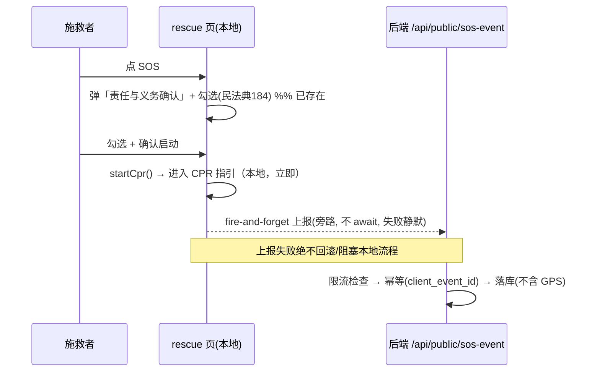

# PRD：SOS 服务端埋点（兑现「虚假呼救可追溯」）

> 路线图对应：`deliverables/software-company/product-backlog.md` **F3**（建议书 §10「反滥用机制」承诺未落地）
> 版本：v1.0 | 状态：**待主理人确认 D1/D2/D6 三项设计决策后开工** | 语言：中文
> 决策前提：用户 2026-09-13 拍板 **「补埋点」**（而非改建议书口径）

---

## 1. 项目信息

| 项 | 内容 |
|---|---|
| Project Name | `sos_telemetry` |
| 技术栈（现状，不改） | 后端 Express + better-sqlite3 + TS；前端 uni-app H5 |
| 需求复述 | 在**不扩大隐私采集面**的前提下，让 SOS 触发在**服务端**留下最小可追溯记录，使建议书 §10「恶意虚假呼救可追溯」成立 |

### 1.1 现状调研结论（基于真实代码，非假设）

**✅ 已具备（重要：本 PRD 的缺口比最初以为的小）**
- **「二次确认」已经实现** —— `pages/rescue/index.vue:201-220`：`BottomSheet` 标题「⚠️ 责任与义务确认」，
  内含勾选「我已阅读并理解《善意救助免责声明》（《民法典》第 184 条）」，按钮「确认启动 CPR」。
  **且有守卫**：`startCpr()` 首行 `if (!confirmed.value) return`（`:289`）⇒ 未勾选无法进入。
- **演习/真实已区分** —— `isDrill = page.options.mode === 'drill'`（`:236`）；演习下 `call120()` 只弹 toast
  而**不真拨号**（`:296`）。
- **免责与法律文案已就位**（民法典 184 条）。

**❌ 缺口（本 PRD 要解决的唯一问题）**
- **SOS 全链路零服务端调用** —— `pages/rescue/index.vue:225-231` 的 import 列表**只有组件与 utils，无任何 `@/api`**；
  拨号用 `uni.makePhoneCall({ phoneNumber: '120' })`（`:298`，**本机拨号**）
  ⇒ **服务端没有任何 SOS 记录**，「可追溯」无从谈起。

### 1.2 ⚠️ 必须先解决的「三处口径不一致」（本 PRD 的核心价值）

| # | 出处 | 原话 / 事实 |
|---|---|---|
| 1 | **UI 对用户的承诺** | `rescue/index.vue:212`：「系统将自动呼叫 120、通知附近志愿者、**记录您的 GPS 位置**」 |
| 2 | **建议书 §10 的对外承诺** | 「用户位置数据**仅在活跃任务期间使用，任务结束后自动删除**，不进行跨任务位置追踪」 |
| 3 | **代码事实** | **什么都没记录**（无 API 调用） |

⇒ 三者互不自洽：**UI 告诉用户"会记录 GPS"，建议书承诺"用完即删"，而代码根本没记**。
**本 PRD 必须在 D1 中给出统一口径**，否则无论补不补埋点，这都是一处对用户/对政府的失实陈述。

---

## 2. 产品定义

### 2.1 产品目标
让「恶意虚假呼救」在服务端**有据可查**（建议书 §10），且**不新增**位置类敏感采集。

### 2.2 用户故事
- 作为**平台运营/政府监管方**，我希望在收到滥用举报时能查明"该账号在某时刻触发过真实 SOS 多少次"，以便依规处置。
- 作为**施救者**，我希望上报**完全不影响**我的急救操作（弱网/离线也必须照常工作）。
- 作为**隐私敏感用户**，我希望系统**不要**记录我的精确位置。

### 2.3 关键约束（安全/合规优先于便利）
> ⚠️ 急救场景下，**每延误 1 分钟存活率下降约 7–10%**（建议书 §02）。任何为埋点而增加的**交互摩擦**都是在拿命换合规。
> ⇒ **埋点必须是旁路，绝不可挡在流程上。**

---

## 3. ⚠️ 关键设计决策（我已按下表设计，**请确认**）

| # | 决策 | 我的设计 | 理由 |
|---|---|---|---|
| **D1** | **只采「事件」，不采「位置」** | 落库仅：`id / user_id(可空) / created_at / is_drill / client_platform / client_event_id`。**不落 GPS** | 可追溯需要的是**身份+时间**，不是位置。位置是唯一的敏感项，且建议书写明"用完即删"——**保留它反而制造不一致** |
| **D2** | **匿名也能呼救**（`user_id` 必须可空） | 建议书 §04 原文：「任何人…可一键触发 SOS…**无需注册**」 | ⇒ 追溯能力对匿名触发**天然有限**。**必须同步修正 UI 与建议书口径**，不能宣称"可追溯至账号实名"却允许匿名 |
| **D3** | **不动"二次确认"行为** | **已实现，不加也不减** | 见 §2.3 约束。埋点只做**触发时的旁路上报** |
| **D4** | **上报尽力而为、绝不阻塞** | fire-and-forget；失败**静默**；**不弹错、不改跳转、不做本地排队补传** | SOS 常发生在**离线/弱网**；且"补传"会把时间/位置长期留在设备上，违背最小化 |
| **D5** | **匿名端点必须限流** | 按 IP 小时限流（沿用本项目既有反滥用模式，拒绝早于写库） | 否则埋点端点自身成为灌水/放大面 |
| **D6** | **保留期**：建议 **90 天**后自动清理 | 需一个清理动作（**待确认**：纯 CLI 手工，还是启动时惰性清理） | 兼顾"可追溯"与 PIPL「最小必要 / 存储期限最短」 |

> **D2 的连带动作（重要）**：`rescue/index.vue:212` 的 UI 文案与建议书 §10 的措辞**都要改**，
> 使三处口径统一。**建议统一为**：「本次救援会记录**触发时间与账号**用于反滥用；**不记录精确位置**。」

---

## 4. 需求池

### P0（本次 MVP 必做）
1. **后端**：新增 `sos_events` 表 + `POST /api/public/sos-event`（匿名可调）+ 按 IP 限流 + `is_drill` 与真实计数**分离**。
2. **前端**：在**确认启动**（`startCpr()` 进入 `cpr` 分支）处 fire-and-forget 上报一次；`client_event_id` 保证幂等。
3. **文案对齐**：修正 `rescue/index.vue:212` 与建议书 §10（见 D2）。
4. **管理侧**：最小只读查询——按 `user_id` / 时间段统计真实（`is_drill=0`）触发次数。
   （**建议**：先做成运维 CLI，**不新增 HTTP 端点**，与本项目「管理面不开接口」的既有取向一致；若政府侧需要，再议看板。）

### P1
5. 保留期清理动作（D6）。
6. 看板字段：真实 SOS 触发数纳入既有 `/api/admin/dashboard`（与「责任人触达」并列）。

### P2（Nice to have）
7. 异常模式提示（同一账号高频触发 → 只**提示**给管理员，**不自动处置**）。
8. 与举报流程打通（人工处置留痕）。

---

## 5. KPI（必须可测量）

| 指标 | 口径 |
|---|---|
| 真实 SOS 上报成功率 | 服务端收到的事件数 / 前端发出的请求数（**两者都要记，否则无法区分"没上报"与"没人触发"**） |
| 上报对急救流程的影响 | **必须为 0**：上报失败时流程跳转**不变**（以测试断言） |
| 演习污染率 | `is_drill=1` 计入真实统计的条数，**必须恒为 0** |

---

## 6. 关键待确认问题

1. **D1**：确认"不采位置"（我建议不采）。若你要求采，则**必须先定保留与删除机制**，否则与建议书 §10 冲突。
2. **D2**：确认"匿名可呼救 + 追溯能力有限"这一表述，并接受**同时修改 UI 文案与建议书**。
3. **D6**：保留期 90 天是否可接受？清理走 CLI 还是惰性？
4. 管理侧查询：**CLI 优先**（不开 HTTP 端点）是否可以？

---

## 7. 主流程（Mermaid）

---

## 8. MVP 边界声明

- ❌ **不做**：实时位置追踪、告警派发（任务/志愿者系统已具备）、音视频留存、实名认证、自动处置滥用。
- ❌ **不做**：离线补传（见 D4 理由）。
- 🔒 **契约约束**：`is_drill` 字段**必须**存在，且统计口径默认排除演习 —— 否则演习会污染反滥用判定。
- ⚠️ **文案一致性**：本项落地时**必须同步**改建议书与 UI 文案（D2），否则问题只解决了一半。
