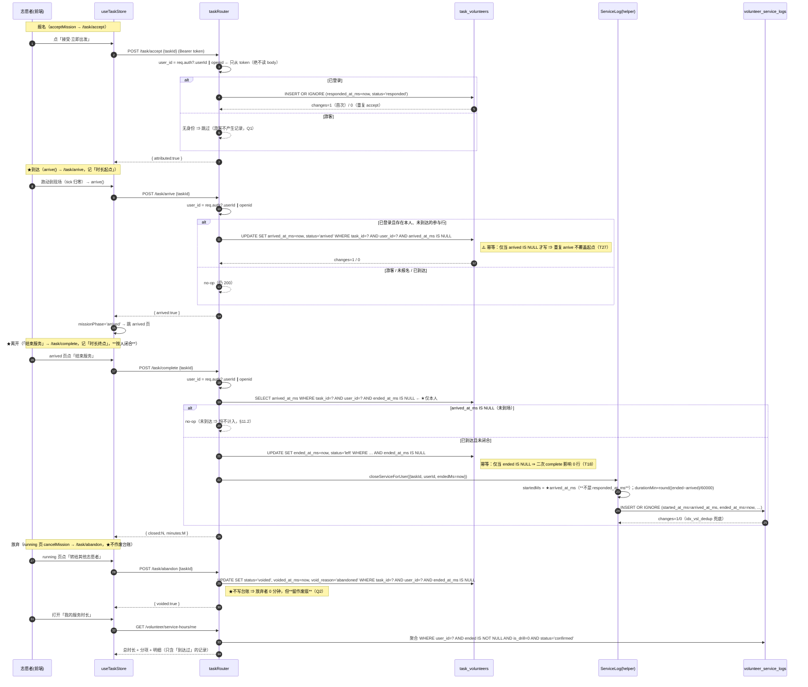
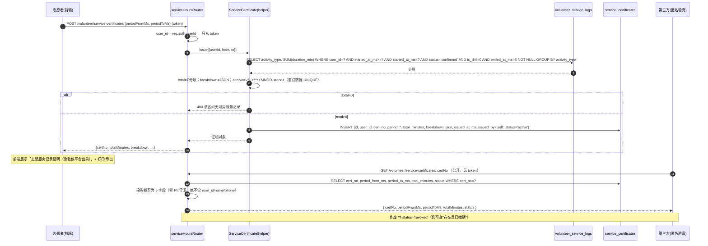
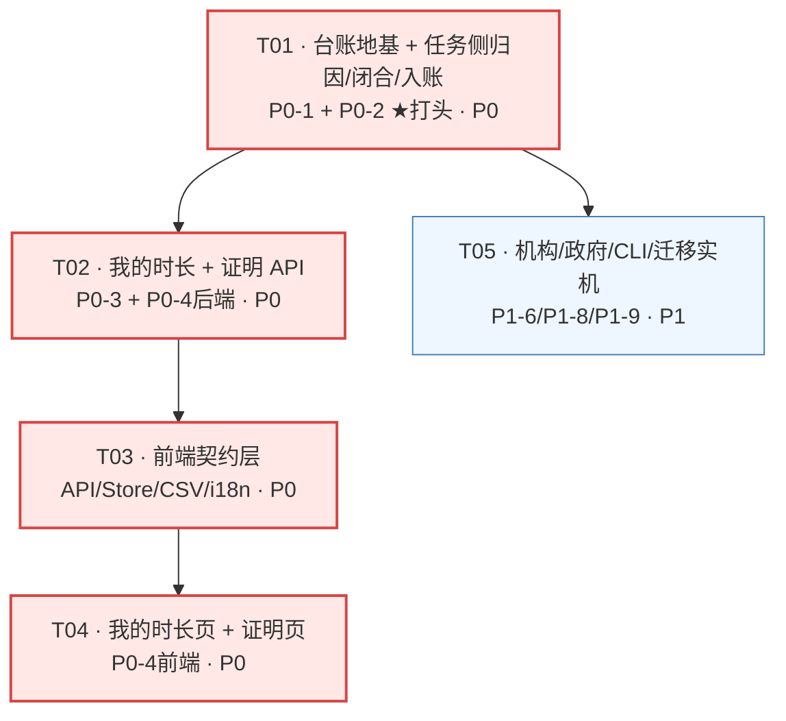
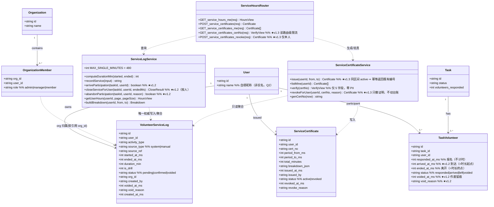

# 设计：志愿服务时长台账 + 志愿服务记录证明（F4）

> 上游：`volunteer-service-hours-prd.md`（v1.0，F4）
> 版本：**v1.3** ｜ 状态：设计定稿（§10 八条已全决；§11 v1.2/v1.3 修正已拍板），待实现 ｜ 语言：中文
> 本文**只写 PRD 没定的东西**（架构、表结构、端点契约、调用流程、任务顺序、测试计划）。
> 组织风格沿用同项目 `i18n-emergency-flow-design.md`（实测修正优先 + 代码取证 + 突变承重性）。
> ⚠️ **v1.1 更正**：断链范围从「task 侧」扩为「**6 个写型接口零接线**」（§1.1）；动员/演习是「**整条链路未实现**」（§1.2）。
> ⚠️ **★ v1.2 更正（读 §11）**：时长区间 = **「到达 → 离开」**（赶路不计入）；`startedMs` 取 **`arrived_at_ms`**；放弃/退出 ⇒ **作废留痕、不入账**；`/complete` 改**按人闭合**。
> ⚠️ **★★ v1.3 更正（读 §11.9 / §11.10）**：① **作废证明 ≠ 作废服务** —— `revoke()` **只撤证明、台账不动**（采 **B**，保护权益），防重复改在**签发**时用 `idx_scert_active_dedup`；② **限流器只挂目标路由**（原 `app.use` 前缀挂载与"勿误伤 `/me`/`POST`"**自相矛盾**）。修订记录见**附录 C**。

---

## §0 已定前提（业务方拍板，本设计不再讨论）

| 决策 | 落地约束（本设计必须满足） |
|---|---|
| **Q1 国标口径** | 做**自有口径**，**不宣称合规**。任何 UI / CSV / PDF / 文案**不得出现**「符合国家标准 / 国标 / 官方 / 政府认可」字样 ⇒ 本设计**新增一条机器守卫**（§7 禁止措辞守卫）。P2-11 不做。 |
| **Q2 实名** | **不实名**，证明姓名取自 `users.name`（自填昵称）。UI 与导出物**必须明示**「平台出具，非实名认证，可采信度有限」。**不得新增姓名/证件号字段**。 |
| **D8 措辞** | 统一「**志愿服务记录证明（急救侠平台出具）**」落在：证明标题、CSV 表头/文件名旁注、PDF 版式、i18n 值。 |
| **开工顺序** | **P0-2 排最前**（任务列表 T01 即含 P0-2，见 §6）。 |

---

## §1 ⚠️ 对 PRD 的三处实测修正/补强（先读这节）

调研真实代码后，PRD 的事实基础基本成立，但有**三处需要修正/补强**，其中第 1 条**直接改变 P0-2 的范围与验收**，第 3 条**直接改变 P0 的范围叙述**。

### 1.1 🔴 修正（关键）：断链不是 1 个接口，是 **6 个写型接口零接线 + 动员/演习无前端入口**

PRD §1.1 缺口 2 只指出「`task.ts:44` 不记录是谁接受」。但 **team-lead 对 `src/api/**` 全部 68 个导出函数做了「HTTP 方法 × 生产调用点」普查**（排除 `__tests__`）后，范围要大得多：

**写型且生产零接线 = 6 个**：
| 接口 | 文件 | 后果 |
|---|---|---|
| `acceptTaskApi` / `completeTaskApi` | `api/task.ts:92-99` | **救援任务无法归因** ⇒ F4 主场景可归因率恒 0 |
| `awardPointsApi` | `api/user.ts` | 积分发放不落库（`stores/user.ts` 的 `awardPoints` 第二参数还被静默丢弃，见 `NEXT_STEPS.md:214`） |
| `createGovViewer` / `updateGovViewer` | `api/gov.ts` | 政府查看者管理无前端入口 |
| `updateProgress` | `api/learn.ts` | 课程进度不落库（与 `courses` 全局单行、不按人留痕一致） |

其余 30+ 写型函数接线正常（SOS 上报 / AED 管理 / 登录注册 / 证书签发等）。

**`task` 侧的逐层证据**：
| 层 | 现状 | 证据 |
|---|---|---|
| API 封装 | `acceptTaskApi` / `completeTaskApi` **存在** | `急救侠-uniapp/src/api/task.ts:92-99` |
| API 测试 | 有（断言 URL/入参） | `src/__tests__/api/task.test.ts:24-27` |
| **Store** | `acceptMission()` **纯本地状态**（`missionAccepted=true` + 计距），**不调 API** | `src/stores/task.ts:50-56` |
| **调用点** | `acceptTaskApi` 全仓**仅**出现在 `api/task.ts` + 测试 + 文档；**无任何页面/store 调用** | `grep -rn acceptTaskApi` = 3 处，全非调用点 |
| 页面 | 「接受·立即出发」→ `taskStore.acceptMission()`（本地） | `src/pages/mission/index.vue:59/189-194` |

⇒ **这是本项目那句教训的「另一半」**：F3 踩的是「模块测得很全，删掉页面里那一行**调用**仍全绿」（`sos-telemetry-design.md:291`）；
F4 这里更极端 —— **API 有、测试有、store 方法有，但 store 方法根本没调 API**。二者同源：**"封装存在" ≠ "被调用"**。

⇒ **结论（写进 P0-2 验收）**：P0-2 **必须同时接线前端调用点**（`stores/task.ts` 的 `acceptMission()` → `acceptTaskApi()`；结束/到达 → `completeTaskApi()`），否则「可归因率」这个 KPI 在主场景**仍恒为 0**，等于没做。
**该接线是 P0-2 的一部分，不是"顺手"**——本设计把它并入 T01，并配**调用点守卫**（§7）。

> ⚠️ 由此得一条本设计的**组织原则**：**凡"后端写了表"的功能，任务的验收必须是"端到端可归因"，而不是"接口 200"**。

### 1.2 🔴 修正（关键）：动员 / 演习**不是「有表缺闭合」，而是「整条链路未实现」**

team-lead 的复查把三条链路的真实完成度重新定了级。**准确措辞如下**（这是"事实"而非"设计参照"）：

| 场景 | schema 里的关系表 | 生产写入路径 | 前端入口 | 闭合时刻 | **真实结论** |
|---|---|---|---|---|---|
| **救援任务** `tasks` | ❌ 无（只有计数器） | ✅ `/task/accept`（但**前端不调**，§1.1） | ⚠️ 有页面但**只改本地 state** | ❌ | 后端有、前端断线；**P0-2 要补的就是它** |
| **急救动员** `mobilization_volunteers` | ✅ 有（`db.ts:399-409`） | ❌ **无生产调用**（`POST /mobilizations/:id/respond` 未被前端调用；且 `src/api/` **无 mobilization 能力函数**） | ❌ **无** | ❌ | **整条链路未实现**（表里几行是 seed 数据） |
| **演习** `drill_participants` | ✅ 有（`db.ts:309-319`） | ❌ **无生产调用**（前端不调 `/drill/events/:id/join`；`src/api/` **无 drill 能力函数**） | ⚠️ 有 `pages/drill/index.vue` 但只创建/展示，不报名 | ❌（`attended` 由 `/complete` 回写，但该端点亦无前端调用） | **整条链路未实现**（表里几行是 seed 数据） |

> 🔎 **取证**：`src/api/` 内搜 `mobilization|drill`，**只命中** `sos.ts` 的 `isDrill`、`push.ts` 的 `drillReminder` 模板、`learn.ts` 的文案 ⇒ **根本没有动员/演习的能力函数**。

⇒ **两条纪律**：
1. `drill_participants.attended`（「报名 → 出席回写」）仍是**好的设计参照**（`task_volunteers` 照它抄），但**绝不能当作"线上已有的事实"**来描述——它只是一个**形状正确、接线为零**的 schema 先例。
2. 因此 **P1-10（动员/演习闭合回写）的前提缺失**：那两条链路**连入口都不存在**，回写无从挂载。**不得塞进 F4**；若政府侧要求演习服务可见，须**先立「动员/演习响应链路」独立立项**（见 §2.4 / §10-Q8）。

> ⚠️ **由此再次印证 §1.1 的组织原则**：本项目当前**真正"端到端跑通并可归因"的写型链路，比它的接口数量所暗示的少得多**。验收必须以"用户动作 ⇒ 库中出数据"为准。

### 1.3 ✅ 修正（少做）：时间字段口径有**现成的最新先例**，不必二选一

PRD §5.1 提示「既有表时间字段混用 TEXT / 毫秒整数」。实测**最新的一张表已给出权威口径**：

| 先例 | 时间列 | 理由（原文见 `db.ts:781-783`） |
|---|---|---|
| `sos_events`（迁移 040，`db.ts:788-800`） | `created_at_ms INTEGER NOT NULL`（**范围查询唯一依据**）+ `created_at TEXT`（**仅供人读**） | `strftime('%s', created_at)` 对 `'T...Z'` / `' +08:00 '` 一律按 UTC 解析且忽略时区后缀 ⇒ **本项目已因此出过一次事故**（`signatureKeepAlive.ts`） |

⇒ F4 新增字段**一律用毫秒整数**（`*_at_ms`）。**但**：团队要求「同一张表不混两种口径」⇒ 新表**连 `created_at TEXT` 也省掉**（人读渲染一律放展示/导出层，`govExport.ts` 已是这么做的）。**取值算口径**（`period_from/to`、`duration`）与**范围查询**都只碰 `_ms`。

---

## §2 范围终稿

### 2.1 P0（本次 MVP，全部落地）

| 条目 | 落点 |
|---|---|
| **P0-1 台账（数据层）** | 新表 `volunteer_service_logs`（§4.1） |
| **P0-2 归因 + 闭合（任务侧，**打头**）** | 新表 `task_volunteers`（照 `drill_participants` 抄）+ `task.ts` 改写 + **前端调用点接线**（§1.1） |
| **P0-3 我的时长** | `GET /api/volunteer/service-hours/me` + 前端「我的服务时长」页 |
| **P0-4 证明生成 + 编号验真** | 新表 `service_certificates` + `POST/GET` + 公开验真端点 + 前端证明页 |
| **P0-5 CSV 导出** | `utils/serviceExport.ts`（复用 `govExport.ts` 的 BOM / `\r\n` / `sanitizeCell→csvEscape`） |

### 2.2 P1（概要，不在本次展开设计）

| 条目 | 一句话落点 |
|---|---|
| P1-6 机构侧汇总 | `GET /api/org/:id/service-hours`（`organization_members` JOIN；仅本机构成员） |
| P1-7 人工登记/审核 | `POST /api/volunteer/service-logs`（`source_type='manual'`、默认 `pending`） |
| P1-8 政府看板聚合 | `/api/gov/dashboard` 追加 `serviceHours`（零 PII） |
| P1-9 保留期清理 CLI | `npm run service:purge`（默认**不删证明**，台账长期保留） |
| **P1-10 动员/演习闭合回写（新增）** | 把「闭合→台账」helper 复用到 `mobilization_volunteers` / `drill_participants`（见 §3.3 说明）。⚠️ **前提缺失**：这两条链路**无前端入口**（§1.2）⇒ 须先立「动员/演习响应链路」独立立项，**回写随该立项落地**，不并入 F4 |

### 2.3 P2（不做）：政府平台同步（P2-10）/ 国标对齐（P2-11）/ 真实二维码 PDF（P2-12）。

### 2.4 ★ P0 阶段「可信时长来源」实际只有一个：**救援任务**

由 §1.1 / §1.2 可推出一条**必须在文档里写明、且会影响验收与 UI** 的事实：

> **在 P0 阶段，唯一"端到端跑通并可归因"的自动时长来源是「救援任务」**（`activity_type='rescue_task'`）。
> 动员 / 演习 / 培训 / AED 巡检**全部没有前端入口**（`src/api/` 无对应能力函数），故**不会产生自动台账行**。
> `manual`（人工登记，P1-7）是唯一另一来源，且默认 `pending`、不自动计入证明。

**对 KPI 的影响**（写进 §7）：
- 「可归因率」在 P0 的分母**只能是救援任务**；用"全部服务参与"作分母会得到一个恒被 0 除或无意义的数。**KPI 口径必须收窄到「救援任务场景内」**，并在报表里注明。
- 「未闭合率」「演习污染率」在 P0 分别是：(a) 救援任务内的未闭合占比；(b) **仅来自 `manual` 或测试直接插入**的 `is_drill=1` 行 —— 属**防御性**不变量，不是主路径（§3.4 已注明）。

**对「我的时长」页展示的影响**（写进 T04 验收）：
- 页面的**分项区在当前数据下只会出现 1 种 `activity_type`** ⇒ **不得写死"多分项"的布局假设**（如固定三列/固定图标映射），要以**数据驱动**渲染（有多少枚举值就渲染多少个），否则 P1-10 上线时会变形。
- 空态必须是**明确文案**（"暂无服务记录"）而非空白或 0 兜底 —— 与 gov 看板「冷启动不显示 0」同一取向（`NEXT_STEPS.md:556`）。

---

## §3 实现方案与技术选型

### 3.1 技术选型：**不加任何新依赖**（默认结论）

| 需求 | 方案 | 理由 |
|---|---|---|
| 时长台账 / 证明 | **better-sqlite3 同步 API**（`db.prepare(...).run/get/all`） | 与既有栈一致；同步 API 无并发竞态面 |
| 编号唯一/验真 | 手写 `cert_no`（纯 JS 生成）+ `UNIQUE` 索引 | 不引 uuid 库；主键后缀照 `push.ts:44` |
| CSV | **手写**，`import { sanitizeCell, csvEscape } from '@/utils/govExport'` | PRD D9 / P2-8 同一取舍；**复用**而非复制（顺序对调是安全点，见 §7 M-CSV2） |
| PDF | H5 `window.print()`，非 H5 退化为 `uni.showToast` | 同 `printGovDashboard()`（`govExport.ts:190-197`） |
| 迁移 | 既有 `initDb()` 内 `migrations[]` runner | 硬约束 #9；见 §4.4 |
| 运维统计/清理 | CLI（`src/scripts/*.ts`），**不开 HTTP** | 同 `sos-report.ts` / `sos-purge.ts` |

### 3.2 架构模式：**「唯一权威口径 + 关系表分离」**

```
                   ┌──────────────────────────────┐
  任务/动员/演习  → │ 关系表（谁参与、何时开、何时闭）│
  （事件域）       │ task_volunteers / drill_...   │
                   └───────────────┬──────────────┘
                                   │ 闭合时刻（complete）触发单一 helper
                                   ▼
                   ┌──────────────────────────────┐
                   │ volunteer_service_logs（台账）│  ← 唯一权威口径
                   │ 所有展示 / 证明 / 导出 只读它  │
                   └───────────────┬──────────────┘
            ┌──────────────────────┼───────────────────────┐
            ▼                      ▼                        ▼
      GET …/service-hours/me   POST …/service-certificates   gov 聚合（零 PII）
```

**分层职责**（松耦合、各司其职）：
1. **关系表（事件域）**：回答「谁、参与了哪个事件、开/闭时刻」。**不做**时长聚合。
2. **台账（权益域）**：**唯一权威口径**。回答「某人某段时间的服务时长」。所有下游只读它。
3. **派生视图**：`me` / 证明 / 机构 / 政府聚合 —— **只读台账**，各自过滤。

### 3.3 ★ 决策：`tasks` 侧选 **(a) 新表 `task_volunteers`**（PRD Q3）

**选 (a)。理由（三条，均为"选 (b) 会立刻坏"）：**

1. **职责不得塌缩（唯一权威口径）**：PRD D1/§5.1 已把台账定义为**唯一权威口径**且**长期保留（权益凭证，D7）**。
   而「accept」是**意向**、不是**已发生服务**。若 (b) 在 accept 直写台账，则**台账会在服务尚未发生时就落一行**，且该行的 `started_at_ms` 一列同时承担「报名时刻」与「服务开始时刻」两种语义 ⇒ 与 `end` 一列一样被迫承载双职责，**为「口径污染」埋雷**（正是本项目 F3 `is_drill` 污染统计的同类教训）。
2. **(b) 使既有计数器不一致可见化**：`/accept` 现在是 `volunteers_responded = volunteers_responded + 1`（`task.ts:44`），**本就不幂等**（重复 accept 反复 +1）。若 (b) 再往里直写台账、且台账靠部分唯一索引去重，则**同一动作产生两种结果**：计数器 +N，台账 1 行 ⇒ 数据自相矛盾、且**两个"真值"**。选 (a) 把「去重」放在**有明确 UNIQUE 约束**的关系表上，语义干净。
3. **既有 schema 先例已存在两张同形表**：`drill_participants`（`db.ts:309-319`，唯一 `event_id,user_id`）与 `mobilization_volunteers`（`db.ts:399-409`，唯一 `mobilization_id,user_id`）。**第三张同形表是最可复现、最可评审的路径**，不是新发明。`drill_participants` 还带 `attended` 闭合标记，形状「最接近目标」。
   ⚠️ **但必须说清（§1.2）**：这两张表是**只有 schema、没有生产接线**的先例（`drill.ts` / `rescue.ts` 的写入代码存在，但前端无入口、无能力函数）⇒ 它们只当**形状参照**用，**不是"线上已有事实"**。`task_volunteers` 走 (a) 的价值在于**把这张正确的形状真正接上线**（配合 §1.1 的调用点接线）。

**为什么 (b) 不选**（除上述 1/2 外）：(b) 把「任务侧」的写入逻辑**硬编码进台账写路径** ⇒ 当 P1-10 要补动员/演习时，台账里会**混入三套链路各自的写入分支**，与「唯一权威口径」直接冲突（PRD Q3 已预警「三种口径」）。选 (a) 后，三条链路**只共用一个 helper**（§3.4），台账写路径**只有一条**。

**`task_volunteers` 的形状（照 `drill_participants` 抄，唯一差异：时间用 `_ms`）**：
`(id, task_id, user_id, responded_at_ms, ended_at_ms, status)`，`UNIQUE(task_id, user_id)`。
闭合时机**照 `drill.ts /complete`（`drill.ts:37-50`）**：`/complete` 时回写 `ended_at_ms` 并为每位参与者写台账 —— 与 drill 的「`attended=1` + 发积分 + 写 `training_records`」是**同一个时机点**。

### 3.4 三链路统一：**P0 只做任务侧，但抽出单一 helper**（回答 PRD Q3 的"要不要统一"）

- PRD Q3 问：要不要把「闭合时刻」统一补到**既有两张表**、并三链路复用？
- **本设计决定：P0-2 范围 = 任务侧（a）**（team-lead 明示「保持范围克制」），**但把「闭合 → 写台账」抽成单一模块** `services/serviceLog.ts`（`recordService()` / `closeService()`），**动员 / 演习的接线列为 P1-10**。
- 理由：① **两条链路连前端入口都不存在**（§1.2：`src/api/` 无 mobilization/drill 能力函数）⇒ 接线无从挂载，**须先立「动员/演习响应链路」独立立项**；② 动员**没有「完成」语义**（`emergency_mobilizations` 有 `complete`，但 `mobilization_volunteers` 无 `attended`）；③ 演习的闭合设计在 `attended` 上（只差 `ended_at_ms` 与时间列）；④ 若回填历史将**臆造时长**（Q4 明确不建议）；⑤ 一次性改三条链路会把 P0-2 变成"三处迁移 + 三处改写 + 三处接线"，违背景戒范围（team-lead 明示克制）。
- **由此产生的一个诚实的后果（与 §2.4 一致）**：P0 阶段唯一自动时长来源是**救援任务**；`is_drill=1` 的台账**只可能来自 `manual` 来源**（人工登记一场演习）或测试直接插入，不来自自动链路 ⇒ §7 的「演习污染率恒为 0」在 P0 是**防御性不变量**，到 P1-10 才成为主路径不变量。**已在 §7 注明，避免后人误判"没接线=没做"**。

### 3.5 时长算法（服务端算，硬约束 #2）

```ts
// 唯一实现，放 services/serviceLog.ts
export const MAX_SINGLE_MINUTES = 480               // D2 单次封顶
export function computeDurationMin(startedMs: number, endedMs: number | null): number | null {
  if (endedMs == null) return null                  // 未闭合 ⇒ 不计入
  const raw = Math.round((endedMs - startedMs) / 60000)
  return Math.max(0, raw)                           // 时钟回拨防御性归零
}
// 超过 MAX_SINGLE_MINUTES ⇒ duration_min 封顶为 480，且 status='pending'（需人工登记/确认，D2）
```
- **绝不读 `req.body.duration_min`**（硬约束 #2 / T3）。
- 封顶后置 `pending`：既满足 D2「超出需人工登记」，又让 §7 的 `T8`（pending 不进证明）成为**主路径**不变量。

> ★★ **v1.2 修正（关键，详见 §11）**：`startedMs` **必须取「到达现场」时刻 `arrived_at_ms`，不是 `responded_at_ms`（报名时刻）**。
> 用户 2026-09-17 拍板：**时长区间 = 到达现场 → 离开现场；赶路不计入**。`responded_at_ms` 仅是"报名"，**不参与计时**。
> `arrived_at_ms IS NULL`（未到场）⇒ **恒不计入**（在**写入层**保证：未到达就不写台账行）。
> ⚠️ **v1.0 的实现缺陷正是这一行**：`closeService()` 取了 `responded_at_ms` ⇒ 时长 = 报名→闭合，**可刷且语义倒置**（§11.1）。

---

## §4 数据结构与接口

### 4.1 新增表 DDL（canonical schema 与 `migrations[]` **逐字一致**）

> 时间列**一律 `_ms INTEGER`**（§1.3）；主键带随机后缀（硬约束 #5）；**无任何经纬度/位置列**（硬约束 #7 / T12）。

```sql
-- 表 1：台账（唯一权威口径）
CREATE TABLE IF NOT EXISTS volunteer_service_logs (
  id             TEXT PRIMARY KEY,
  user_id        TEXT NOT NULL,                 -- 只来自 token；FK users(id)
  activity_type  TEXT NOT NULL,                 -- rescue_task|drill|training|aed_checkin|manual
  source_type    TEXT NOT NULL DEFAULT 'system',-- system|manual
  source_ref     TEXT NOT NULL DEFAULT '',      -- 关联事件 id；manual 为空
  started_at_ms  INTEGER NOT NULL,
  ended_at_ms    INTEGER,                       -- NULL = 未闭合，不计入时长
  duration_min   INTEGER,                       -- 服务端算；ended 为空时 NULL
  is_drill       INTEGER NOT NULL DEFAULT 0,    -- 演习/真实分离（D4）
  status         TEXT NOT NULL DEFAULT 'pending',-- pending|confirmed|voided
  org_id         TEXT NOT NULL DEFAULT '',      -- 机构归属快照（可空）
  created_by     TEXT NOT NULL DEFAULT '',      -- 人工登记的登记人（留痕）
  voided_at_ms   INTEGER,
  void_reason    TEXT NOT NULL DEFAULT '',      -- 作废留痕（软删，硬约束 #6）
  created_at_ms  INTEGER NOT NULL,
  FOREIGN KEY (user_id) REFERENCES users(id)
);
CREATE INDEX IF NOT EXISTS idx_vsl_user_time ON volunteer_service_logs(user_id, started_at_ms);
CREATE INDEX IF NOT EXISTS idx_vsl_type      ON volunteer_service_logs(activity_type, started_at_ms);
CREATE INDEX IF NOT EXISTS idx_vsl_status    ON volunteer_service_logs(status);
-- 幂等：系统来源 + 有 source_ref 时，(来源,事件,人) 唯一（硬约束 #4）
CREATE UNIQUE INDEX IF NOT EXISTS idx_vsl_dedup
  ON volunteer_service_logs(source_type, source_ref, user_id) WHERE source_ref <> '';

-- 表 2：证明发放记录
CREATE TABLE IF NOT EXISTS service_certificates (
  id             TEXT PRIMARY KEY,
  user_id        TEXT NOT NULL,                 -- FK users(id)
  cert_no        TEXT NOT NULL,                 -- 唯一可查，如 VS-20260917-A7F3K2
  period_from_ms INTEGER NOT NULL,
  period_to_ms   INTEGER NOT NULL,
  total_minutes  INTEGER NOT NULL,              -- 只含 is_drill=0 且 status='confirmed' 且 ended 非空
  breakdown_json TEXT NOT NULL DEFAULT '{}',    -- 按 activity_type 分解
  issued_at_ms   INTEGER NOT NULL,
  issued_by      TEXT NOT NULL DEFAULT 'self',  -- self|org_admin
  status         TEXT NOT NULL DEFAULT 'active',-- active|revoked
  revoked_at_ms  INTEGER,
  revoke_reason  TEXT NOT NULL DEFAULT '',
  FOREIGN KEY (user_id) REFERENCES users(id)
);
CREATE UNIQUE INDEX IF NOT EXISTS idx_scert_no ON service_certificates(cert_no);
CREATE INDEX IF NOT EXISTS idx_scert_user ON service_certificates(user_id, issued_at_ms DESC);
-- ★ v1.3 防重复签发：同人 + 同区间，最多**一个** active 证明（部分唯一索引，形状同 idx_vsl_dedup）。
-- 作废（status→'revoked'）后该行离开索引 ⇒ 允许对同区间**重新**签发（新编号）。见 §11.9。
CREATE UNIQUE INDEX IF NOT EXISTS idx_scert_active_dedup
  ON service_certificates(user_id, period_from_ms, period_to_ms) WHERE status = 'active';

-- 表 3（Q3 选 a）：任务参与关系（照 drill_participants）
-- ★ v1.2：区分三个时刻 —— 报名 responded_at_ms / 到达 arrived_at_ms / 离开 ended_at_ms
CREATE TABLE IF NOT EXISTS task_volunteers (
  id               TEXT PRIMARY KEY,
  task_id          TEXT NOT NULL,               -- FK tasks(id)
  user_id          TEXT NOT NULL,               -- FK users(id)
  responded_at_ms  INTEGER NOT NULL,            -- 报名（**不计时**）
  arrived_at_ms    INTEGER,                     -- ★ 到达现场（= 时长**起点**）；NULL = 未到场
  ended_at_ms      INTEGER,                     -- 离开现场（= 时长**终点**）
  status           TEXT NOT NULL DEFAULT 'responded', -- responded|arrived|left|voided
  voided_at_ms     INTEGER,                     -- ★ 作废留痕（放弃/中途退出）
  void_reason      TEXT NOT NULL DEFAULT '',    -- ★
  FOREIGN KEY (task_id) REFERENCES tasks(id),
  FOREIGN KEY (user_id) REFERENCES users(id),
  UNIQUE(task_id, user_id)
);
CREATE INDEX IF NOT EXISTS idx_tv_task ON task_volunteers(task_id);
```
> ★ **v1.2 表变更**：`task_volunteers` 新增 `arrived_at_ms` / `voided_at_ms` / `void_reason`，`status` 取值扩为
> `responded | arrived | left | voided`。**走迁移 044**（3 条 `ALTER TABLE ... ADD COLUMN`，照迁移 038 的幂等写法；
> 全新库因 canonical 已含这些列而 skipped）。**不改** `volunteer_service_logs` / `service_certificates` 结构。

- **不加** `users.service_hours` / `volunteers.*` 冗余列（PRD §5.1 显式声明）：时长**一律从台账实时聚合**，杜绝双真值。`volunteers` 是**死表**（`seed.ts:135` 才写，与登录用户双轨）⇒ 时长**必须**挂 `users.id`。
- **不新增** `users` 姓名/证件号列（Q2 / 硬约束）。

### 4.2 与既有表的关联

| 关联 | 键 | 用途 | 说明 |
|---|---|---|---|
| `volunteer_service_logs.user_id` → `users.id` | FK | 身份 | 只从 token 派生（硬约束 #1） |
| `volunteer_service_logs.org_id` → `organizations.id` | 软引用（**不加 FK**） | 机构归属快照 | 与 `aed_devices.district` 等既有"软列"惯例一致；不设 FK 以免机构解散后历史台账被级联约束 |
| `task_volunteers.task_id` → `tasks.id`；`.user_id` → `users.id` | FK | 归因 | 照 `drill_participants` |
| `GET /api/org/:id/service-hours` ↔ `organization_members` | JOIN | 机构隔离 | 复用既有表，**不新建** |
| `gov 聚合` ↔ `district`（`tasks.district`，迁移 034） | COALESCE 归一 | 区域维度 | 沿用 `gov.ts` 的 `DISTRICT_EXPR` |

### 4.3 API 端点契约（统一 `{code, data, message}`；`success()`/`error()`）

> **鉴权铁律（硬约束 #1）**：**所有新端点**身份 `user_id = req.auth.userId || req.auth.openid`；**绝不读 `req.body.userId`**。
> 既有 26 处 body 解构 / 6 处 query 取身份是**系统性问题、不在本次修复范围**，仅记账为独立技术债（§9）。

| # | 方法 | 路径 | 鉴权 | 入参 | 出参（`data`） | 状态码 |
|---|---|---|---|---|---|---|
| 1 | `GET` | `/api/volunteer/service-hours/me` | `authMiddleware` | query: `page?`,`pageSize?`,`activityType?` | `{ totalMinutes, breakdown:[{activityType,minutes,count}], items:[…], page, pageSize, total }` | 200 / **401** |
| 2 | `POST` | `/api/volunteer/service-certificates` | `authMiddleware` | body: `periodFromMs`,`periodToMs` | `{ certNo, periodFromMs, periodToMs, totalMinutes, breakdown, issuedAtMs, status }` | 200 / 400（区间非法/无数据） / 401 |
| 3 | `GET` | `/api/volunteer/service-certificates/me` | `authMiddleware` | — | `[{certNo,periodFromMs,periodToMs,totalMinutes,status,issuedAtMs}]` | 200 / 401 |
| 4 | `GET` | `/api/volunteer/service-certificates/:certNo` | **公开（无鉴权）** + **★该路由级中间件** `createHourlyIpLimiter('SERVICE_CERT_VERIFY_HOURLY_LIMIT', 60)`（Q7，见 §6-T02-3） | path | `{ certNo, periodFromMs, periodToMs, totalMinutes, status }` **仅此 5 字段** | 200 / 404 / **429** |
| 5 | `POST` | `/api/volunteer/service-logs`（P1-7） | `authMiddleware` | body: `activityType`,`startedAtMs`,`endedAtMs`,`orgId?`,`targetUserId?` | `{id,status}` | 200 / 401 / 403 |
| 6 | `GET` | `/api/org/:id/service-hours`（P1-6） | `authMiddleware` + 内联 admin/manager 校验 | query 同上 | 结构同 #1（**仅本机构成员**） | 200 / 401 / 403；跨机构 ⇒ **空集** |
| 7 | `GET` | `/api/gov/dashboard`（P1-8） | `govMiddleware`（既有） | — | 追加 `serviceHours:{ totalMinutes, participantCount, byActivityType:[…] }` | 200 |
| 8 | `POST` | `/api/task/accept`（**改写**） | **`optionalAuth`**（见 §10-Q1） | body: `taskId` | `{ attributed:boolean }` | 200 |
| 9 | `POST` | **`/api/task/arrive`**（**v1.2 新增**，§11.4） | **`optionalAuth`** | body: `taskId` | `{ arrived:boolean }` | 200 |
| 10 | `POST` | `/api/task/complete`（**v1.2 改为「按人闭合」**，§11.4） | **`optionalAuth`** | body: `taskId` | `{ closed:number, minutes:number }` | 200 |
| 11 | `POST` | **`/api/task/abandon`**（**v1.2 新增**，§11.4） | **`optionalAuth`** | body: `taskId`, `reason?` | `{ voided:boolean }` | 200 |
| 12 | `POST` | **`/api/volunteer/service-certificates/:certNo/revoke`**（**v1.3 新增**，**仅本人自撤**） | `authMiddleware` | body: `reason?` | `{ certNo, status:'revoked' }` | 200 / 401 / **403（非本人）** / 404 |
| CLI | `npm run service:report` / `service:purge` | 运维 | **不开 HTTP** | `--days`/`--dry-run` | 见 §5.3 | exit 0/1/2 |

**验收锚点**：
- #1 **无 token ⇒ 401**（T1）；A **绝不**读到 B 的条目（T10，`user_id` 恒来自 token）。
- #1 的 `breakdown` 之和 **恒等于** `totalMinutes`（T5）；P0 阶段分项**实际只有 `rescue_task`**（§2.4）—— 断言须**数据驱动**，不得写死"恰好 N 个分项"。
- #2 **同区间重复签发 ⇒ 幂等返回既有 `active` 编号**（★ v1.3 **修订原 P0-4①**，见 §11.9）；**作废后**再开 ⇒ **新编号、同 `totalMinutes`**。
- #4 **零 PII**：响应体**不含** `user_id`/`name`/`phone`/`userId`（T15，深扫断言，照 `role-split.test.ts`）。
- #4 **限流**（Q7）：**只作用于该条路由**（`router.get('/:certNo', verifyLimiter, handler)`）；超阈值 ⇒ **429**；`/me` 与 `POST` **不受**该限流器影响（T25）。限流器须在测试中 `force=true` 注入验证（照 `createSmsReportLimiter(force)` 先例）。
- #4 作废后 ⇒ `status: 'revoked'`（T9）；★ **台账完全不受影响**（v1.3 语义 B，见 §11.9）：该区间 minutes **仍可被后续新证明统计**，原台账行仍在。
- #12 **仅本人可撤**（`user_id` 来自 token）；撤他人 ⇒ **403**；撤销**不动台账**（§11.9）。
- #8~#11 **游客不产生时长记录**（Q1，§10）：无 token 调 accept/arrive/complete/abandon ⇒ **无参与行、无台账行**，**仍返回 200**（不 401）。⚠️ 这是**约束的结果、不是缺陷**（不登录就没有 `user_id`，物理上无法归因）——**不得**据此改 `authMiddleware`，也不得录为 bug。

### 4.4 迁移通道（硬约束 #9，严格走既有 runner）

| 项 | 结论 | 依据 |
|---|---|---|
| Runner | `initDb()` 内 `migrations[]`，**启动时执行**，登记 `_migrations` | `db.ts:820-1011` |
| 通道 | **canonical schema（新库）+ `migrations[]`（既有库）双写**，两处 DDL 逐字一致 | 同 `040`（`db.ts:967-984`） |
| 编号 | **041 `add_task_volunteers` / 042 `add_volunteer_service_logs` / 043 `add_service_certificates`**（接续当前最大 `040`）；**v1.2 追加 044 `add_task_arrival_void`**（给 `task_volunteers` 加 `arrived_at_ms`/`voided_at_ms`/`void_reason`）；**v1.3 追加 045 `add_service_cert_active_dedup`**（先**去重既有 active 重复**再建 `idx_scert_active_dedup`，见下） | `db.ts:968` |
| ⚠️ **045 必须先去重再建唯一索引** | 旧行为**允许**同区间重复开证明 ⇒ 直接 `CREATE UNIQUE INDEX` 会因**既有重复**而**失败**。故 045 的 `sql` 须**先**执行一条一次性 `UPDATE ... SET status='revoked'`（对同 `(user_id, period_from, period_to)` 的多条 active，**保留 `issued_at_ms` 最早的一条**，其余作废），**再**建唯一索引。**全库无重复时该 UPDATE 影响 0 行（幂等）** | 本设计（新） |
| ⚠️ **必须改 `clearAll()`** | 把 3 张新表加进 `db.ts:1061` 的 `DELETE` 清单，否则**测试隔离污染**（T17） | 硬约束 + PRD §5.2 |
| ⚠️ **必须实机验证升级路径** | 单测跑 `:memory:`，canonical 已建表 ⇒ 迁移**恒为 skipped，真实升级从未被验证**。须照 `NEXT_STEPS.md:609-621`：**复制真实库 → 剥离 041/042/043/044/045 产物 → 启真实服务 → 日志必须是 `Migration applied: 041/042/043/044/045`**（非 skipped）（T16，**在实机跑，`:memory:` 测不出**）。⚠️ 045 还需**专门构造"含重复 active 证明的旧库"**验证去重步骤真的清掉了重复（T32） |
| 回填 | **不做历史回填**（Q4 判定为臆造数据）⇒ `migrations[]` **无 `after` 回调** | Q4 |

---

## §5 程序调用流程

### 5.1 时序图 ①：救援任务「报名 → 到达 → 离开」→ 时长入账（★ v1.2 重画）

> ⚠️ **v1.2 关键更正**：v1.0 把「到达」与「结束」合成一个 `任务结束（到达/结束）` 动作 ⇒ **正是 §11.1 缺陷的源头**。
> 现**拆成两个独立动作**：`到达`（`/task/arrive`，记**时长起点**）与 `离开`（`/task/complete`，记**时长终点**）；**赶路不计入**。



### 5.2 时序图 ②：证明生成 → 编号验真（含零 PII 校验）



### 5.3 CLI 流程（P1，只读统计 + 保留期）

```
npm run service:report [--user <id>] [--days <N>]
  → 可归因率 / 未闭合率 / 演习污染率（三行并列，照 sos-report.ts 的"必然输出三行"纪律）
npm run service:purge [--days <N>] [--dry-run]
  → 默认不删任何东西（台账长期保留，D7）；证明记录永久保留；仅 --dry-run 报数 + 显式确认
  → ⚠️ 运维落点（systemd timer/crontab）在代码之外，登记为待办（同 sos-purge）
```

---

## §6 ★ 任务列表（有序 · 含依赖 · P0-2 打头）

> **任务上限 5**（硬性）。每条含「做什么 / 改哪些文件 / 验收标准 / 依赖」。
> **关于"第一个任务必须是基础设施"**：本仓库是**存量项目**，无新增配置/入口文件；故本设计的「地基」= **数据库迁移底座 + 共享模块 + 类型契约**（即 T01）。**不新增依赖**（§3.1）；`package.json` 脚本声明并入 T05。
> **P0-2 打头**：按业务方开工顺序，**归因留痕（P0-2）在最前**，与 P0-1（台账表）**合并进 T01**（team-lead：二者强耦合，分开必返工）。

---

### **T01 · 台账地基 + 任务侧归因/闭合/入账（P0-1 + P0-2，★打头）** — Priority **P0** · 依赖：无

- **做什么**：
  1. `db.ts`：新增 3 张表 canonical schema + 索引；`migrations[]` 追加 **041/042/043**（逐字一致）；**v1.2 追加迁移 044**（`task_volunteers` + `arrived_at_ms`/`voided_at_ms`/`void_reason`，见 §11.3）；`clearAll()` 补 3 表。
  2. `types/index.ts` / `types/rows.ts`：新增 `ActivityType` 枚举、台账/证明/参与 行类型与响应类型；**v1.2 扩 `TaskVolunteer.status` 为 `responded|arrived|left|voided`**；复用 `success()/error()`。
  3. `services/serviceLog.ts`：`recordService()` / `computeDurationMin()` / `MAX_SINGLE_MINUTES` / 聚合 helper（`getUserHours()`）；**v1.2**：把 **task-wide 的 `closeService()` 改为 `closeServiceForUser()`（按人闭合）**，并新增 `arriveParticipation()` / `abandonParticipation()`（§11.4）——**唯一权威实现**（供 T02/T05 复用）。
  4. `routes/task.ts`：`/accept`（`optionalAuth`，`INSERT OR IGNORE`）；**v1.2 新增 `/arrive`（记到达）**、`/complete`（改为**按人闭合**，`startedMs=arrived_at_ms`）、**`/abandon`（作废留痕、不写台账）**。⚠️ **`volunteers_responded` 的既有非幂等行为保持不变**（§10-Q2），但**必须加一条测试固定它**（见验收）。
  5. **前端调用点重映射（★ v1.2 核心，§11.5）**：`api/task.ts` 增 `arriveTaskApi` / `abandonTaskApi`；`stores/task.ts`：`acceptMission()`→`/accept`；**`arrive()`→`/arrive`（原错调 `/complete`）**；**新增 `endService()`→`/complete`**（供 arrived 页「结束服务」）；**新增 `abandonMission()`→`/abandon`**（供 running 页「放弃」）；`finishMission()` **降为纯本地重置（不再调任何 API）**；`declineMission()` 路径**不发请求**。
- **改文件**：`急救侠-server/src/db.ts`、`src/types/index.ts`、`src/types/rows.ts`、`src/services/serviceLog.ts`、`src/routes/task.ts`、`src/__tests__/task.test.ts`、`src/__tests__/service-hours.test.ts`、`急救侠-uniapp/src/api/task.ts`、`src/stores/task.ts`、`src/pages/mission/arrived.vue`（**含文案变更，见下**）、`src/pages/mission/running.vue`、`src/pages/mission/index.vue`、`src/__tests__/stores/task.test.ts`
- **验收标准**：
  - 同一用户对同一任务 accept 两次 ⇒ `task_volunteers` **仅 1 行**（T6 同类）。
  - **★ v1.2 时长口径**：`/complete` 后 `duration_min === round((arrived − responded?)…)` —— 准确说 **= round((`ended_at_ms` − `arrived_at_ms`)/60000)**，**与 `responded_at_ms` 无关**（T26）。传 `duration_min: 9999` 被忽略（T3）。
  - **★ v1.2 未到场恒不计入**：只在 `/accept`、未调 `/arrive` 就 `/complete` ⇒ **无台账行、0 分钟**（T26）。
  - **★ v1.2 幂等（到达）**：`/arrive` 重复调用 ⇒ `arrived_at_ms` **不被覆盖**（T27）。
  - **★ v1.2 放弃**：`/abandon` ⇒ 参与行 `status='voided'` + `void_reason` 非空 + `voided_at_ms` 非空，且**无台账行**（0 分钟）（T28）。
  - **★ v1.2 按人闭合（堵搭便车）**：A 已到达、B 仅报名；A `/complete` ⇒ **只有 A 入账**，B 仍 `arrived_at_ms IS NULL` 且**无台账**（T29）。
  - **★ v1.2 调用点守卫**（§11.5）：`arrived.vue`「结束服务」⇒ 调 `/complete`；`running.vue`「放弃」⇒ 调 `/abandon`；`stores.arrive()` ⇒ 调 `/arrive`。**各删对应调用行 ⇒ 精确变红**（T30）。
  - **游客不产生记录**（Q1）：无 token 调 accept/arrive/complete/abandon ⇒ 无参与行、无台账行，且**返回 200**（非 401）（T23）。
  - ⚠️ **`volunteers_responded` 既有行为固定测试**（Q2）：接线后该计数器**首次被真实调用**，其非幂等会实际暴露 ⇒ 必须有一条用例**断言其当前（非幂等）行为**并附可检索注释，防止后人误以为它可靠（T24）。
  - `PRAGMA table_info` 3 张表**均无**位置列（T12）；`clearAll()` 后 3 表为空（T17）。
  - ⚠️ **UI 文案变更（T01 附加项）**：`arrived.vue` 的「返回首页」改为语义明确的「**结束服务并返回**」（`running.vue`/`index.vue` 的「已转给其他志愿者」保持）。mission/* 页面**本就未本地化**（不在 `i18n-scope.ts` 的 `SCOPE_FILES`）⇒ 该文案**保持纯中文、不做 `t()`**，避免"半本地化"。**若日后再动此文案，须一并评估把 mission/* 纳入 i18n 范围。**
- **可并行**：否（T02/T05 皆依赖它）。

---

### **T02 · 我的时长 + 证明生成 + 编号验真（P0-3 + P0-4 后端）** — Priority **P0** · 依赖：T01

- **做什么**：
  1. `routes/serviceHours.ts`（**新**，挂 `/api/volunteer`）：
     - `GET /service-hours/me`（auth，分页 + 分项）。
     - `POST /service-certificates`（auth，选区间 → `certNo`/`total_minutes`/`breakdown`；**v1.3 幂等**：同人同区间已有 `active` 证明 ⇒ 返回既有编号）。
     - `GET /service-certificates/me`（auth，我的证明列表）。
     - `GET /service-certificates/:certNo`（**公开**，**仅 5 字段，零 PII**，**★该路由级限流**——Q7）。
     - **`POST /service-certificates/:certNo/revoke`**（auth，**仅本人**自撤；§11.9）。
  2. `services/serviceCertificate.ts`（**新**）：`issue()`（区间聚合 + `cert_no` 生成 + 撞库重试 + **同区间 `active` 幂等**）、`listMine()`、`verify()`（**投影裁剪为 5 字段**）、`revoke()`（★ **v1.3 只作废证明本身，绝不动台账** —— 见 §11.9）。
  3. **★ §6-T02-3（v1.3 重写 —— 原设计自相矛盾，见 §11.10）**：
     - **限流器作为该单条路由的中间件**，写在 router 里：`serviceHoursRouter.get('/service-certificates/:certNo', verifyLimiter, handler)`。**不再**用 `app.use('/api/volunteer/service-certificates', limiter)` 前缀挂载（`app.use(path,…)` 是**前缀匹配**，会连带命中 `/me` 与 `POST`；且依赖 `req.path` 相对路径语义，挂载点一变即静默失效）。
     - ⚠️ **循环导入陷阱**：`createHourlyIpLimiter` 目前**定义在 `app.ts`**（并被导出）。若 `routes/serviceHours.ts` 从 `app.ts` import 它，会形成 **`app.ts → routes/serviceHours.ts → app.ts` 循环依赖**（ESM 下可能拿到未初始化绑定 ⇒ 启动即崩，且堆栈指向无辜模块；同 F2 `tabbar-locale` 的 TDZ 教训，`i18n-emergency-flow-design.md` §15.1）。⇒ **把 `createHourlyIpLimiter`（连同 `createSmsReportLimiter` / `isTestMode`）抽到独立模块 `src/middleware/rateLimit.ts`**；`app.ts` 与 `routes/serviceHours.ts` **都从那里 import**。
     - `app.ts` 只需保留 `app.use('/api/volunteer', serviceHoursRouter)`（在既有 `volunteerRouter` 之后）。
  4. 测试：`__tests__/service-hours-api.test.ts`、`__tests__/service-certificates.test.ts`、`__tests__/service-cert-verify-rate-limit.test.ts`、`__tests__/service-cert-revoke.test.ts`。
- **改文件**：`src/routes/serviceHours.ts`(新)、`src/services/serviceCertificate.ts`(新)、**`src/middleware/rateLimit.ts`(新)**、`src/app.ts`、`src/db.ts`（迁移 045）、`src/__tests__/service-hours-api.test.ts`(新)、`src/__tests__/service-certificates.test.ts`(新)、`src/__tests__/service-cert-verify-rate-limit.test.ts`(新)、`src/__tests__/service-cert-revoke.test.ts`(新)
- **验收标准**：
  - 无 token ⇒ **401**（T1）；用户 A **绝不**读到 B 任一条（T10）。
  - 分项之和 **恒等于** 总时长（T5）；`pending` / `is_drill=1` / `ended IS NULL` **均不进**证明（T4/T7/T8）。
  - **同区间重复签发 ⇒ 幂等返回既有 `active` 编号**（★ v1.3 修订原 P0-4①；作废后再开 ⇒ 新编号、同 `totalMinutes`）（T33）。
  - 验真接口深扫**不含** `user_id`/`name`/`phone`（T15）。
  - ★ **作废证明只影响证明本身，台账不动**（T34）：撤一张覆盖 120h 的证明后，该 120h **仍能被后续新证明统计**；原台账行仍在。
  - **验真端点限流**（Q7）：**只作用于 `GET /:certNo`**；超阈值 ⇒ **429**；`/me` 与 `POST` **不受影响**（T25）。
  - ★ **本人自撤**：非本人撤 ⇒ **403**；撤他人证明不改任何台账（T35）。
- **可并行**：与 **T05** 并行（T05 只依赖 T01）。

---

### **T03 · 前端契约层：API + Store + CSV 导出 + i18n 键（P0-5 数据契约 + 消费层）** — Priority **P0** · 依赖：T02

- **做什么**：
  1. `api/serviceHours.ts`（**新**）：`getMyHours()` / `createCertificate()` / `listMyCertificates()` / `verifyCertificate()`（走既有 `request/requestFull`，`requestFull` 保 code 分支）。
  2. `stores/serviceHours.ts`（**新**）：Pinia store（`totalMinutes` / `breakdown` / `items` / `certificates` / `load*()` 显式记 error、不静默兜底——照 `stores/gov.ts` 范式）。
  3. `utils/serviceExport.ts`（**新**）：CSV 生成 + 文件名 `service-hours-YYYYMMDD.csv`；**`import { sanitizeCell, csvEscape } from '@/utils/govExport'`**（复用顺序，勿复制）；导出物含「志愿服务记录证明（急救侠平台出具）」标题行 + 「平台出具，非实名认证」声明行。
  4. `locales/zh-CN.ts` / `en-US.ts`：新增 `hours.*` / `serviceCert.*` 键（语义命名、整句、具名插值；`en-US` 必须 ⊇ `zh-CN`）。
  5. 测试：`__tests__/serviceExport.test.ts`（BOM / `\r\n` / 公式注入 / 数值不被清洗）。
- **改文件**：`急救侠-uniapp/src/api/serviceHours.ts`(新)、`src/stores/serviceHours.ts`(新)、`src/utils/serviceExport.ts`(新)、`src/locales/zh-CN.ts`、`src/locales/en-US.ts`、`src/__tests__/serviceExport.test.ts`(新)
- **验收标准**：CSV 首字符 `\uFEFF`、行尾 `\r\n`（T13）；姓名 `=1+1` 被前置 `'`、数值 `-1.5` **不被**清洗（T14）；导出**不含**禁用词（§7 禁止措辞守卫）。
- **可并行**：与 **T05** 并行。

---

### **T04 · 我的时长页 + 证明页 + 「我的」入口（P0-4 前端）** — Priority **P0** · 依赖：T03

- **做什么**：
  1. `pages/volunteer/hours.vue`（**新**）：「我的服务时长」——总时长 + 分项卡 + 明细列表（分页）+ 「生成证明」「导出 CSV」按钮（**调用点**）。
  2. `pages/volunteer/certificates.vue`（**新**）：证明列表 + 选区间生成 + H5 `window.print()`（非 H5 toast）+ **编号验真入口**。
  3. `pages/cert/index.vue`：在「我的」页加入口（「我的服务时长」/「我的服务证明」）——**不得放进 SOS 主流程**（F2 §6 硬契约）。
  4. `pages.json`：注册 2 个新页。
  5. i18n 守卫扩围：`__tests__/i18n-scope.ts` + `__tests__/i18n.test.ts` 的 `SCOPE_FILES` 加入 2 新页；新增 `__tests__/pages/hours-i18n.test.ts`（裸 CJK + en 渲染快照 + 内容完整性）。
- **改文件**：`src/pages/volunteer/hours.vue`(新)、`src/pages/volunteer/certificates.vue`(新)、`src/pages/cert/index.vue`、`src/pages.json`、`src/__tests__/i18n-scope.ts`、`src/__tests__/i18n.test.ts`、`src/__tests__/pages/hours-i18n.test.ts`(新)
- **验收标准**：新文案**零裸 CJK**（守卫）；**登录态 + 游客态两套夹具**（不渲染分支对守卫不可见）；**按钮调用点**有独立用例（删掉那一行 ⇒ 变红）；**措辞**仅「志愿服务记录证明（急救侠平台出具）」。
  - **分项区必须数据驱动**（§2.4）：P0 阶段实际只有 `rescue_task` 一种来源 ⇒ 布局**不得写死"多分项/固定列/固定图标映射"**，须按返回的 `breakdown` 长度渲染；空态为**明确文案**（"暂无服务记录"）而非空白或 0 兜底。
- **可并行**：否（依赖 T03）。

---

### **T05 · 机构/政府聚合 + CLI + 迁移实机验证（P1-6/P1-8/P1-9 + 收口）** — Priority **P1** · 依赖：T01

- **做什么**：
  1. `routes/org.ts`：`GET /:id/service-hours`（auth + 内联 admin/manager 校验；`organization_members` JOIN；跨机构 ⇒ **空集**）。
  2. `routes/gov.ts`：`/dashboard` 追加 `serviceHours`（**零 PII**；冷启动 ⇒ `null`，绝不 0 兜底）。
  3. `scripts/service-report.ts`（**新**）：可归因率 / 未闭合率 / 演习污染率（三行并列）。
  4. `scripts/service-purge.ts`（**新**）：`--days`/`--dry-run`，**默认不删证明**。
  5. `package.json`（server）：`service:report` / `service:purge` 脚本。
  6. `docs/DEPLOY.md`：登记 purge 定时器为运维待办（与 sos-purge 同性质）。
  7. 测试：`__tests__/service-hours-gov.test.ts`（机构隔离 T11 + gov 零 PII）。
- **改文件**：`src/routes/org.ts`、`src/routes/gov.ts`、`src/scripts/service-report.ts`(新)、`src/scripts/service-purge.ts`(新)、`package.json`、`docs/DEPLOY.md`、`src/__tests__/service-hours-gov.test.ts`(新)
- **验收标准**：非本机构成员**不出现**在机构汇总（T11）；gov 响应深扫**不含** `userId`/`name`；**迁移实机验证**：旧库启动日志 = `Migration applied: 041/042/043`（**非 skipped**，T16）。
- **可并行**：与 **T02 / T03** 并行。

---

### 任务依赖图



**并行安排**：T01 →（**T02 ∥ T05**）→ T03 → T04。
其中 **T05 只依赖 T01**，故可与 T02/T03 并行；**T04 必须等 T03**（页面依赖 store/导出）。

---

## §7 共享知识（跨文件约定）

1. **命名**
   - 表/列：`snake_case`；新表**一律** `snake_case`；时间列后缀 `_ms`（毫秒整数）。
   - 主键：`'<前缀>_' + Date.now() + '_' + Math.random().toString(36).slice(2,6)`（前缀：`vsl_` / `sc_` / `tv_`）。**禁止**纯 `Date.now()`（`NEXT_STEPS.md:216`）。
   - 端点：`/api/volunteer/service-hours/*`、`/api/volunteer/service-certificates/*`、`/api/org/:id/service-hours`。
   - `activity_type` 枚举：`rescue_task|drill|training|aed_checkin|manual`（**唯一事实源**放 `types/index.ts`）。
2. **时间口径**：**一律毫秒整数**（`*_at_ms`）；**同表不混 TEXT**；人读渲染在展示/导出层（`YYYY-MM-DD HH:mm:ss` 手写补零，**不依赖 locale**，照 `govExport.ts:52-58`）。
3. **错误处理**：统一 `{code,data,message}`；业务失败 `code=-1` + `message`；鉴权失败 `401`（`authMiddleware` 既有行为）；**绝不吞异常静默兜底**（`stores/*` 显式记 `error`）。
4. **i18n（前端）**：新增用户可见文案**必须走 `t()`**；`en-US` 必须 ⊇ `zh-CN`；**禁止整句拼装**（用整句 + 具名插值）；语言是**响应式**的 —— `t()` **只能在 computed/函数体/回调**里调用（`v-html` 消息**不得**含不可信插值，F2 §11.5）。
5. **幂等/去重**：靠**数据库约束**（`UNIQUE` + `INSERT OR IGNORE`），**不要**应用层先查后插（硬约束 #4）。
6. **作废留痕**：`status='voided'` + `void_reason` + `voided_at_ms`；**不物理删除**（硬约束 #6）。
7. **零 PII**：政府看板只出**聚合**；验真端点**只出 5 字段**；响应体不得含 `userId`/`name`/`phone`（硬约束 #7）。
8. **测试约定**：后端 `src/__tests__/*.test.ts` 跑 `:memory:`（用 `app` 做 `request()`）；前端 vitest（基线以当日实测为准）；突变一律 `cp` 备份 + `shasum -a256 -c` 还原；跑完全量**扫 `Errors` 行**（F2 §11.3）。
9. **★ 禁止措辞（Q1/D8）**：任何 UI/CSV/PDF/i18n 值**不得**含「符合国家标准 / 国家标准 / 国标 / 官方 / 政府认可」。
10. **★ 任务时长口径（v1.2，§11）**：`task_volunteers` 三时刻 —— `responded`（报名，**不计时**）/ `arrived`（**时长起点**）/ `ended`（**时长终点**）；`status ∈ responded|arrived|left|voided`。**闭合一律按人**（`user_id` 维度），**禁止 task-wide 闭合**。放弃/退出 ⇒ `voided` + `void_reason`，**不写台账**。
11. **★ 限流器只挂在目标路由上（v1.3，§11.10）**：一律 `router.<method>(path, limiter, handler)`，**禁止** `app.use(prefix, limiter)` 前缀挂载 —— Express 的 `app.use(path,…)` 是**前缀匹配**，会**误伤同前缀的其它路由**；且若在限流器内用 `req.path` 区分路由，会**依赖相对路径语义**（挂载点一变即**静默失效**）。⚠️ 限流器工厂（`createHourlyIpLimiter` / `createSmsReportLimiter`）**必须放在独立中间件模块**（`src/middleware/rateLimit.ts`）—— **不得从 `app.ts` import**（router↔app 会**循环依赖**）。

---

## §8 测试与突变验证计划（本项目要求：改坏必须**精确变红**）

> 逐条给「**被攻击的不变量** → **突变方式** → **应红的用例**」。
> ⚠️ **复跑纪律**：vitest 编辑后立即跑可能取到过期缓存、把突变**假报存活**（`NEXT_STEPS.md:302`）⇒ 任何 SURVIVED 结论**必须复跑确认**。
> ⚠️ **调用点必须单独测**（§1.1 / F3 教训）。

| # | 不变量 | 突变方式 | 应红用例 | 层级 |
|---|---|---|---|---|
| T1 | 写入端点**无 token ⇒ 401** | 去掉 `authMiddleware` | 401 断言 | 后端 |
| T2 | body `userId:'victim'` **被忽略**，`user_id` = token 身份 | 改读 `req.body.userId` | 身份断言 | 后端 |
| T3 | 时长**服务端算**；客户端传 `duration_min:9999` 被忽略 | 采信入参 | 时长断言 | 后端 |
| T4 | `ended_at_ms IS NULL` **不计入**总时长与分项 | 聚合漏加 `ended IS NOT NULL` | 聚合断言 | 后端 |
| T5 | **分项之和恒等于总时长** | 分项漏一种 `activity_type` | 分项断言 | 后端 |
| T6 | 幂等：同 `(source_type,source_ref,user_id)` 写两次 ⇒ 仅 1 行 | 删 `idx_vsl_dedup` | 行数断言 | 后端 |
| T7 | **演习污染率恒 0**：`is_drill=1` 不进证明 | 证明聚合漏加 `WHERE is_drill=0` | 证明断言 | 后端 |
| T8 | `status='pending'` **不进**证明 | 漏加 `status='confirmed'` | 证明断言 | 后端 |
| T9 | 作废：验真返回 `revoked`、分钟数从后续证明消失、**原行仍在** | 改成 `DELETE` | 前半绿 / **后半红** | 后端 |
| T10 | 越权：A 查 `/me` 由 token 决定 ⇒ A 永不见 B | 改读 query `userId` | 隔离断言 | 后端 |
| T11 | 机构隔离：非成员**不出现**在 `/org/:id/service-hours` | 去掉 `organization_members` JOIN | 隔离断言 | 后端 |
| T12 | `PRAGMA table_info` 3 表**无**位置列 | 加一列 `lat` | 结构断言 | 后端 |
| T13 | CSV **首字符 `\uFEFF`** + 行尾 `\r\n` | 去 BOM / 改 `\n` | 首尾断言 | 前端 |
| T14 | 公式注入：姓名 `=1+1` ⇒ 前置 `'`；数值 `-1.5` **不清洗** | `sanitizeCell` 恒等 / 去掉数字放行 | 前半红 / **后半红** | 前端 |
| T15 | 验真**零 PII**：不含 `user_id`/`name`/`phone` | 多返回 `userName` | 深扫断言（照 `role-split.test.ts`） | 后端 |
| T16 | **迁移实机**：旧库启动 ⇒ `Migration applied: 041/042/043`（非 skipped） | 只写 canonical 不写 `migrations[]` | **实机日志断言**（`:memory:` 测不出） | 实机 |
| T17 | `clearAll()` **含新表**：写后 `clearAll()` ⇒ 3 表为空 | 漏加进 `db.ts:1061` | 隔离断言 | 后端 |
| T18 | **闭合幂等**：`/complete` 调两次 ⇒ 参与仍 1 行、`ended` 不被覆盖、时长不翻倍 | 去掉 `ended IS NULL` 守卫 | 行数/时长断言 | 后端 |
| **T19** | ★ **可归因率端到端**：走 `useTaskStore.acceptMission()` ⇒ 库中出参与行 | **删 store 里那一行 `acceptTaskApi()` 调用** | **调用点守卫**（§1.1） | 前端 |
| **T20** | ★ **前端按钮调用点**：「生成证明」点按 ⇒ 调 `createCertificate()` | 删页面里那一行调用 | 调用点守卫 | 前端 |
| **T21** | ★ **禁止措辞**：UI/CSV/i18n 无「国家标准/国标/官方」 | 往 locale 值塞「符合国家标准」 | 禁用词守卫 | 前端 |
| **T22** | 夹具盲区：**登录态 + 游客态**两套夹具均渲染并被断言 | 删游客态夹具 | 游客态用例 | 前端 |
| **T23** | **游客响应不产生记录**（Q1）：无 token 调 accept/complete ⇒ 无参与/台账行且**返回 200** | 把 `optionalAuth` 改成 `authMiddleware`（游客被 401） | 游客用例红（**证明这是约束、不是可"修"的缺陷**） | 后端 |
| **T24** | **`volunteers_responded` 既有非幂等行为被固定**（Q2） | 把计数器改成幂等重算 | 该固定用例红（**提醒**：修它=行为变更，须另开工单） | 后端 |
| **T25** | **验真端点限流**（Q7）且**不误伤** `/me`+`POST` | 去掉限流器 / 把限流器挂到整个 `/api/volunteer` 前缀 | 限流用例红（两方向） | 后端 |
| **T26** | ★ **v1.2 时长起点 = 到达**：`duration_min === round((ended − **arrived**)/60000)`；未到场 ⇒ 无台账 | 把 `closeServiceForUser` 的 `startedMs` 改回 `responded_at_ms` | 「时长 = ended−arrived」用例红（**本缺陷的回归守卫**） | 后端 |
| **T27** | ★ **到达幂等**：`/arrive` 调两次 ⇒ `arrived_at_ms` 不被覆盖 | 去掉 `arrived_at_ms IS NULL` 守卫 | 起点不变断言红 | 后端 |
| **T28** | ★ **放弃留痕且不计入**：`/abandon` ⇒ `status='voided'`+`void_reason`+`voided_at_ms`，且**无台账** | 让 `/abandon` 也写台账（或漏写 `void_reason`） | 「0 分钟」/「留痕非空」用例红（两方向） | 后端 |
| **T29** | ★ **按人闭合**：A 到达、B 仅报名；A `/complete` ⇒ 仅 A 入账，B 无台账 | 把 `closeServiceForUser` 改回 task-wide 循环 | 「B 无台账」用例红（**堵第 4 类搭便车**） | 后端 |
| **T30** | ★ **v1.2 调用点守卫**：`arrived.vue`→`/complete`；`running.vue`→`/abandon`；`stores.arrive()`→`/arrive` | 各删对应一行调用 | 三个调用点用例**分别**红（§11.5） | 前端 |
| **T31** | ★ **v1.2 幂等闭合（按人）**：同一人 `/complete` 两次 ⇒ `ended_at_ms` 不被覆盖、时长不翻倍 | 去掉 `ended_at_ms IS NULL` 守卫 | 行数/时长断言红（**原 T18 的按人版**） | 后端 |
| **T32** | ★ **v1.3 迁移 045 去重**：含重复 active 证明的旧库启动 ⇒ 去重后 `idx_scert_active_dedup` 建成、每 `(user,period)` 仅 1 条 active | 去掉 045 的去重 `UPDATE`（直接建唯一索引） | **迁移失败 / 启动报错**（实机红） | 实机 |
| **T33** | ★ **v1.3 同区间幂等签发**：同人同区间再 `POST` ⇒ 返回**既有** `certNo`；作废后再开 ⇒ **新**编号、同 `totalMinutes` | 去掉 `idx_scert_active_dedup` / 去掉 issue 的幂等分支 | 编号断言红（两方向） | 后端 |
| **T34** | ★★ **v1.3 作废不伤台账**（**权益主守卫**）：撤一张覆盖 120h 的证明 ⇒ 台账行**仍在**、该 120h **仍可被后续新证明统计** | 让 `revoke()` 顺手把区间台账 `status='voided'`（=A 的做法） | 「台账仍在」+「后续证明含该 120h」用例红 | 后端 |
| **T35** | ★ **v1.3 自撤鉴权**：非本人撤他人证明 ⇒ **403**，且**不改任何台账/证明** | 去掉 `user_id` 归属校验 | 403 用例红 | 后端 |

**守卫承重性自检（本项目教训）**：
- 「扫描器自身失效」类自检**必须能被突变咬住**（如「范围清单非空」断言要写成"应等于 N"而非 `>= 0`，F2 §9.4）。
- 每加一层守卫，**先问"还有谁会咬住同一突变"**，避免把别人的功劳记到自己头上（F2 §9.4.1）。
- ⚠️ **T23/T24 是"行为固定型"用例**：它们不是防回归，而是**防后人误判**（把"约束的结果"当 bug 修、把"既有缺陷"当可靠计数器用）。断言消息里须写明原因，照 `KNOWN-BUG` 标记法（F2 §13.2）。
- ★ **T26–T31 是 v1.2 缺陷的"回归守卫"**：v1.0 的四类错误（可刷 / 语义倒置 / 退出即记 / 搭便车）**各对应至少一条**；其中 **T26 是本次缺陷的"主守卫"** —— 它把「到达才计时」钉死在实现层。⚠️ **T18 的语义已随 v1.2 变更**（从 task-wide 变 per-user，见 T31），旧断言须同步更新。
- ★★ **T34 是 v1.3 的"权益主守卫"**：它是**唯一**能咬住「作废证明误伤台账」这条**不可逆权益损失**的用例 —— **必须有**（撤一张证明后，该区间时长仍能被**新**证明统计）。突变方向只有一个（`revoke()` 顺手作废台账），**必须精确变红**。

---

## §9 技术债记账（本次**不修**，仅登记）

| # | 位置 | 问题 | 处置 |
|---|---|---|---|
| D-1 | `routes/*` + `services/*` **26 处** `{…}=req.body` 解构 `userId` + **6 处** `req.query.userId` | **系统性**信任边界弱点（PRD 附录 A） | **新代码不沿用**；另开工单收敛。**不在本次范围** |
| D-2 | `routes/org.ts:198` 证书签发**无鉴权**、`userId` 取自 body | 机构可给任何人发证 | T05 的新端点**加 auth**；**旧的 `certificates` 签发端点不在本次修复范围**（避免范围膨胀），另立工单 |
| D-3 | `/api/task/accept` 的 `volunteers_responded` **非幂等**（重复 accept 反复 +1） | 计数虚高 | 本次**不改**（并入 T01 时**保留既有行为**，见 §10-Q2）；另立工单 |
| D-4 | `volunteers` 是**死表**（`seed.ts` 才写） | 排行榜与真实用户双轨 | 时长**已挂 `users.id`**，不碰 `volunteers` |
| **D-5** | **另 4 个写型接口生产零接线**（team-lead 普查确认）：`awardPointsApi`（`api/user.ts`）、`createGovViewer`、`updateGovViewer`（`api/gov.ts`）、`updateProgress`（`api/learn.ts`） | 这些能力"有封装、无入口"，与 §1.1 同源 | **不在 F4 范围**（F4 只接 task 侧那 2 个）；**另开工单**逐条核"该能力是否本就需要"（`awardPoints` 的第二参数还被静默丢弃，`NEXT_STEPS.md:214`） |
| **D-6** | **动员/演习链路整条未实现**（§1.2）：`src/api/` 无 mobilization/drill 能力函数，前端不调 respond/join | 政府侧若要"演习服务可见"将落空 | **须独立立项**（「动员/演习响应链路」）；**不得塞进 F4**（§10-Q8） |

---

## §10 已决事项（team-lead / 业务方拍板 —— 本设计据此落地，不再"待明确"）

> ✅ **全部 8 条已决**（2026-09 拍板）。下表为**决策 + 落地位置**；无待回问项。
> ⚠️ **编号说明**：本节的 `Q1…Q8` 是**本文档的"设计待明确项"编号**（team-lead 决策单沿用），**与 PRD §11 的 Q1…Q9 无关**（如本文 `Q1`=鉴权、PRD `Q1`=国标口径）。引用时请写「§10-Qx」以免混淆。

| # | 决策 | 落地位置 |
|---|---|---|
| **Q1** | **采纳 `optionalAuth`**。**不登录就没有 `user_id`，物理上无法归因 ⇒ 游客响应必然不产生时长记录。这是约束的结果、不是缺陷**；**不得**为此改 `authMiddleware`（会破坏建议书 §04「无需注册」，优先级更高）。 | §4.3 端点 #8/#9 + 验收锚点；**§4.3 已显式写明「游客响应不产生时长记录」**；T23 固定该行为 |
| **Q2** | **不动 `volunteers_responded`**（保持最小改动面），由 `task_volunteers` 提供可核对真值；⚠️ 接线后该计数器**首次被真实调用** ⇒ T01 内**加测试固定其既有（非幂等）行为**，防后人误以为可靠 | D-3 + T01 验收 + T24 |
| **Q3b** | **采纳 (a) 不计入** —— 无闭合不臆造时长 | §3.5 / §7 T4 |
| **Q4** | **不做历史回填** | §4.4 |
| **Q5** | **采纳「封顶 480 + `status='pending'` 待人工确认」** | §3.5 |
| **Q6** | **采纳 `VS-YYYYMMDD-<6位base36大写>`**，`UNIQUE` + 撞库重试；**不加校验位**（日期内 36⁶ ≈ 21.7 亿组合，配合 Q7 限流已足） | §4.1 / §5.2 |
| **Q7** | **要限流**（复用 `createHourlyIpLimiter`）。理由：验真端点公开、编号可枚举 ⇒ 虽只返回总时长不返回 PII，但**「某人有无证明」本身即隐私** | §4.3 端点 #4 + T02 + T25 |
| **Q8** | **不做**。理由比原设计更强：动员/演习**连前端入口都不存在**（§1.2，`src/api/` 无能力函数）⇒ 回写无从挂载。若政府侧要求演习服务可见，**应先立「动员/演习响应链路」独立立项，不得塞进 F4** | §1.2 / §2.2 P1-10 / §2.4 |

---

## §10bis 仍需业务/架构确认的**次要**事项（不阻塞）

| # | 事项 | 我的默认 |
|---|---|---|
| N1 | `serviceHours` 的 KPI 分母口径（§2.4：P0 需收窄到"救援任务场景内"） | 报表里注明分母范围，不用"全部服务参与" |
| N2 | 机构侧人工登记（P1-7）是否要**双人复核**（PRD Q8 原始提问，未决） | 默认不做；另评估 |
| N3 | `cert_no` 前缀是否需可配（多租户） | 默认固定 `VS-` |

---

## §11 ★★ v1.2 增量设计：时长区间语义修正（「到达 → 离开」，赶路不计入）

> 触发：team-lead 复核 T01 实现（`212271e` 后端 / `92f0c4a` 前端）时**证实一处设计级缺陷**：时长体系**可被刷、且语义倒置**。用户 2026-09-17 拍板修正口径。
> ⚠️ **问题在设计，不在实现**：工程师的实现质量是好的（幂等、DB 约束去重、helper 集中、T18/T19/T23/T24 都真红）——**本次是增量修正，不重写地基**（`serviceLog` 唯一权威口径、`*_at_ms` 时间口径、迁移 runner 全部不变）。

### 11.1 缺陷证据链（team-lead 逐条复现）

根因：**设计只定义了公式 `ended − started`，没定义「服务开始」取哪一刻** ⇒ v1.0 的 `closeService()`（`services/serviceLog.ts:144-166`）取了 `responded_at_ms`（报名时刻），再叠加 §5.1 时序图写的 `任务结束（到达/结束）`，产生四类错误：

| # | 触发 | 实际语义 | v1.0 行为 | 后果 |
|---|---|---|---|---|
| 1 | `running.vue:143-151` `cancelMission()`「已转给其他志愿者」 | **放弃** | 闭合 + 入账 | 时长 = 报名→放弃 ⇒ **可反复刷** |
| 2 | `arrived.vue:64-67` `goHome()`「返回首页」 | **退出** | 闭合 + 入账 | 同上 |
| 3 | `stores/task.ts:94-98` `arrive()` | 服务**开始** | 闭合 + 入账 | **语义倒置：赶路被计时、真正救人不再计** |
| 4 | 报名后不去、由他人完成任务 | 未参与 | `closeService` 闭合**该任务下所有**未闭合行 | **搭便车：白得时长** |

> 第 4 条最讽刺 —— §1.2 亲手写了「**报名 ≠ 出席**」，但实现里**没有任何出席判定**。**根因是把「任务级闭合」当成了「个人服务结束」**。

### 11.2 已拍板口径（2026-09-17）

| # | 决策 |
|---|---|
| **Q1** | **时长区间 = 「到达现场 → 离开现场」**。`arrive()` 记**服务开始**，arrived 页退出动作记**服务结束**。**赶路不计入**（报到 ≠ 服务）。未到场者自然无时长 ⇒ **顺带堵死第 4 条搭便车**。 |
| **Q2** | **放弃 / 拒绝 / 中途退出 ⇒ 不计入时长，且参与行标为作废（`void_reason` 留痕）**。 |

### 11.3 表结构变更（迁移 **044**）

`task_volunteers` 从「两时刻」扩为「**三时刻 + 作废**」（DDL 见 §4.1）：
`responded_at_ms`（报名，**不计时**）/ `arrived_at_ms`（★到达，**时长起点**）/ `ended_at_ms`（离开，**时长终点**）/ `status ∈ {responded, arrived, left, voided}` / `voided_at_ms` / `void_reason`。
迁移 044 = 3 条 `ALTER TABLE task_volunteers ADD COLUMN`（幂等写法同 038；全新库 skipped）。

### 11.4 端点定义（★ 新增 2 个；`/complete` 改为按人闭合）

| 端点 | 鉴权 | 语义 | SQL 守卫（幂等/安全） |
|---|---|---|---|
| `POST /api/task/arrive`（**新**） | `optionalAuth`（同 accept，游客跳过且返 200） | 记**到达**（时长起点） | `UPDATE task_volunteers SET arrived_at_ms=?, status='arrived' WHERE task_id=? AND user_id=? AND **arrived_at_ms IS NULL**` ⇒ 重复上报**不覆盖起点**；对**本人**行操作（绝不 task-wide）。无本人行 ⇒ no-op |
| `POST /api/task/complete`（**改**） | `optionalAuth` | 记**离开**（时长终点），**仅闭合本人、且仅当已到达** | `SELECT arrived_at_ms ... WHERE task_id=? AND **user_id=?** AND ended_at_ms IS NULL`；`arrived_at_ms IS NULL` ⇒ **no-op（未到场不计入）**；否则 `UPDATE ... SET ended_at_ms=?, status='left' WHERE ... AND ended_at_ms IS NULL` ⇒ 幂等；`recordService(startedAtMs=**arrived_at_ms**, endedAtMs=now)` |
| `POST /api/task/abandon`（**新**） | `optionalAuth` | 放弃/中途退出 ⇒ **作废留痕、不写台账** | `UPDATE ... SET status='voided', voided_at_ms=?, void_reason=? WHERE task_id=? AND user_id=? AND ended_at_ms IS NULL` ⇒ 重复无副作用；**绝不** `recordService` |

**入参/出参**：`arrive` `{taskId}`→`{arrived:boolean}`；`complete` `{taskId}`→`{closed,minutes}`；`abandon` `{taskId, reason?}`→`{voided:boolean}`。
**通用**：`user_id = req.auth?.userId ∥ req.auth?.openid`（**只从 token**）；游客 ⇒ 恒 no-op、返 200（Q1 约束，非缺陷）。

**`/complete` 的闭合面（回答 team-lead item 5）**：
- **只能闭合「本人 + 已到达 + 未闭合」的行**。**未到达**的本人行 ⇒ **保持未闭合、不计入**（**不**自动作废 —— 因为"结束服务"只在"已到达"后才有意义；running 页的退出走 `/abandon`）。
- 与 **§10-Q3b** 衔接：未到达 / 未闭合**都恒不计入**（§3.5 已固化）；但到达后未闭合的边界另见 §11.6。
- **`tasks.status='completed'` 的全局更新**：v1.0 在 `/complete` 里顺手做（task-wide 心智）。v1.2 **保留但改为保守**：仅更新本人闭合时的任务状态（**不再**由「某人离开」隐式闭合他人参与行）。⚠️ 若后续要更准确的"事件级结束"，应另立信号（§11.6 的 P1）。

### 11.5 ★ 前端调用点重映射（这正是本次缺陷的现场 —— 逐条给对应关系）

| 调用点 | v1.0（错） | **v1.2（对）** |
|---|---|---|
| `stores/task.ts` `acceptMission()` | `acceptTaskApi()` → `/accept` | 不变 → `/accept`（报名） |
| `stores/task.ts` `arrive()` | ❌ `completeTaskApi()` → `/complete` | ✅ **`arriveTaskApi()` → `/arrive`**（到达，记起点） |
| `arrived.vue` `goHome()`「返回首页」 | `finishMission()` → 间接 `/complete` | ✅ **改走 `endService()` → `/complete`**（离开，记终点）+ 文案改「**结束服务并返回**」 |
| `running.vue` `cancelMission()`「已转给其他志愿者」 | `finishMission()` → `/complete`（**误入账**） | ✅ **`abandonMission()` → `/abandon`**（作废留痕、不入账） |
| `index.vue` `declineMission()`「无法前往」 | `finishMission()` → `/complete`（no 本人行，但触发 task-wide 闭合） | ✅ **只做本地重置，不发任何请求**（拒绝 ⇒ 无参与行）。⚠️ **确认**：本条在 v1.2 下**彻底安全**；v1.0 下它其实**会触发 task-wide 闭合**（team-lead 说"现状已安全"仅指"decliner 本人无行"这一半） |
| `stores/task.ts` `finishMission()` | 调 `/complete` | ✅ **降为纯本地重置**（清 `missionAccepted`/`missionPhase`/`activeTask`），**不再发请求**；三个页面各自决定走 `endService()`/`abandonMission()`/不发 |

> ⚠️ **`finishMission()` 是「3 页共用的退出语义」** —— v1.0 的缺陷正是把 3 种不同退出（**结束 / 放弃 / 拒绝**）都塞进同一个"闭合"动作。**这是本次要拆开的核心。**

### 11.6 「到达后永不结束」边界的处置（回答 team-lead 的追问）

用户到达后**永不按「结束服务」**（关 App / 换页 / 忘记）⇒ 该行 `status='arrived'`、`ended_at_ms IS NULL`。

- **默认处置：不计入**（**安全方向**，与 §10-Q3b 一致）。理由：**没有结束时刻就不臆造时长**（Q3b 决议）；且因 `started_at_ms = arrived`、未闭合行根本不进聚合，**不存在被刷的可能**（宁少不多）。
- **代价**：老实做完却忘了点"结束"的志愿者**拿不到这段时长**。这是**可接受的不精确**，但须在 UI 上降低概率（arrived 页把「结束服务」做成**主按钮**）。
- **不采用**的做法：① 用**他人离开**去闭合（=重引入 task-wide 闭合 =搭便车）；② 用"报名时刻"兜底补时长（=Q3b 明确否定的臆造）。
- **P1 兜底（可选，另立项）**：当**事件级**结束信号出现（120 到场交接 / 调度侧关闭任务）时，由**系统**把该任务下「已到达且未闭合」的行按**事件结束时刻**封顶闭合。**这是唯一允许的"非本人触发闭合"**，且必须有**事件级**信号为据（不是某个志愿者的动作）。**P0 不做**。

### 11.7 v1.2 新增验收 / 突变（摘要，完整矩阵见 §8 的 **T26–T31**）

- **T26** 时长 = `ended − arrived`（**不是** `responded`）；未到场 ⇒ 无台账。（**主守卫**）
- **T27** `/arrive` 幂等：重复上报**不覆盖** `arrived_at_ms`。
- **T28** `/abandon`：`void_reason` 留痕 + **0 分钟**（不写台账）。
- **T29** **按人闭合**：A 到达、B 仅报名；A `/complete` ⇒ B **无台账**（堵搭便车）。
- **T30** **调用点守卫**：`arrived.vue`→`/complete`、`running.vue`→`/abandon`、`stores.arrive()`→`/arrive`，**各删一行各变红**。
- **T31** 按人闭合幂等（原 T18 的按人版）。

### 11.8 影响面与"不重写地基"的边界

| 层 | 是否改 | 说明 |
|---|---|---|
| `volunteer_service_logs` / `service_certificates` | **不改** | 唯一权威口径不变；`recordService`/聚合/证明/导出**零改动** |
| `services/serviceLog.ts` | **增量** | `closeService()` → **`closeServiceForUser()`**（按人）；新增 `arriveParticipation()` / `abandonParticipation()`；`computeDurationMin()` 不变 |
| `task_volunteers` | **加列**（迁移 044） | 仅 `arrived_at_ms` / `voided_at_ms` / `void_reason` |
| `routes/task.ts` | **改 1 + 加 2** | `/complete` 改按人；新增 `/arrive`、`/abandon` |
| 前端 `store` + 3 个 mission 页 | **改** | 见 §11.5（**本次缺陷现场**） |
| T02/T03/T04/T05 | **不受影响** | 它们只读台账，台账语义未变 |

### 11.9 ★★ v1.3：`revoke()` 语义澄清 —— **作废证明 ≠ 作废服务**（语义 B）

**问题（team-lead + 实现方发现）**：v1.0 的 T9 写了「作废后…该分钟数**从后续证明消失**」，实现方据此推断"唯一机制是作废台账"，于是 `revoke()` **顺带把该证明覆盖区间内的所有 `confirmed` 台账行置为 `voided`**。后果**不可逆地损害志愿者权益**：服务了 1–6 月共 120h、开了一张证明交学校；后来想重开（改日期/分月开），**作废旧证明 ⇒ 那 120h 全部作废**，后续任何证明都不含它。而"作废"在常识里只是「**这张纸无效了**」。

**★ 决策：采 B —— `revoke()` 只作废「证明本身」，台账完全不动。**

| 维度 | **A（v1.0 现状，弃）** | **B（v1.3 采纳）** |
|---|---|---|
| 作废作用域 | 证明 + **覆盖区间台账** | **仅证明**（`service_certificates.status='revoked'`） |
| 志愿者时长 | **丢失**（不可逆） | **不受影响** |
| 后续证明 | 该区间永久缺席 | **仍可统计**该区间；可**重新开** |
| 与 P0-4① 的张力 | 允许任意重复签发 ⇒ 用户可能**无意清空自己的时长** | 无（防重复改在**签发**时做） |

**采 B 的理由**：① 台账是**权益凭证**（D7），**只有"服务没发生"才该作废它**，而"撤回一张纸"不是；② A 把**破坏性**操作暴露给一个**允许重复签发**（P0-4①）的入口 ⇒ 用户极易自伤；③ "防重复证明"的**正确落点是在签发**，不是在作废。

**★ B 需要补的机制（防重复签发）—— 落在 T02**：
- **同 `(user_id, period_from_ms, period_to_ms)` 最多一个 `active` 证明**，由 §4.1 的 **部分唯一索引 `idx_scert_active_dedup`** 在 **DB 层**强制（形状同 `idx_vsl_dedup`）。
- `issue()` 行为：命中已有 `active` ⇒ **幂等返回既有 `certNo`**（不新建、不换编号）；若既有为 `revoked` ⇒ 允许新建（**新编号**）。
- ⚠️ **这修订了 PRD 的 P0-4①**（原：「同区间两次 ⇒ 编号**不同**」）。新口径：**同区间两次（未作废）⇒ 幂等同编号；作废后再开 ⇒ 新编号、同 `totalMinutes`**。**保留原意**（`cert_no` 全局唯一 + `totalMinutes` 确定性），**去掉**与 B 冲突的"必须产生两个编号"。**此属 PRD 级断言变更，须业务方/team-lead 确认**（若坚持 A，请回复，我再改回）。
- ⚠️ **实现方已写的「同区间两次 ⇒ 编号不同」用例须同步改写**为上述新口径（否则会与 `idx_scert_active_dedup` 冲突而失败）。

**`revoke()` 的 HTTP 端点归属（回答 team-lead item 4）**：
- v1.0 只把 `revoke()` 列为**服务函数、无 HTTP 端点** —— 部分**有意**（管理面收敛），但既然采 B（非破坏性），**本人自撤是安全的用户动作** ⇒ **本版在 T02 补 `POST /api/volunteer/service-certificates/:certNo/revoke`（auth、仅本人）**。
- **机构/管理员**作废他人证明 ⇒ **归 T05**（需 org 鉴权与授权模型）；若本次不做，**另立工单**，不得塞进 T02。

### 11.10 ★ v1.3：限流器挂载修正（原 §6-T02-3 自相矛盾）

**问题**：v1.0 要求 `app.use('/api/volunteer/service-certificates', limiter)` **同时**要求"勿让 `/me` 与 `POST` 也被限流" —— **自相矛盾**：Express 的 `app.use(path, mw)` 是**前缀匹配**，三者都会命中。实现方在限流器内部用 `req.path` 判断（只限 `GET` 且非 `/`、`/me`）**满足了意图**，但**依赖 `req.path` 在挂载点下的相对路径语义**（隐晦）；若后人把挂载点改成 `/api/volunteer`，判断**静默失效**。

**修正**：限流器作为**该单条路由的中间件**（`serviceHoursRouter.get('/service-certificates/:certNo', verifyLimiter, handler)`），**不依赖任何路径语义**、不受挂载点变化影响。配套：限流器工厂**抽到 `src/middleware/rateLimit.ts`**（避免 router↔app 循环导入，见 §6-T02-3）。**共享知识新增 §7-11**。

---

## 附录 A：类图（数据结构与接口）



---

## 附录 B：开放问题 → 结论（速查，均已定）

| PRD 问题 | 结论 | 依据 |
|---|---|---|
| Q3（a/b） | **(a) 新表 `task_volunteers`** | §3.3（三条理由） |
| Q3（三链路统一） | P0 只做任务侧，**抽单一 helper**；动员/演习 **P1-10**（须先立独立立项） | §3.4 |
| Q3b | 未闭合 ⇒ **不计入** | §3.5 / §10-Q3b |
| Q4 | **不回填** | §4.4 / §10-Q4 |
| Q5 | 不采位置；台账**长期保留**；政府只给聚合 | 硬约束 #7/#8 |
| Q7（政府平台同步 / 国标） | **不做**（P2-10/P2-11） | §0 |
| **Q1（鉴权）** | **`optionalAuth`**；游客不产生记录（约束，非缺陷） | §10-Q1 |
| **Q2（计数器）** | 不动，加测试固定既有行为 | §10-Q2 |
| **Q6（`cert_no`）** | `VS-YYYYMMDD-<6 base36>`，无校验位 | §10-Q6 |
| **Q7（验真限流）** | **要限流**（编号可枚举 ⇒ 「有无证明」即隐私） | §10-Q7 |
| **Q8（动员/演习）** | **不做**（无入口 ⇒ 须独立立项） | §10-Q8 / §2.4 |

---

## 附录 C：修订记录

| 版本 | 变更 |
|---|---|
| v1.0 | 初版（P0-1~P0-5 设计 + 5 任务分解 + §10 八条待明确） |
| **v1.1** | ① §1.1 范围从「task 侧断线」**扩为「6 个写型接口零接线」**；② **新增 §1.2**：动员/演习**非「有表缺闭合」而是「整条链路未实现」**（原三档表措辞已更正）；③ **新增 §2.4**：P0 可信时长来源**只有救援任务**，并给出对 KPI / UI 的影响；④ §10 八条**全部已决**（Q1 `optionalAuth`+游客不产生记录 / Q7 限流 / Q8 不做），新增 §10bis 次要项；⑤ 任务验收补 **T23 游客不产生记录 / T24 计数器行为固定 / T25 验真限流**；⑥ T02 增限流器与测试文件。 |
| **v1.2** | ★ **新增 §11 增量设计**：修正「时长区间语义」设计级缺陷（可刷 + 语义倒置 + 搭便车）。① 表 `task_volunteers` 加 `arrived_at_ms`/`voided_at_ms`/`void_reason`，`status` 扩为 4 值，**迁移 044**；② **新端点 `/task/arrive`、`/task/abandon`**，`/complete` **改为按人闭合**（`startedMs=arrived_at_ms`）；③ **§5.1 时序图重画**（到达/离开拆成两个动作）；④ **§3.5** 固化"起点=到达"；⑤ `closeService()`→`closeServiceForUser()`；⑥ **§11.5 前端调用点重映射**（`arrive()` 改调 `/arrive`；`finishMission()` 降为纯本地重置；新增 `endService()`/`abandonMission()`）；⑦ §6 T01 验收与 §8 增 **T26–T31**；⑧ `arrived.vue` 文案「返回首页」→「结束服务并返回」（标注为 T01 附加项）；⑨ §11.6 处置「到达后永不结束」边界。 |
| **v1.3** | ★ **两处修订（均由 T02 实现方据实上报，team-lead 核实）**：<br>① **§11.9 `revoke()` 语义 = B**：**作废证明只作废证明本身、台账不动**（v1.0 的 A 会让志愿者**不可逆丢时长**）。配套**防重复签发**：`idx_scert_active_dedup`（部分唯一索引，**迁移 045**，须**先去重再建**）+ `issue()` 同区间幂等返回既有编号；**新增 `POST /service-certificates/:certNo/revoke`（仅本人）归 T02**，机构侧归 T05。**修订 PRD P0-4①**（同区间两次 ⇒ **同**编号；作废后再开 ⇒ 新编号）。<br>② **§11.10 限流器挂载修正**：原 `app.use('/api/volunteer/service-certificates', limiter)` 与"勿误伤 `/me`/`POST`"**自相矛盾**（Express 前缀匹配）⇒ 改为**该单条路由的中间件**，并把 `createHourlyIpLimiter` **抽到 `src/middleware/rateLimit.ts`**（避 router↔app **循环导入**）。**§7 新增约定 #11**。§8 增 **T32–T35**（T34 = 权益主守卫）。 |

