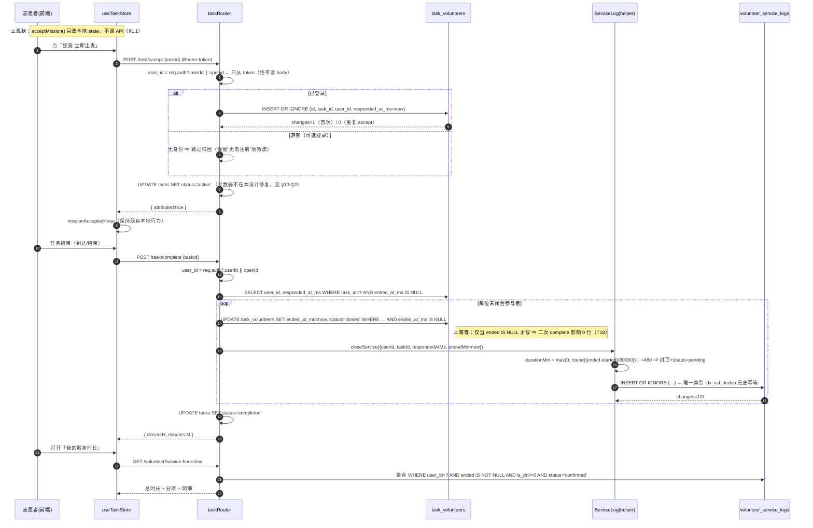
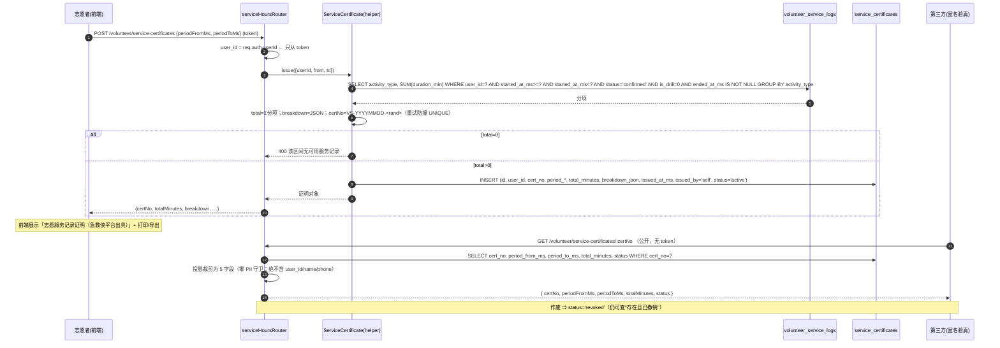
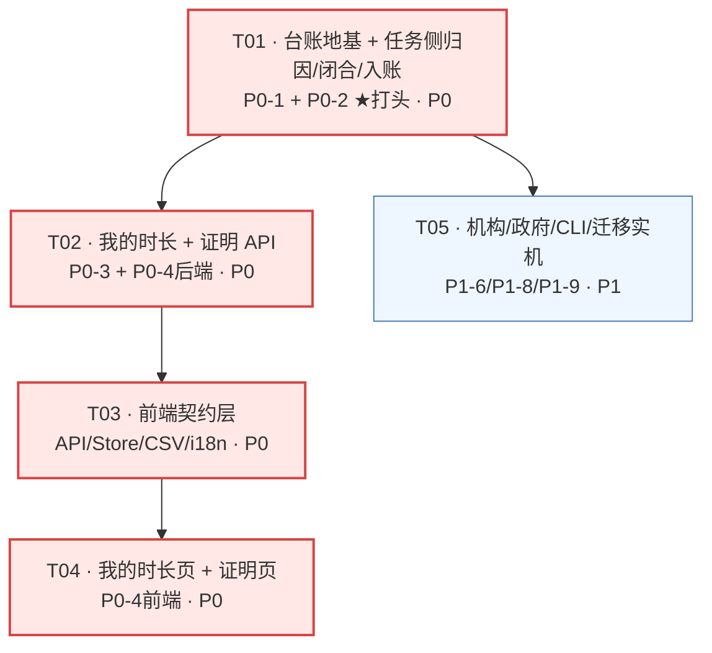
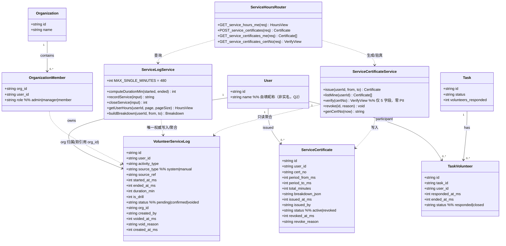

# 设计：志愿服务时长台账 + 志愿服务记录证明（F4）

> 上游：`volunteer-service-hours-prd.md`（v1.0，F4）
> 版本：v1.0 ｜ 状态：设计定稿，待实现 ｜ 语言：中文
> 本文**只写 PRD 没定的东西**（架构、表结构、端点契约、调用流程、任务顺序、测试计划）；
> **业务已拍板**的 Q1 / Q2 / D8 / 开工顺序**不复述、不重开**（见下「§0 已定前提」）。
> 组织风格沿用同项目 `i18n-emergency-flow-design.md`（实测修正优先 + 代码取证 + 突变承重性）。

---

## §0 已定前提（业务方拍板，本设计不再讨论）

| 决策 | 落地约束（本设计必须满足） |
|---|---|
| **Q1 国标口径** | 做**自有口径**，**不宣称合规**。任何 UI / CSV / PDF / 文案**不得出现**「符合国家标准 / 国标 / 官方 / 政府认可」字样 ⇒ 本设计**新增一条机器守卫**（§7 禁止措辞守卫）。P2-11 不做。 |
| **Q2 实名** | **不实名**，证明姓名取自 `users.name`（自填昵称）。UI 与导出物**必须明示**「平台出具，非实名认证，可采信度有限」。**不得新增姓名/证件号字段**。 |
| **D8 措辞** | 统一「**志愿服务记录证明（急救侠平台出具）**」落在：证明标题、CSV 表头/文件名旁注、PDF 版式、i18n 值。 |
| **开工顺序** | **P0-2 排最前**（任务列表 T01 即含 P0-2，见 §6）。 |

---

## §1 ⚠️ 对 PRD 的两处实测修正（先读这节）

调研真实代码后，PRD 的事实基础基本成立，但有**两处需要修正/补强**，其中第 1 条**直接改变 P0-2 的范围与验收**。

### 1.1 🔴 修正（关键）：`/api/task/accept` 与 `/complete` **在前端零调用点** —— 只补后端，可归因率仍恒为 0

PRD §1.1 缺口 2 只指出「`task.ts:44` 不记录是谁接受」。但真正的断链**不止后端**：

| 层 | 现状 | 证据 |
|---|---|---|
| API 封装 | `acceptTaskApi` / `completeTaskApi` **存在** | `急救侠-uniapp/src/api/task.ts:92-99` |
| API 测试 | 有（断言 URL/入参） | `src/__tests__/api/task.test.ts:24-27` |
| **Store** | `acceptMission()` **纯本地状态**（`missionAccepted=true` + 计距），**不调 API** | `src/stores/task.ts:50-56` |
| **调用点** | `acceptTaskApi` 全仓**仅**出现在 `api/task.ts` + 测试 + 文档；**无任何页面/store 调用** | `grep -rn acceptTaskApi` = 3 处，全非调用点 |
| 页面 | 「接受·立即出发」→ `taskStore.acceptMission()`（本地） | `src/pages/mission/index.vue:59/189-194` |

⇒ **这是本项目那句教训的「另一半」**：F3 踩的是「模块测得很全，删掉页面里那一行**调用**仍全绿」（`sos-telemetry-design.md:291`）；
F4 这里更极端 —— **API 有、测试有、store 方法有，但 store 方法根本没调 API**。二者同源：**"封装存在" ≠ "被调用"**。

⇒ **结论（写进 P0-2 验收）**：P0-2 **必须同时接线前端调用点**（`stores/task.ts` 的 `acceptMission()` → `acceptTaskApi()`；结束/到达 → `completeTaskApi()`），否则「可归因率」这个 KPI 在主场景**仍恒为 0**，等于没做。
**该接线是 P0-2 的一部分，不是"顺手"**——本设计把它并入 T01，并配**调用点守卫**（§7）。

> ⚠️ 由此得一条本设计的**组织原则**：**凡"后端写了表"的功能，任务的验收必须是"端到端可归因"，而不是"接口 200"**。

### 1.2 ✅ 修正（少做）：时间字段口径有**现成的最新先例**，不必二选一

PRD §5.1 提示「既有表时间字段混用 TEXT / 毫秒整数」。实测**最新的一张表已给出权威口径**：

| 先例 | 时间列 | 理由（原文见 `db.ts:781-783`） |
|---|---|---|
| `sos_events`（迁移 040，`db.ts:788-800`） | `created_at_ms INTEGER NOT NULL`（**范围查询唯一依据**）+ `created_at TEXT`（**仅供人读**） | `strftime('%s', created_at)` 对 `'T...Z'` / `' +08:00 '` 一律按 UTC 解析且忽略时区后缀 ⇒ **本项目已因此出过一次事故**（`signatureKeepAlive.ts`） |

⇒ F4 新增字段**一律用毫秒整数**（`*_at_ms`）。**但**：团队要求「同一张表不混两种口径」⇒ 新表**连 `created_at TEXT` 也省掉**（人读渲染一律放展示/导出层，`govExport.ts` 已是这么做的）。**取值算口径**（`period_from/to`、`duration`）与**范围查询**都只碰 `_ms`。

---

## §2 范围终稿

### 2.1 P0（本次 MVP，全部落地）

| 条目 | 落点 |
|---|---|
| **P0-1 台账（数据层）** | 新表 `volunteer_service_logs`（§4.1） |
| **P0-2 归因 + 闭合（任务侧，**打头**）** | 新表 `task_volunteers`（照 `drill_participants` 抄）+ `task.ts` 改写 + **前端调用点接线**（§1.1） |
| **P0-3 我的时长** | `GET /api/volunteer/service-hours/me` + 前端「我的服务时长」页 |
| **P0-4 证明生成 + 编号验真** | 新表 `service_certificates` + `POST/GET` + 公开验真端点 + 前端证明页 |
| **P0-5 CSV 导出** | `utils/serviceExport.ts`（复用 `govExport.ts` 的 BOM / `\r\n` / `sanitizeCell→csvEscape`） |

### 2.2 P1（概要，不在本次展开设计）

| 条目 | 一句话落点 |
|---|---|
| P1-6 机构侧汇总 | `GET /api/org/:id/service-hours`（`organization_members` JOIN；仅本机构成员） |
| P1-7 人工登记/审核 | `POST /api/volunteer/service-logs`（`source_type='manual'`、默认 `pending`） |
| P1-8 政府看板聚合 | `/api/gov/dashboard` 追加 `serviceHours`（零 PII） |
| P1-9 保留期清理 CLI | `npm run service:purge`（默认**不删证明**，台账长期保留） |
| **P1-10 动员/演习闭合回写（新增）** | 把「闭合→台账」helper 复用到 `mobilization_volunteers` / `drill_participants`（见 §3.3 说明） |

### 2.3 P2（不做）：政府平台同步（P2-10）/ 国标对齐（P2-11）/ 真实二维码 PDF（P2-12）。

---

## §3 实现方案与技术选型

### 3.1 技术选型：**不加任何新依赖**（默认结论）

| 需求 | 方案 | 理由 |
|---|---|---|
| 时长台账 / 证明 | **better-sqlite3 同步 API**（`db.prepare(...).run/get/all`） | 与既有栈一致；同步 API 无并发竞态面 |
| 编号唯一/验真 | 手写 `cert_no`（纯 JS 生成）+ `UNIQUE` 索引 | 不引 uuid 库；主键后缀照 `push.ts:44` |
| CSV | **手写**，`import { sanitizeCell, csvEscape } from '@/utils/govExport'` | PRD D9 / P2-8 同一取舍；**复用**而非复制（顺序对调是安全点，见 §7 M-CSV2） |
| PDF | H5 `window.print()`，非 H5 退化为 `uni.showToast` | 同 `printGovDashboard()`（`govExport.ts:190-197`） |
| 迁移 | 既有 `initDb()` 内 `migrations[]` runner | 硬约束 #9；见 §4.4 |
| 运维统计/清理 | CLI（`src/scripts/*.ts`），**不开 HTTP** | 同 `sos-report.ts` / `sos-purge.ts` |

### 3.2 架构模式：**「唯一权威口径 + 关系表分离」**

```
                   ┌──────────────────────────────┐
  任务/动员/演习  → │ 关系表（谁参与、何时开、何时闭）│
  （事件域）       │ task_volunteers / drill_...   │
                   └───────────────┬──────────────┘
                                   │ 闭合时刻（complete）触发单一 helper
                                   ▼
                   ┌──────────────────────────────┐
                   │ volunteer_service_logs（台账）│  ← 唯一权威口径
                   │ 所有展示 / 证明 / 导出 只读它  │
                   └───────────────┬──────────────┘
            ┌──────────────────────┼───────────────────────┐
            ▼                      ▼                        ▼
      GET …/service-hours/me   POST …/service-certificates   gov 聚合（零 PII）
```

**分层职责**（松耦合、各司其职）：
1. **关系表（事件域）**：回答「谁、参与了哪个事件、开/闭时刻」。**不做**时长聚合。
2. **台账（权益域）**：**唯一权威口径**。回答「某人某段时间的服务时长」。所有下游只读它。
3. **派生视图**：`me` / 证明 / 机构 / 政府聚合 —— **只读台账**，各自过滤。

### 3.3 ★ 决策：`tasks` 侧选 **(a) 新表 `task_volunteers`**（PRD Q3）

**选 (a)。理由（三条，均为"选 (b) 会立刻坏"）：**

1. **职责不得塌缩（唯一权威口径）**：PRD D1/§5.1 已把台账定义为**唯一权威口径**且**长期保留（权益凭证，D7）**。
   而「accept」是**意向**、不是**已发生服务**。若 (b) 在 accept 直写台账，则**台账会在服务尚未发生时就落一行**，且该行的 `started_at_ms` 一列同时承担「报名时刻」与「服务开始时刻」两种语义 ⇒ 与 `end` 一列一样被迫承载双职责，**为「口径污染」埋雷**（正是本项目 F3 `is_drill` 污染统计的同类教训）。
2. **(b) 使既有计数器不一致可见化**：`/accept` 现在是 `volunteers_responded = volunteers_responded + 1`（`task.ts:44`），**本就不幂等**（重复 accept 反复 +1）。若 (b) 再往里直写台账、且台账靠部分唯一索引去重，则**同一动作产生两种结果**：计数器 +N，台账 1 行 ⇒ 数据自相矛盾、且**两个"真值"**。选 (a) 把「去重」放在**有明确 UNIQUE 约束**的关系表上，语义干净。
3. **既有先例已存在两张同形表**：`drill_participants`（`db.ts:309-319`，唯一 `event_id,user_id`）与 `mobilization_volunteers`（`db.ts:399-409`，唯一 `mobilization_id,user_id`），写入点都是 `INSERT OR IGNORE`（`drill.ts:30` / `rescue.ts:71`）。**第三张同形表是最可复现、最可评审的路径**，不是新发明。团队亦已确认 `drill_participants`「最接近目标的形状」（它是三者中**唯一有闭合标记 `attended`** 的）。

**为什么 (b) 不选**（除上述 1/2 外）：(b) 把「任务侧」的写入逻辑**硬编码进台账写路径** ⇒ 当 P1-10 要补动员/演习时，台账里会**混入三套链路各自的写入分支**，与「唯一权威口径」直接冲突（PRD Q3 已预警「三种口径」）。选 (a) 后，三条链路**只共用一个 helper**（§3.4），台账写路径**只有一条**。

**`task_volunteers` 的形状（照 `drill_participants` 抄，唯一差异：时间用 `_ms`）**：
`(id, task_id, user_id, responded_at_ms, ended_at_ms, status)`，`UNIQUE(task_id, user_id)`。
闭合时机**照 `drill.ts /complete`（`drill.ts:37-50`）**：`/complete` 时回写 `ended_at_ms` 并为每位参与者写台账 —— 与 drill 的「`attended=1` + 发积分 + 写 `training_records`」是**同一个时机点**。

### 3.4 三链路统一：**P0 只做任务侧，但抽出单一 helper**（回答 PRD Q3 的"要不要统一"）

- PRD Q3 问：要不要把「闭合时刻」统一补到**既有两张表**、并三链路复用？
- **本设计决定：P0-2 范围 = 任务侧（a）**（team-lead 明示「保持范围克制」），**但把「闭合 → 写台账」抽成单一模块** `services/serviceLog.ts`（`recordService()` / `closeService()`），**动员 / 演习的接线列为 P1-10**。
- 理由：① 动员**没有「完成」语义**（`emergency_mobilizations` 有 `complete`，但 `mobilization_volunteers` 无 `attended`）；② 演习的闭合已在 `attended` 上（只差 `ended_at_ms` 与时间列）；③ 若回填历史将**臆造时长**（Q4 明确不建议）。④ 一次性改三条链路会把 P0-2 变成"三处迁移 + 三处改写"，违背景戒范围。
- **由此产生的一个诚实的后果**：P0 阶段 `is_drill=1` 的台账**只会来自 `manual` 来源**（人工登记一场演习），不来自自动链路 ⇒ §7 的「演习污染率恒为 0」在 P0 是**防御性不变量**（靠 `manual` + 直接插入构造用例），到 P1-10 才成为主路径不变量。**已在 §7 注明，避免后人误判"没接线=没做"**。

### 3.5 时长算法（服务端算，硬约束 #2）

```ts
// 唯一实现，放 services/serviceLog.ts
export const MAX_SINGLE_MINUTES = 480               // D2 单次封顶
export function computeDurationMin(startedMs: number, endedMs: number | null): number | null {
  if (endedMs == null) return null                  // 未闭合 ⇒ 不计入
  const raw = Math.round((endedMs - startedMs) / 60000)
  return Math.max(0, raw)                           // 时钟回拨防御性归零
}
// 超过 MAX_SINGLE_MINUTES ⇒ duration_min 封顶为 480，且 status='pending'（需人工登记/确认，D2）
```
- **绝不读 `req.body.duration_min`**（硬约束 #2 / T3）。
- 封顶后置 `pending`：既满足 D2「超出需人工登记」，又让 §7 的 `T8`（pending 不进证明）成为**主路径**不变量。

---

## §4 数据结构与接口

### 4.1 新增表 DDL（canonical schema 与 `migrations[]` **逐字一致**）

> 时间列**一律 `_ms INTEGER`**（§1.2）；主键带随机后缀（硬约束 #5）；**无任何经纬度/位置列**（硬约束 #7 / T12）。

```sql
-- 表 1：台账（唯一权威口径）
CREATE TABLE IF NOT EXISTS volunteer_service_logs (
  id             TEXT PRIMARY KEY,
  user_id        TEXT NOT NULL,                 -- 只来自 token；FK users(id)
  activity_type  TEXT NOT NULL,                 -- rescue_task|drill|training|aed_checkin|manual
  source_type    TEXT NOT NULL DEFAULT 'system',-- system|manual
  source_ref     TEXT NOT NULL DEFAULT '',      -- 关联事件 id；manual 为空
  started_at_ms  INTEGER NOT NULL,
  ended_at_ms    INTEGER,                       -- NULL = 未闭合，不计入时长
  duration_min   INTEGER,                       -- 服务端算；ended 为空时 NULL
  is_drill       INTEGER NOT NULL DEFAULT 0,    -- 演习/真实分离（D4）
  status         TEXT NOT NULL DEFAULT 'pending',-- pending|confirmed|voided
  org_id         TEXT NOT NULL DEFAULT '',      -- 机构归属快照（可空）
  created_by     TEXT NOT NULL DEFAULT '',      -- 人工登记的登记人（留痕）
  voided_at_ms   INTEGER,
  void_reason    TEXT NOT NULL DEFAULT '',      -- 作废留痕（软删，硬约束 #6）
  created_at_ms  INTEGER NOT NULL,
  FOREIGN KEY (user_id) REFERENCES users(id)
);
CREATE INDEX IF NOT EXISTS idx_vsl_user_time ON volunteer_service_logs(user_id, started_at_ms);
CREATE INDEX IF NOT EXISTS idx_vsl_type      ON volunteer_service_logs(activity_type, started_at_ms);
CREATE INDEX IF NOT EXISTS idx_vsl_status    ON volunteer_service_logs(status);
-- 幂等：系统来源 + 有 source_ref 时，(来源,事件,人) 唯一（硬约束 #4）
CREATE UNIQUE INDEX IF NOT EXISTS idx_vsl_dedup
  ON volunteer_service_logs(source_type, source_ref, user_id) WHERE source_ref <> '';

-- 表 2：证明发放记录
CREATE TABLE IF NOT EXISTS service_certificates (
  id             TEXT PRIMARY KEY,
  user_id        TEXT NOT NULL,                 -- FK users(id)
  cert_no        TEXT NOT NULL,                 -- 唯一可查，如 VS-20260917-A7F3K2
  period_from_ms INTEGER NOT NULL,
  period_to_ms   INTEGER NOT NULL,
  total_minutes  INTEGER NOT NULL,              -- 只含 is_drill=0 且 status='confirmed' 且 ended 非空
  breakdown_json TEXT NOT NULL DEFAULT '{}',    -- 按 activity_type 分解
  issued_at_ms   INTEGER NOT NULL,
  issued_by      TEXT NOT NULL DEFAULT 'self',  -- self|org_admin
  status         TEXT NOT NULL DEFAULT 'active',-- active|revoked
  revoked_at_ms  INTEGER,
  revoke_reason  TEXT NOT NULL DEFAULT '',
  FOREIGN KEY (user_id) REFERENCES users(id)
);
CREATE UNIQUE INDEX IF NOT EXISTS idx_scert_no ON service_certificates(cert_no);
CREATE INDEX IF NOT EXISTS idx_scert_user ON service_certificates(user_id, issued_at_ms DESC);

-- 表 3（Q3 选 a）：任务参与关系（照 drill_participants）
CREATE TABLE IF NOT EXISTS task_volunteers (
  id               TEXT PRIMARY KEY,
  task_id          TEXT NOT NULL,               -- FK tasks(id)
  user_id          TEXT NOT NULL,               -- FK users(id)
  responded_at_ms  INTEGER NOT NULL,
  ended_at_ms      INTEGER,
  status           TEXT NOT NULL DEFAULT 'responded', -- responded|closed
  FOREIGN KEY (task_id) REFERENCES tasks(id),
  FOREIGN KEY (user_id) REFERENCES users(id),
  UNIQUE(task_id, user_id)
);
CREATE INDEX IF NOT EXISTS idx_tv_task ON task_volunteers(task_id);
```

- **不加** `users.service_hours` / `volunteers.*` 冗余列（PRD §5.1 显式声明）：时长**一律从台账实时聚合**，杜绝双真值。`volunteers` 是**死表**（`seed.ts:135` 才写，与登录用户双轨）⇒ 时长**必须**挂 `users.id`。
- **不新增** `users` 姓名/证件号列（Q2 / 硬约束）。

### 4.2 与既有表的关联

| 关联 | 键 | 用途 | 说明 |
|---|---|---|---|
| `volunteer_service_logs.user_id` → `users.id` | FK | 身份 | 只从 token 派生（硬约束 #1） |
| `volunteer_service_logs.org_id` → `organizations.id` | 软引用（**不加 FK**） | 机构归属快照 | 与 `aed_devices.district` 等既有"软列"惯例一致；不设 FK 以免机构解散后历史台账被级联约束 |
| `task_volunteers.task_id` → `tasks.id`；`.user_id` → `users.id` | FK | 归因 | 照 `drill_participants` |
| `GET /api/org/:id/service-hours` ↔ `organization_members` | JOIN | 机构隔离 | 复用既有表，**不新建** |
| `gov 聚合` ↔ `district`（`tasks.district`，迁移 034） | COALESCE 归一 | 区域维度 | 沿用 `gov.ts` 的 `DISTRICT_EXPR` |

### 4.3 API 端点契约（统一 `{code, data, message}`；`success()`/`error()`）

> **鉴权铁律（硬约束 #1）**：**所有新端点**身份 `user_id = req.auth.userId || req.auth.openid`；**绝不读 `req.body.userId`**。
> 既有 26 处 body 解构 / 6 处 query 取身份是**系统性问题、不在本次修复范围**，仅记账为独立技术债（§9）。

| # | 方法 | 路径 | 鉴权 | 入参 | 出参（`data`） | 状态码 |
|---|---|---|---|---|---|---|
| 1 | `GET` | `/api/volunteer/service-hours/me` | `authMiddleware` | query: `page?`,`pageSize?`,`activityType?` | `{ totalMinutes, breakdown:[{activityType,minutes,count}], items:[…], page, pageSize, total }` | 200 / **401** |
| 2 | `POST` | `/api/volunteer/service-certificates` | `authMiddleware` | body: `periodFromMs`,`periodToMs` | `{ certNo, periodFromMs, periodToMs, totalMinutes, breakdown, issuedAtMs, status }` | 200 / 400（区间非法/无数据） / 401 |
| 3 | `GET` | `/api/volunteer/service-certificates/me` | `authMiddleware` | — | `[{certNo,periodFromMs,periodToMs,totalMinutes,status,issuedAtMs}]` | 200 / 401 |
| 4 | `GET` | `/api/volunteer/service-certificates/:certNo` | **公开（无鉴权）** | path | `{ certNo, periodFromMs, periodToMs, totalMinutes, status }` **仅此 5 字段** | 200 / 404 |
| 5 | `POST` | `/api/volunteer/service-logs`（P1-7） | `authMiddleware` | body: `activityType`,`startedAtMs`,`endedAtMs`,`orgId?`,`targetUserId?` | `{id,status}` | 200 / 401 / 403 |
| 6 | `GET` | `/api/org/:id/service-hours`（P1-6） | `authMiddleware` + 内联 admin/manager 校验 | query 同上 | 结构同 #1（**仅本机构成员**） | 200 / 401 / 403；跨机构 ⇒ **空集** |
| 7 | `GET` | `/api/gov/dashboard`（P1-8） | `govMiddleware`（既有） | — | 追加 `serviceHours:{ totalMinutes, participantCount, byActivityType:[…] }` | 200 |
| 8 | `POST` | `/api/task/accept`（**改写**） | **`optionalAuth`**（见 §10-Q1） | body: `taskId` | `{ attributed:boolean }` | 200 |
| 9 | `POST` | `/api/task/complete`（**改写**） | **`optionalAuth`** | body: `taskId` | `{ closed:number, minutes:number }` | 200 |
| CLI | `npm run service:report` / `service:purge` | 运维 | **不开 HTTP** | `--days`/`--dry-run` | 见 §5.3 | exit 0/1/2 |

**验收锚点**：
- #1 **无 token ⇒ 401**（T1）；A **绝不**读到 B 的条目（T10，`user_id` 恒来自 token）。
- #1 的 `breakdown` 之和 **恒等于** `totalMinutes`（T5）。
- #2 同区间生成两次 ⇒ `certNo` **不同**、`totalMinutes` **相同**（P0-4 验收①）。
- #4 **零 PII**：响应体**不含** `user_id`/`name`/`phone`/`userId`（T15，深扫断言，照 `role-split.test.ts`）。
- #4 作废后 ⇒ `status: 'revoked'`（T9 半段）；且该分钟数从**后续**证明中消失、原台账行**仍在**（不物理删）。

### 4.4 迁移通道（硬约束 #9，严格走既有 runner）

| 项 | 结论 | 依据 |
|---|---|---|
| Runner | `initDb()` 内 `migrations[]`，**启动时执行**，登记 `_migrations` | `db.ts:820-1011` |
| 通道 | **canonical schema（新库）+ `migrations[]`（既有库）双写**，两处 DDL 逐字一致 | 同 `040`（`db.ts:967-984`） |
| 编号 | **041 `add_task_volunteers` / 042 `add_volunteer_service_logs` / 043 `add_service_certificates`**（接续当前最大 `040`） | `db.ts:968` |
| ⚠️ **必须改 `clearAll()`** | 把 3 张新表加进 `db.ts:1061` 的 `DELETE` 清单，否则**测试隔离污染**（T17） | 硬约束 + PRD §5.2 |
| ⚠️ **必须实机验证升级路径** | 单测跑 `:memory:`，canonical 已建表 ⇒ 迁移**恒为 skipped，真实升级从未被验证**。须照 `NEXT_STEPS.md:609-621`：**复制真实库 → 剥离 041/042/043 产物 → 启真实服务 → 日志必须是 `Migration applied: 041/042/043`**（非 skipped）（T16，**在实机跑，`:memory:` 测不出**） |
| 回填 | **不做历史回填**（Q4 判定为臆造数据）⇒ `migrations[]` **无 `after` 回调** | Q4 |

---

## §5 程序调用流程

### 5.1 时序图 ①：救援任务 `accept` → 时长入账（含幂等与闭合）



### 5.2 时序图 ②：证明生成 → 编号验真（含零 PII 校验）



### 5.3 CLI 流程（P1，只读统计 + 保留期）

```
npm run service:report [--user <id>] [--days <N>]
  → 可归因率 / 未闭合率 / 演习污染率（三行并列，照 sos-report.ts 的"必然输出三行"纪律）
npm run service:purge [--days <N>] [--dry-run]
  → 默认不删任何东西（台账长期保留，D7）；证明记录永久保留；仅 --dry-run 报数 + 显式确认
  → ⚠️ 运维落点（systemd timer/crontab）在代码之外，登记为待办（同 sos-purge）
```

---

## §6 ★ 任务列表（有序 · 含依赖 · P0-2 打头）

> **任务上限 5**（硬性）。每条含「做什么 / 改哪些文件 / 验收标准 / 依赖」。
> **关于"第一个任务必须是基础设施"**：本仓库是**存量项目**，无新增配置/入口文件；故本设计的「地基」= **数据库迁移底座 + 共享模块 + 类型契约**（即 T01）。**不新增依赖**（§3.1）；`package.json` 脚本声明并入 T05。
> **P0-2 打头**：按业务方开工顺序，**归因留痕（P0-2）在最前**，与 P0-1（台账表）**合并进 T01**（team-lead：二者强耦合，分开必返工）。

---

### **T01 · 台账地基 + 任务侧归因/闭合/入账（P0-1 + P0-2，★打头）** — Priority **P0** · 依赖：无

- **做什么**：
  1. `db.ts`：新增 3 张表 canonical schema + 索引；`migrations[]` 追加 **041/042/043**（逐字一致）；`clearAll()` 补 3 表。
  2. `types/index.ts` / `types/rows.ts`：新增 `ActivityType` 枚举、台账/证明/参与 行类型与响应类型；复用 `success()/error()`。
  3. `services/serviceLog.ts`（**新**）：`recordService()` / `closeService()` / `computeDurationMin()` / `MAX_SINGLE_MINUTES` / 聚合 helper（`getUserHours()`）——**唯一权威实现**（供 T02/T05 复用）。
  4. `routes/task.ts`：`/accept`（`optionalAuth`，`INSERT OR IGNORE task_volunteers`）、`/complete`（闭合 + 写台账，**幂等**）。
  5. **前端调用点接线（§1.1 关键）**：`api/task.ts` 保持；`stores/task.ts` 的 `acceptMission()` 调 `acceptTaskApi(taskId)`；`finishMission()`/`arrive()` 结束时调 `completeTaskApi(taskId)`。
- **改文件**：`急救侠-server/src/db.ts`、`src/types/index.ts`、`src/types/rows.ts`、`src/services/serviceLog.ts`(新)、`src/routes/task.ts`、`src/__tests__/task.test.ts`、`src/__tests__/service-hours.test.ts`(新)、`急救侠-uniapp/src/stores/task.ts`、`急救侠-uniapp/src/__tests__/stores/task.test.ts`
- **验收标准**：
  - 同一用户对同一任务 accept 两次 ⇒ `task_volunteers` **仅 1 行**（T6 同类）。
  - `/complete` 后该行**必有** `ended_at_ms`；`/complete` 重复调用 ⇒ 仍 1 行、`ended_at_ms` **不被第二次覆盖**、时长**不重复累加**（T18）。
  - `duration_min` 恒等于服务端算法；body 传 `duration_min: 9999` **被忽略**（T3）。
  - 写入端点 body 传 `userId:'victim'` ⇒ `user_id` 恒等于 token 身份（T2）。
  - **可归因率 > 0 的端到端证明**：走 `useTaskStore.acceptMission()`（**不是直接打端点**）⇒ 库中出现该用户的参与行（**调用点守卫**，§7）。
  - `PRAGMA table_info` 3 张表**均无**位置列（T12）；`clearAll()` 后 3 表为空（T17）。
- **可并行**：否（T02/T05 皆依赖它）。

---

### **T02 · 我的时长 + 证明生成 + 编号验真（P0-3 + P0-4 后端）** — Priority **P0** · 依赖：T01

- **做什么**：
  1. `routes/serviceHours.ts`（**新**，挂 `/api/volunteer`）：
     - `GET /service-hours/me`（auth，分页 + 分项）。
     - `POST /service-certificates`（auth，选区间 → `certNo`/`total_minutes`/`breakdown`）。
     - `GET /service-certificates/me`（auth，我的证明列表）。
     - `GET /service-certificates/:certNo`（**公开**，**仅 5 字段，零 PII**）。
  2. `services/serviceCertificate.ts`（**新**）：`issue()`（区间聚合 + `cert_no` 生成 + 撞库重试）、`listMine()`、`verify()`（**投影裁剪为 5 字段**）、`revoke()`（软删）。
  3. `app.ts`：`app.use('/api/volunteer', serviceHoursRouter)`（在既有 `volunteerRouter` 之后）。
  4. 测试：`__tests__/service-hours-api.test.ts`、`__tests__/service-certificates.test.ts`。
- **改文件**：`src/routes/serviceHours.ts`(新)、`src/services/serviceCertificate.ts`(新)、`src/app.ts`、`src/__tests__/service-hours-api.test.ts`(新)、`src/__tests__/service-certificates.test.ts`(新)
- **验收标准**：
  - 无 token ⇒ **401**（T1）；用户 A **绝不**读到 B 任一条（T10）。
  - 分项之和 **恒等于** 总时长（T5）；`pending` / `is_drill=1` / `ended IS NULL` **均不进**证明（T4/T7/T8）。
  - 同区间生成两次 ⇒ `certNo` 不同、`totalMinutes` 相同（P0-4①）。
  - 验真接口深扫**不含** `user_id`/`name`/`phone`（T15）；作废后返回 `revoked` 且该分钟数从**后续**证明消失、原台账行仍在（T9）。
- **可并行**：与 **T05** 并行（T05 只依赖 T01）。

---

### **T03 · 前端契约层：API + Store + CSV 导出 + i18n 键（P0-5 数据契约 + 消费层）** — Priority **P0** · 依赖：T02

- **做什么**：
  1. `api/serviceHours.ts`（**新**）：`getMyHours()` / `createCertificate()` / `listMyCertificates()` / `verifyCertificate()`（走既有 `request/requestFull`，`requestFull` 保 code 分支）。
  2. `stores/serviceHours.ts`（**新**）：Pinia store（`totalMinutes` / `breakdown` / `items` / `certificates` / `load*()` 显式记 error、不静默兜底——照 `stores/gov.ts` 范式）。
  3. `utils/serviceExport.ts`（**新**）：CSV 生成 + 文件名 `service-hours-YYYYMMDD.csv`；**`import { sanitizeCell, csvEscape } from '@/utils/govExport'`**（复用顺序，勿复制）；导出物含「志愿服务记录证明（急救侠平台出具）」标题行 + 「平台出具，非实名认证」声明行。
  4. `locales/zh-CN.ts` / `en-US.ts`：新增 `hours.*` / `serviceCert.*` 键（语义命名、整句、具名插值；`en-US` 必须 ⊇ `zh-CN`）。
  5. 测试：`__tests__/serviceExport.test.ts`（BOM / `\r\n` / 公式注入 / 数值不被清洗）。
- **改文件**：`急救侠-uniapp/src/api/serviceHours.ts`(新)、`src/stores/serviceHours.ts`(新)、`src/utils/serviceExport.ts`(新)、`src/locales/zh-CN.ts`、`src/locales/en-US.ts`、`src/__tests__/serviceExport.test.ts`(新)
- **验收标准**：CSV 首字符 `\uFEFF`、行尾 `\r\n`（T13）；姓名 `=1+1` 被前置 `'`、数值 `-1.5` **不被**清洗（T14）；导出**不含**禁用词（§7 禁止措辞守卫）。
- **可并行**：与 **T05** 并行。

---

### **T04 · 我的时长页 + 证明页 + 「我的」入口（P0-4 前端）** — Priority **P0** · 依赖：T03

- **做什么**：
  1. `pages/volunteer/hours.vue`（**新**）：「我的服务时长」——总时长 + 分项卡 + 明细列表（分页）+ 「生成证明」「导出 CSV」按钮（**调用点**）。
  2. `pages/volunteer/certificates.vue`（**新**）：证明列表 + 选区间生成 + H5 `window.print()`（非 H5 toast）+ **编号验真入口**。
  3. `pages/cert/index.vue`：在「我的」页加入口（「我的服务时长」/「我的服务证明」）——**不得放进 SOS 主流程**（F2 §6 硬契约）。
  4. `pages.json`：注册 2 个新页。
  5. i18n 守卫扩围：`__tests__/i18n-scope.ts` + `__tests__/i18n.test.ts` 的 `SCOPE_FILES` 加入 2 新页；新增 `__tests__/pages/hours-i18n.test.ts`（裸 CJK + en 渲染快照 + 内容完整性）。
- **改文件**：`src/pages/volunteer/hours.vue`(新)、`src/pages/volunteer/certificates.vue`(新)、`src/pages/cert/index.vue`、`src/pages.json`、`src/__tests__/i18n-scope.ts`、`src/__tests__/i18n.test.ts`、`src/__tests__/pages/hours-i18n.test.ts`(新)
- **验收标准**：新文案**零裸 CJK**（守卫）；**登录态 + 游客态两套夹具**（不渲染分支对守卫不可见）；**按钮调用点**有独立用例（删掉那一行 ⇒ 变红）；**措辞**仅「志愿服务记录证明（急救侠平台出具）」。
- **可并行**：否（依赖 T03）。

---

### **T05 · 机构/政府聚合 + CLI + 迁移实机验证（P1-6/P1-8/P1-9 + 收口）** — Priority **P1** · 依赖：T01

- **做什么**：
  1. `routes/org.ts`：`GET /:id/service-hours`（auth + 内联 admin/manager 校验；`organization_members` JOIN；跨机构 ⇒ **空集**）。
  2. `routes/gov.ts`：`/dashboard` 追加 `serviceHours`（**零 PII**；冷启动 ⇒ `null`，绝不 0 兜底）。
  3. `scripts/service-report.ts`（**新**）：可归因率 / 未闭合率 / 演习污染率（三行并列）。
  4. `scripts/service-purge.ts`（**新**）：`--days`/`--dry-run`，**默认不删证明**。
  5. `package.json`（server）：`service:report` / `service:purge` 脚本。
  6. `docs/DEPLOY.md`：登记 purge 定时器为运维待办（与 sos-purge 同性质）。
  7. 测试：`__tests__/service-hours-gov.test.ts`（机构隔离 T11 + gov 零 PII）。
- **改文件**：`src/routes/org.ts`、`src/routes/gov.ts`、`src/scripts/service-report.ts`(新)、`src/scripts/service-purge.ts`(新)、`package.json`、`docs/DEPLOY.md`、`src/__tests__/service-hours-gov.test.ts`(新)
- **验收标准**：非本机构成员**不出现**在机构汇总（T11）；gov 响应深扫**不含** `userId`/`name`；**迁移实机验证**：旧库启动日志 = `Migration applied: 041/042/043`（**非 skipped**，T16）。
- **可并行**：与 **T02 / T03** 并行。

---

### 任务依赖图



**并行安排**：T01 →（**T02 ∥ T05**）→ T03 → T04。
其中 **T05 只依赖 T01**，故可与 T02/T03 并行；**T04 必须等 T03**（页面依赖 store/导出）。

---

## §7 共享知识（跨文件约定）

1. **命名**
   - 表/列：`snake_case`；新表**一律** `snake_case`；时间列后缀 `_ms`（毫秒整数）。
   - 主键：`'<前缀>_' + Date.now() + '_' + Math.random().toString(36).slice(2,6)`（前缀：`vsl_` / `sc_` / `tv_`）。**禁止**纯 `Date.now()`（`NEXT_STEPS.md:216`）。
   - 端点：`/api/volunteer/service-hours/*`、`/api/volunteer/service-certificates/*`、`/api/org/:id/service-hours`。
   - `activity_type` 枚举：`rescue_task|drill|training|aed_checkin|manual`（**唯一事实源**放 `types/index.ts`）。
2. **时间口径**：**一律毫秒整数**（`*_at_ms`）；**同表不混 TEXT**；人读渲染在展示/导出层（`YYYY-MM-DD HH:mm:ss` 手写补零，**不依赖 locale**，照 `govExport.ts:52-58`）。
3. **错误处理**：统一 `{code,data,message}`；业务失败 `code=-1` + `message`；鉴权失败 `401`（`authMiddleware` 既有行为）；**绝不吞异常静默兜底**（`stores/*` 显式记 `error`）。
4. **i18n（前端）**：新增用户可见文案**必须走 `t()`**；`en-US` 必须 ⊇ `zh-CN`；**禁止整句拼装**（用整句 + 具名插值）；语言是**响应式**的 —— `t()` **只能在 computed/函数体/回调**里调用（`v-html` 消息**不得**含不可信插值，F2 §11.5）。
5. **幂等/去重**：靠**数据库约束**（`UNIQUE` + `INSERT OR IGNORE`），**不要**应用层先查后插（硬约束 #4）。
6. **作废留痕**：`status='voided'` + `void_reason` + `voided_at_ms`；**不物理删除**（硬约束 #6）。
7. **零 PII**：政府看板只出**聚合**；验真端点**只出 5 字段**；响应体不得含 `userId`/`name`/`phone`（硬约束 #7）。
8. **测试约定**：后端 `src/__tests__/*.test.ts` 跑 `:memory:`（用 `app` 做 `request()`）；前端 vitest（基线以当日实测为准）；突变一律 `cp` 备份 + `shasum -a256 -c` 还原；跑完全量**扫 `Errors` 行**（F2 §11.3）。
9. **★ 禁止措辞（Q1/D8）**：任何 UI/CSV/PDF/i18n 值**不得**含「符合国家标准 / 国家标准 / 国标 / 官方 / 政府认可」。

---

## §8 测试与突变验证计划（本项目要求：改坏必须**精确变红**）

> 逐条给「**被攻击的不变量** → **突变方式** → **应红的用例**」。
> ⚠️ **复跑纪律**：vitest 编辑后立即跑可能取到过期缓存、把突变**假报存活**（`NEXT_STEPS.md:302`）⇒ 任何 SURVIVED 结论**必须复跑确认**。
> ⚠️ **调用点必须单独测**（§1.1 / F3 教训）。

| # | 不变量 | 突变方式 | 应红用例 | 层级 |
|---|---|---|---|---|
| T1 | 写入端点**无 token ⇒ 401** | 去掉 `authMiddleware` | 401 断言 | 后端 |
| T2 | body `userId:'victim'` **被忽略**，`user_id` = token 身份 | 改读 `req.body.userId` | 身份断言 | 后端 |
| T3 | 时长**服务端算**；客户端传 `duration_min:9999` 被忽略 | 采信入参 | 时长断言 | 后端 |
| T4 | `ended_at_ms IS NULL` **不计入**总时长与分项 | 聚合漏加 `ended IS NOT NULL` | 聚合断言 | 后端 |
| T5 | **分项之和恒等于总时长** | 分项漏一种 `activity_type` | 分项断言 | 后端 |
| T6 | 幂等：同 `(source_type,source_ref,user_id)` 写两次 ⇒ 仅 1 行 | 删 `idx_vsl_dedup` | 行数断言 | 后端 |
| T7 | **演习污染率恒 0**：`is_drill=1` 不进证明 | 证明聚合漏加 `WHERE is_drill=0` | 证明断言 | 后端 |
| T8 | `status='pending'` **不进**证明 | 漏加 `status='confirmed'` | 证明断言 | 后端 |
| T9 | 作废：验真返回 `revoked`、分钟数从后续证明消失、**原行仍在** | 改成 `DELETE` | 前半绿 / **后半红** | 后端 |
| T10 | 越权：A 查 `/me` 由 token 决定 ⇒ A 永不见 B | 改读 query `userId` | 隔离断言 | 后端 |
| T11 | 机构隔离：非成员**不出现**在 `/org/:id/service-hours` | 去掉 `organization_members` JOIN | 隔离断言 | 后端 |
| T12 | `PRAGMA table_info` 3 表**无**位置列 | 加一列 `lat` | 结构断言 | 后端 |
| T13 | CSV **首字符 `\uFEFF`** + 行尾 `\r\n` | 去 BOM / 改 `\n` | 首尾断言 | 前端 |
| T14 | 公式注入：姓名 `=1+1` ⇒ 前置 `'`；数值 `-1.5` **不清洗** | `sanitizeCell` 恒等 / 去掉数字放行 | 前半红 / **后半红** | 前端 |
| T15 | 验真**零 PII**：不含 `user_id`/`name`/`phone` | 多返回 `userName` | 深扫断言（照 `role-split.test.ts`） | 后端 |
| T16 | **迁移实机**：旧库启动 ⇒ `Migration applied: 041/042/043`（非 skipped） | 只写 canonical 不写 `migrations[]` | **实机日志断言**（`:memory:` 测不出） | 实机 |
| T17 | `clearAll()` **含新表**：写后 `clearAll()` ⇒ 3 表为空 | 漏加进 `db.ts:1061` | 隔离断言 | 后端 |
| T18 | **闭合幂等**：`/complete` 调两次 ⇒ 参与仍 1 行、`ended` 不被覆盖、时长不翻倍 | 去掉 `ended IS NULL` 守卫 | 行数/时长断言 | 后端 |
| **T19** | ★ **可归因率端到端**：走 `useTaskStore.acceptMission()` ⇒ 库中出参与行 | **删 store 里那一行 `acceptTaskApi()` 调用** | **调用点守卫**（§1.1） | 前端 |
| **T20** | ★ **前端按钮调用点**：「生成证明」点按 ⇒ 调 `createCertificate()` | 删页面里那一行调用 | 调用点守卫 | 前端 |
| **T21** | ★ **禁止措辞**：UI/CSV/i18n 无「国家标准/国标/官方」 | 往 locale 值塞「符合国家标准」 | 禁用词守卫 | 前端 |
| **T22** | 夹具盲区：**登录态 + 游客态**两套夹具均渲染并被断言 | 删游客态夹具 | 游客态用例 | 前端 |

**守卫承重性自检（本项目教训）**：
- 「扫描器自身失效」类自检**必须能被突变咬住**（如「范围清单非空」断言要写成"应等于 N"而非 `>= 0`，F2 §9.4）。
- 每加一层守卫，**先问"还有谁会咬住同一突变"**，避免把别人的功劳记到自己头上（F2 §9.4.1）。

---

## §9 技术债记账（本次**不修**，仅登记）

| # | 位置 | 问题 | 处置 |
|---|---|---|---|
| D-1 | `routes/*` + `services/*` **26 处** `{…}=req.body` 解构 `userId` + **6 处** `req.query.userId` | **系统性**信任边界弱点（PRD 附录 A） | **新代码不沿用**；另开工单收敛。**不在本次范围** |
| D-2 | `routes/org.ts:198` 证书签发**无鉴权**、`userId` 取自 body | 机构可给任何人发证 | T05 的新端点**加 auth**；**旧的 `certificates` 签发端点不在本次修复范围**（避免范围膨胀），另立工单 |
| D-3 | `/api/task/accept` 的 `volunteers_responded` **非幂等**（重复 accept 反复 +1） | 计数虚高 | 本次**不改**（并入 T01 时**保留既有行为**，见 §10-Q2）；另立工单 |
| D-4 | `volunteers` 是**死表**（`seed.ts` 才写） | 排行榜与真实用户双轨 | 时长**已挂 `users.id`**，不碰 `volunteers` |

---

## §10 待明确事项（回问产品/业务方）

> 以下为**我在设计时做了默认选择**但**没有绝对把握**的点，请业务方/team-lead 确认或纠正。

- **Q1（鉴权，影响"急救无需注册"）**：`/task/accept` 与 `/complete` 我选了 **`optionalAuth`**（登录则归因、游客跳过），以**保持 SOS「无需注册」的既有流**（建议书 §04）。若业务要求"任务响应必须登录"，则应改 `authMiddleware`（游客将被 401 拦截）——**请拍板**。
- **Q2（计数器）**：`volunteers_responded` 的**非幂等**是既有缺陷。我倾向**本次不动**（保持最小改动面），仅在 T01 接线后由关系表提供可核对真值。是否要在本次顺手改为「按 `task_volunteers` 重算」？
- **Q3b（未闭合兜底）**：始终无 `ended_at_ms` 的参与记录，我选 **(a) 不计入**（最保守、不臆造）。确认？
- **Q4（历史回填）**：不做（臆造时长）。确认？
- **Q5（封顶后的处置）**：`> 480 min` 我选「**封顶 480 + `status='pending'` 待人工确认**」（D2「超出需人工登记」的最省事落法）。若业务要求「整条不计入直到人工改」，需调整。
- **Q6（`cert_no` 形态）**：默认 `VS-YYYYMMDD-<6位base36大写>`，`UNIQUE` 兜底 + 撞库重试。是否需要**校验位 / 更长熵 / 前缀可配**？
- **Q7（验真端点限流）**：`GET /service-certificates/:certNo` 为**公开**端点。是否需要**按 IP 限流**（防遍历枚举编号）？我倾向**要**（复用 `createHourlyIpLimiter`），但会新增一处限流配置——**请拍板**。
- **Q8（P1-10 时间窗）**：动员/演习闭合回写（`is_drill=1` 自动来源）**本次不做**。是否会因此导致政府侧"演习服务"不可见而被要求提前？

---

## 附录 A：类图（数据结构与接口）



---

## 附录 B：开放问题 → 本设计的默认结论（速查）

| PRD 问题 | 本设计结论 | 依据 |
|---|---|---|
| Q3（a/b） | **(a) 新表 `task_volunteers`** | §3.3（三条理由） |
| Q3（三链路统一） | P0 只做任务侧，**抽单一 helper**，动员/演习列 **P1-10** | §3.4 |
| Q3b | 未闭合 ⇒ **不计入** | §3.5 / §10-Q3b |
| Q4 | **不回填** | §4.4 / §10-Q4 |
| Q5 | 不采位置；台账**长期保留**；政府只给聚合 | 硬约束 #7/#8 |
| Q7（同步/国标） | **不做**（P2-10/P2-11） | §0 |
