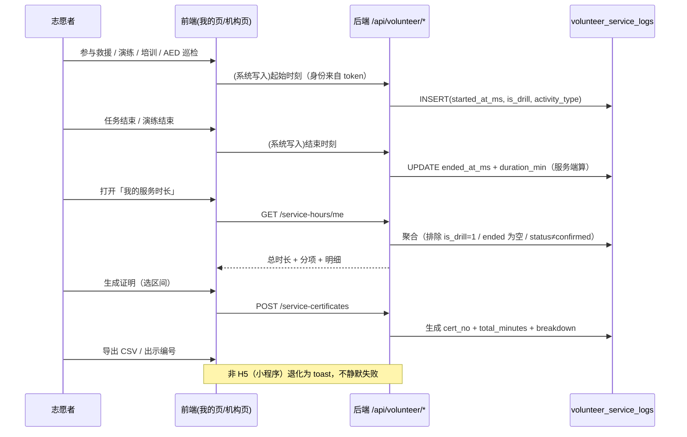

# PRD：志愿服务时长记录 + 志愿服务证明（F4）

> 路线图对应：`deliverables/software-company/product-backlog.md` **F4**（建议书 §10 / §06 承诺，代码实测为零）
> 版本：v1.0 ｜ 状态：**待业务方拍板 Q1「国家标准口径」与 Q2「实名」后开工** ｜ 语言：中文
> 缺口性质：**类型 A**（已对外承诺、代码里没有）—— 比普通功能缺失敏感，政府评估时会按建议书验收。

---

## 1. 项目信息

| 项 | 内容 |
|---|---|
| Project Name | `volunteer_service_hours` |
| 技术栈（现状，不改） | 后端 Express + better-sqlite3 + TS；前端 uni-app（**主目标 H5**，小程序为降级端） |
| 需求复述 | 为志愿者的可认定服务行为建立**服务端时长台账**，并据此生成**可查、可导出的志愿服务记录证明**；在国家标准口径与政府平台接口就绪前，**只落本地台账 + 导出**，不宣称合规、不对接外部 |

### 1.1 现状调研结论（基于真实代码，非假设）

**❌ 缺口 1：`时长`这一维度在代码里完全不存在（已复核）**

```
# 后端（排除 __tests__）
grep "服务时长|志愿证明|志愿服务证明|serviceHours|volunteerHours|service_hours|志愿时长|时长证明"
  急救侠-server/src  →  仅命中 `open_hours`（AED 开放时间，db.ts:122）与 gov.ts:193 的 hourlyDistribution
# 前端
  急救侠-uniapp/src  →  零命中
```
`users` / `volunteers` 两表均**只有 `points` / `rescue_count`**（`db.ts:72-73`、`db.ts:670-671`）。
前端志愿者页只展示**积分 / 参与救援 / 发现 AED / 已打卡**（`pages/volunteer/index.vue:6-24`），**没有"时长"**。

**❌ 缺口 2（比缺口 1 更致命）：主场景根本没有「人 × 事件」记录**

```ts
// 急救侠-server/src/routes/task.ts:44
db.prepare("UPDATE tasks SET status = 'active', volunteers_responded = volunteers_responded + 1 WHERE id = ?").run(taskId)
```
`POST /api/task/accept` **只把计数器 +1，不记录是谁接受了任务**。`tasks` 表本身也无 `user_id` 列（`db.ts:91-103`）。
⇒ **救援任务这一最核心的服务场景，当前无法归因到任何一个人**，"服务时长"无从计算。这是 F4 的**真前置**。

**⚠️ 缺口 3：现有「人 × 事件」记录散落五处，且**都只有单时间戳、没有时长**

| 表 | 字段 | 有无"人" | 有无"时长/区间" |
|---|---|---|---|
| `aed_pickups` (`db.ts:172-183`) | `user_id`, `pickup_time`, `return_time` | ✅ | ✅ **唯一天然有区间的** |
| `drill_participants` (`db.ts:309-319`) | `user_id`, `attended`, `joined_at` | ✅ | ❌ 只有加入时刻 |
| `mobilization_volunteers` (`db.ts:399-409`) | `user_id`, `status`, `responded_at` | ✅ | ❌ 只有响应时刻 |
| `training_records` (`db.ts:295-307`) | `user_id`, `date` | ✅ | ❌ 只有日期 |
| `aed_checkins` (`db.ts:134-146`) | `user_id`, `date` | ✅ | ❌ 只有日期 |
| `tasks` (`db.ts:91-103`) | 无 `user_id` | ❌ | ❌ |

另：`courses` 的进度是**全局单行**，`UPDATE courses SET progress=?` 不带用户（`routes/learn.ts:26`）⇒ **培训完成也没有按人留痕**。

**⚠️ 缺口 4：`volunteers` 表是"死表"，排行榜与真实用户是两套数据**

全仓检索 `INSERT INTO volunteers` 只命中 `seed.ts:135` 与测试 ⇒ **运行时从不写入 `volunteers`**。
`pages/volunteer/index.vue` 的排行榜走 `/api/volunteer/rankings`（`routes/volunteer.ts:16` 查 `volunteers`），
而登录用户走 `users` 表。⇒ **时长绝不能挂在 `volunteers` 上，必须挂在 `users.id`**。

**⚠️ 缺口 5：「官方证明」缺主体要素 —— 系统无实名**

`users` 表列全览（`db.ts:67-89`）：`id / name / avatar / tier / points / city / volunteer_id / certifications /
rescue_count / public_id / is_leader / affiliation / volunteer_type / is_organizer / is_public / phone / is_platform_admin`
⇒ **无姓名（name 为自填昵称）、无证件号**。登录方式为手机号与微信 code（`routes/auth.ts:29` 起）。
而"官方志愿服务证明"通常要求**实名主体**。

**⚠️ 缺口 6：现有「证书卡」不可核验**

`pages/cert/index.vue:22` 的 `<view class="qr-box"/>` 是一个**空 div**，其"二维码"由 `:143` 的
`repeating-linear-gradient` **CSS 画格子**模拟 ⇒ 不可扫码、不含编号、不含任何可验真数据。
`certificates` 表由机构管理员签发（`routes/org.ts:197-206`，且**该端点无鉴权**、`userId` 直接取自 body）。

**✅ 可复用的现成能力（不要重造）**

| 能力 | 出处 | 复用方式 |
|---|---|---|
| CSV：UTF-8 BOM + RFC 4180 + 公式注入清洗 | `急救侠-uniapp/src/utils/govExport.ts:36/64/85/95`；口径见 `NEXT_STEPS.md:552-557` | 证明导出**直接照抄** `sanitizeCell` → `csvEscape` 顺序与 BOM/`\r\n` 约定 |
| 身份只从 token 派生 | `routes/user.ts:106-113`（`POST /api/user/points` 挂 `authMiddleware`）、F3 设计 §3.1 | 新端点**一律** `authMiddleware` + `req.auth.userId` |
| 管理面走 CLI、不开 HTTP | `src/scripts/sos-report.ts`、`sos-purge.ts`；`NEXT_STEPS.md:553` 明确此取向 | 运维侧统计/清理照此 |
| 迁移双写 + `_migrations` runner | `db.ts:820-1011`（数组内 `migrations[]`，启动时跑、登记入 `_migrations`） | 见 §5.2 |
| 演习/真实必须分离 | F3 核心教训（`is_drill` 污染统计） | 服务台账**同样**要分离 |

---

## 2. 产品定义

### 2.1 一句话范围

> **把志愿者每一次可认定的服务行为，按"谁 / 什么活动 / 起止时刻 / 多少分钟"记进服务端台账，并让志愿者能据此导出一份带唯一编号、可被查证的《志愿服务记录证明》；在国家标准口径与政府平台接口到位之前，只做本地台账与导出，不做"合规"宣称、不做外部同步。**

### 2.2 产品目标

1. **可归因**：核心服务场景（救援任务 / 演练 / 培训 / AED 巡检）能落到具体 `user_id`，具备起止时刻。
2. **可查证**：生成的每一份证明有唯一编号、区间、总时长与分项分解，可被第三方按编号查到"存在且未被撤销"。
3. **可收口**：在国家标准与政府接口未就绪时，交付物仍是**自洽、可导出、不越界**的（不伪造合规、不臆造官方背书）。

### 2.3 用户故事

**志愿者**
- 作为**志愿者**，我希望看到自己累计的服务时长与逐条明细，以便我的付出有据可查。
- 作为**志愿者**，我希望把某段时间的时长导出成一份带编号的证明，以便提交给学校/单位/评优场景。
- 作为**志愿者**，我希望**演习与真实救援分开计**，以便演习时长不会稀释（也不会虚增）真实服务记录。
- 作为**隐私敏感用户**，我希望知道时长**从哪些行为算出、被谁看到、能否删除**。

**机构管理员（组织 / 队伍 / 合作单位）**
- 作为**机构管理员**，我希望看到本机构成员的服务时长汇总并批量导出，以便做内部表彰与工时申报。
- 作为**机构管理员**，我希望为本机构成员**补登记**线下服务（系统无留痕的那部分），但**留痕谁登记的**。

**政府侧**
- 作为**政府监管方**，我希望在看板看到区域服务时长的**聚合指标**（总量 / 人数 / 趋势），以便评估试点成效。
- 作为**政府监管方**，我希望拿到的**只有聚合数**，不含任何个人身份信息（与现有 gov 看板"零 PII"取向一致）。

### 2.4 关键约束

> ⚠️ **不得为了让"官方证明"成立而自行发明一套"国家标准"。**
> 建议书 §10 原文：「急救侠志愿者认证及任务记录**符合国家志愿服务时长记录标准**，可向**政府志愿服务平台同步数据**，志愿者可获得**官方志愿服务证明**」。
> **本 PRD 明确声明：我不能确认该标准的具体口径（字段格式、认定规则、认定主体、是否需实名）** —— 见 Q1。
> 在 Q1 有答案前，交付物**一律不得**标注"符合国家…标准"或"官方"。

---

## 3. ⚠️ 关键设计决策（我已按下表设计，**请确认**）

| # | 决策 | 我的设计 | 理由 |
|---|---|---|---|
| **D1** | **先补"人×事件"，再谈时长** | P0 必须包含「任务参与留痕」（新表 `task_volunteers` 或在 accept/complete 时直写台账） | `task.ts:44` 证明主场景**当前无法归因**；不做这步，F4 交付的是一个空壳 |
| **D2** | **时长单位与算法** | **分钟**入库（`duration_min INTEGER`），服务端由起止时刻算出；**不采信客户端上报的时长**；单次上限封顶（建议 **480 分钟/条**，超出需人工登记） | 客户端时长可伪造；封顶是防"挂机刷时长"的最廉价护栏 |
| **D3** | **自动记 vs 需审核** | **系统来源自动记（`status='confirmed'`）**；**人工登记来源默认 `pending`，需机构管理员或本人确认**；两种都可被**作废**（留 `void_reason`，**不物理删除**） | 全量人工审核会压垮运营；全量自动记则无纠错口。**作废留痕**比删除更可审计 |
| **D4** | **演习与真实分离** | 台账带 `is_drill`；证明**默认只统计 `is_drill=0`**，且分项可见 | 直接继承 F3 教训：`is_drill` 若不分，统计必被污染 |
| **D5** | **身份只从 token 派生** | 所有写入端点挂 `authMiddleware`，`user_id = req.auth.userId`；**绝不读 `req.body.userId`** | F3 §3.1 已确立；注意 `task.ts` / `rescue.ts:71` / `drill.ts` / `org.ts:198` **至今仍在读 body.userId**，这是**既有的**信任边界弱点，**新端点不得沿用** |
| **D6** | **谁能看** | 本人 → 全部明细；机构管理员 → **仅本机构成员**的聚合与明细；政府 → **仅聚合、零 PII**；编号验真页 → **仅返回编号/区间/总时长/状态，不返回姓名** | 与 gov 看板既有取向一致（`NEXT_STEPS.md:555`「零 PII」） |
| **D7** | **保留期** | **台账长期保留（不设自动删除）**；**证明记录永久保留**（它是权益凭证）；行为明细中的**位置类字段一律不采**（见 §6） | 与 F3 的 SOS 埋点（90 天清理）**性质不同**：时长是志愿者的**权益**，删了等于剥夺凭据 ⇒ **不可照抄 F3 的保留期** |
| **D8** | **证明的措辞** | UI 与导出物统一用「**志愿服务记录证明（急救侠平台出具）**」，**不使用**"官方""国家标准""政府认可"字样 | 避免重复 §1.1 缺口 6 那种"看着像、实际不可验"的失实陈述；"官方"需政府背书（建议书 §06 政府方职责含"荣誉证书、政府表彰"） |
| **D9** | **不新增导出依赖** | CSV 手写（复用 `govExport.ts`）；PDF 走 H5 `window.print()`；非 H5 退化为 toast | 与 P2-8 完全同一取舍（`NEXT_STEPS.md:555`）；本项目主目标 H5 |

---

## 4. 需求池

### P0（Must have —— 本次 MVP 必做）

**P0-1 · 服务时长台账（数据层）**
- 做什么：新建 `volunteer_service_logs` 表（见 §5.1），字段含 `user_id / activity_type / source_type / source_ref / started_at_ms / ended_at_ms / duration_min / is_drill / status / org_id / 作废留痕`。
- 为什么：这是 F4 的**唯一权威口径**，所有展示/证明/导出都从它派生，避免各处重算（与 `aed-linkage-prd.md:65`「唯一权威口径」同一原则）。
- 验收：① 同一 `(source_type, source_ref, user_id)` 重复写入**不产生第二行**；② `duration_min` 恒等于服务端算出的 `(ended-started)` 取整，**客户端传值被忽略**；③ `PRAGMA table_info` **不含任何经纬度/位置列**。

**P0-2 · 补主场景的「人 × 事件」留痕**
- 做什么：让救援任务可归因 —— 二选一（**方案由架构师定，见 Q3**）：
  (a) 新表 `task_volunteers(task_id, user_id, responded_at_ms, ended_at_ms)`，`accept`/`complete` 时写；
  (b) 不建关系表，`accept` 时直写台账、`complete` 时补 `ended_at_ms`。
- 为什么：`task.ts:44` 现状下主场景零归因，F4 会做成空壳。
- 验收：同一用户对同一任务 accept 两次 ⇒ 仍**只有一条**参与记录；`complete` 后该条**必须有** `ended_at_ms`（缺失即视为未闭合，不计入时长）。

**P0-3 · 我的时长（查询 + 明细）**
- 做什么：`GET /api/volunteer/service-hours/me`（token 派生），返回**总时长 + 按 `activity_type` 分项 + 明细列表（分页）**。
- 为什么：志愿者看不到，等于没有。
- 验收：① 无 token ⇒ **401**；② A 用户**绝不能**读到 B 的任一条；③ 分项之和 **恒等于** 总时长（不变量）。

**P0-4 · 证明生成 + 编号可查**
- 做什么：新建 `service_certificates` 表；`POST` 生成（入参：区间；产出：唯一 `cert_no`、`total_minutes`、`breakdown_json`）；`GET /volunteer/service-certificates/:certNo` **公开可查**（只返回编号/区间/总时长/状态）。
- 为什么：建议书承诺的"可获得证明"，且**可查证**是它与现有装饰性证书卡（§1.1 缺口 6）的本质区别。
- 验收：① 两次对同一区间生成 ⇒ 编号**不同**、总时长**相同**；② 作废后按编号查询返回 `revoked`；③ 验真接口**不返回** `user_id` / `name` / 任何 PII。

**P0-5 · 导出（CSV）**
- 做什么：`utils/serviceExport.ts`（**照抄** `govExport.ts` 的 BOM / `\r\n` / `sanitizeCell`→`csvEscape` 顺序），导出本人台账与证明摘要；文件名 `service-hours-YYYYMMDD.csv`（纯 ASCII）。
- 为什么：这是"证明可提交给第三方"的实际载体。
- 验收：① 首字符是 `\uFEFF`；② 行尾 `\r\n`；③ 姓名等可由用户自填的字段以 `= + - @` 开头时**被前置单引号**（公式注入用例必须存在）；④ 纯数字列（如 `-1.5`）**不被**清洗。

### P1（Should have）

**P1-6 · 机构侧：成员时长汇总 + 批量导出**
- 依赖 `organization_members`（`db.ts:732-741`）判定归属；**仅本机构成员**。
- 验收：跨机构访问 ⇒ 返回空集（不是报错，也不是全量）。

**P1-7 · 人工登记与审核流**
- 机构管理员为本机构成员补登记线下服务 ⇒ `source_type='manual'` + `status='pending'`；需确认才计入证明。
- 验收：`pending` 记录**不进入**任何证明的 `total_minutes`（改坏必须变红）。

**P1-8 · 政府看板聚合指标**
- `/api/gov/dashboard` 增加 `serviceHours`（总时长、参与人数、按 activity_type 分布），**零 PII**。
- 验收：看板响应体**不含**任何 `userId` / `name`；`dataGap` 机制沿用既有一致约定（`NEXT_STEPS.md:556`「null 一律空串、绝不做 0 兜底」）。

**P1-9 · 保留期与删除（CLI）**
- `src/scripts/service-purge.ts`，`--days` / `--dry-run`；**默认不删证明记录**。
- ⚠️ 运维落点（systemd timer / crontab）在代码之外，需登记为待办（与 `sos-purge` 同性质）。

### P2（Nice to have —— **依赖外部方**，不要先做）

**P2-10 · 向政府志愿服务平台同步数据** —— 需对方接口、鉴权与数据协议；**在接口未就绪前，本 PRD 的落点是"本地台账 + 可导出证明"（P0 全量 + P1），同步层作为薄适配层预留**。
**P2-11 · 国家标准口径对齐改造** —— 待 Q1 有答案后，可能涉及字段更名/新增、认定规则、计时长短规则。**极可能是破坏性变更**，这正是它必须等 Q1 的原因。
**P2-12 · PDF 版式证明 / 政府联合署名 / 二维码验真** —— 需真实二维码（替代 `cert/index.vue:22` 的 CSS 假码）与政府背书授权。

---

## 5. 数据模型与接口契约

### 5.1 表结构（新增 2~3 张，不改既有表语义）

**新表 1：`volunteer_service_logs`**（时长台账，**唯一权威口径**）

```sql
CREATE TABLE IF NOT EXISTS volunteer_service_logs (
  id             TEXT PRIMARY KEY,
  user_id        TEXT NOT NULL,               -- 只来自 token；外键 users(id)
  activity_type  TEXT NOT NULL,               -- 'rescue_task' | 'drill' | 'training' | 'aed_checkin' | 'manual'
  source_type    TEXT NOT NULL DEFAULT 'system',  -- 'system' | 'manual'
  source_ref     TEXT NOT NULL DEFAULT '',    -- 关联事件 id（task_id / drill_id …）；manual 为空
  started_at_ms  INTEGER NOT NULL,
  ended_at_ms    INTEGER,                     -- NULL = 未闭合，不计入时长
  duration_min   INTEGER,                     -- 服务端算；ended 为空时 NULL
  is_drill       INTEGER NOT NULL DEFAULT 0,  -- 演习与真实分离（D4）
  status         TEXT NOT NULL DEFAULT 'pending',  -- pending | confirmed | voided
  org_id         TEXT NOT NULL DEFAULT '',    -- 机构归属快照（可空）
  created_by     TEXT NOT NULL DEFAULT '',    -- 人工登记时的登记人（留痕）
  voided_at_ms   INTEGER,
  void_reason    TEXT NOT NULL DEFAULT '',
  created_at_ms  INTEGER NOT NULL,
  created_at     TEXT NOT NULL DEFAULT (datetime('now'))
);
CREATE INDEX IF NOT EXISTS idx_vsl_user_time  ON volunteer_service_logs(user_id, started_at_ms);
CREATE INDEX IF NOT EXISTS idx_vsl_type       ON volunteer_service_logs(activity_type, started_at_ms);
CREATE INDEX IF NOT EXISTS idx_vsl_status     ON volunteer_service_logs(status);
-- 幂等：系统来源 + 有 source_ref 时，(来源, 事件, 人) 唯一
CREATE UNIQUE INDEX IF NOT EXISTS idx_vsl_dedup
  ON volunteer_service_logs(source_type, source_ref, user_id) WHERE source_ref <> '';
```

**新表 2：`service_certificates`**（证明发放记录）

```sql
CREATE TABLE IF NOT EXISTS service_certificates (
  id             TEXT PRIMARY KEY,
  user_id        TEXT NOT NULL,
  cert_no        TEXT NOT NULL,              -- 唯一、可查（如 VS-20260917-A7F3K2）
  period_from_ms INTEGER NOT NULL,
  period_to_ms   INTEGER NOT NULL,
  total_minutes  INTEGER NOT NULL,           -- 只含 is_drill=0 且 status='confirmed'
  breakdown_json TEXT NOT NULL DEFAULT '{}', -- 按 activity_type 分解
  issued_at_ms   INTEGER NOT NULL,
  issued_by      TEXT NOT NULL DEFAULT 'self',  -- 'self' | 'org_admin'
  status         TEXT NOT NULL DEFAULT 'active', -- active | revoked
  revoked_at_ms  INTEGER,
  revoke_reason  TEXT NOT NULL DEFAULT ''
);
CREATE UNIQUE INDEX IF NOT EXISTS idx_scert_no   ON service_certificates(cert_no);
CREATE INDEX IF NOT EXISTS idx_scert_user        ON service_certificates(user_id, issued_at_ms DESC);
```

> **为什么不复用 `certificates` 表**：它已有明确语义 —— **机构签发的急救资质证书**（签发方 `routes/org.ts:197`，看板按 `status` 统计 `active/expiring/expired`）。
> 把"时长证明"塞进去会污染该语义与 `org` 的到期统计。**明确新建表**。

**新表 3（若 Q3 选方案 a）：`task_volunteers`**

```sql
CREATE TABLE IF NOT EXISTS task_volunteers (
  id               TEXT PRIMARY KEY,
  task_id          TEXT NOT NULL,
  user_id          TEXT NOT NULL,
  responded_at_ms  INTEGER NOT NULL,
  ended_at_ms      INTEGER,
  status           TEXT NOT NULL DEFAULT 'responded',
  FOREIGN KEY (task_id) REFERENCES tasks(id),
  FOREIGN KEY (user_id) REFERENCES users(id)
);
CREATE UNIQUE INDEX IF NOT EXISTS idx_tv_dedup ON task_volunteers(task_id, user_id);
```

**不新增的列（显式声明，防止架构师误解）**：`users` 与 `volunteers` **都不加** `service_hours` 冗余列 ——
时长**一律从台账实时聚合**，避免"两处真值不一致"。

### 5.2 迁移通道（**必须按本项目既有机制，不要另起炉灶**）

| 项 | 结论 |
|---|---|
| Runner | `initDb()` 内的 `migrations[]` 数组，**进程启动时执行**，结果登记进 `_migrations` 表（`db.ts:820-1011`）。**没有独立迁移命令，也不是 CI 里的单独步骤** |
| 通道 | **canonical schema（新库）+ `migrations[]`（既有库）双写**，编号接续 **041 / 042**（当前最大为 `040_add_sos_events`，`db.ts:968`）。两处 DDL **必须逐字一致**（`CREATE TABLE IF NOT EXISTS` 幂等，两处都跑不冲突） |
| ⚠️ 必须同步改 `clearAll()` | `db.ts:1061` 的 `DELETE FROM …` 清单是**手写的**，新表**必须加进去**，否则测试隔离会被污染（跨测试串数据） |
| ⚠️ 必须做的额外验证 | 单测全跑 `:memory:`，canonical 已建表 ⇒ **新表迁移在测试里恒为 no-op / skipped，真实升级路径没被验证过**。必须照 `NEXT_STEPS.md:609-621` 的「持久库升级路径」做一次实机验证：复制真实库 → 剥离新表 → 启真实服务 → 确认日志是 **`Migration applied: 041`**（而非 skipped） |
| 回填 | 若 Q4 决定"回填历史参与记录"，**必须挂在 `after` 回调**（仅首次应用时跑一次，见 `db.ts:918-930` 迁移 036 的 `after` 与注释），**不要**每次启动回填 |
| 部署文档 | 若新增运维项（purge 定时器），需进 `docs/DEPLOY.md`；迁移**后处理失败不会自动重试**（`docs/DEPLOY.md §10.6`） |

### 5.3 API 契约（全部新建，全部挂 `authMiddleware`）

| 方法 | 路径 | 谁可调 | 说明 |
|---|---|---|---|
| `POST` | `/api/volunteer/service-logs` | 登录用户（本人）／机构管理员（其成员） | **身份只从 token 派生**；人工登记来源默认 `pending` |
| `GET` | `/api/volunteer/service-hours/me` | 本人 | 总时长 + 分项 + 明细（分页） |
| `POST` | `/api/volunteer/service-certificates` | 本人 | 入参区间；产出 `cert_no` + 总时长 + 分项 |
| `GET` | `/api/volunteer/service-certificates/me` | 本人 | 我的证明列表 |
| `GET` | `/api/volunteer/service-certificates/:certNo` | **公开（无需登录）** | **验真**：只返回 `certNo / 区间 / 总时长 / status`，**绝不返回 `user_id`、`name` 或任何 PII** |
| `GET` | `/api/org/:id/service-hours` | 该机构 admin/manager | 仅本机构成员；跨机构 ⇒ 空集 |
| `GET` | `/api/gov/dashboard` | gov token | **仅追加聚合字段** `serviceHours`，零 PII |
| CLI | `npm run service:report` / `service:purge` | 运维 | **不开 HTTP**（沿用 `sos-report.ts` / `sos-purge.ts`） |

统一响应体沿用 `{ code, data, message }`（`types/index.ts` 的 `success()` / `error()`）。

### 5.4 权限矩阵

| 数据 | 志愿者本人 | 机构管理员 | 政府 | 匿名 |
|---|---|---|---|---|
| 本人台账明细 | ✅ 全部 | ✅ 本机构成员 | ❌ | ❌ |
| 证明详情（含姓名） | ✅ | ✅ 本机构成员 | ❌ | ❌ |
| 证明验真（编号） | ✅ | ✅ | ✅ | ✅ **仅 4 个字段** |
| 区域聚合时长 | ❌ | ❌ | ✅ | ❌ |

---

## 6. ⚠️ 隐私边界（F3 已确立：采集范围必须显式定义）

**这是产品/合规决策，下表是我的建议方案，最终口径见 Q5/Q6。**

| 问题 | 我的建议 | 说明 |
|---|---|---|
| **时长从哪些事件算** | 仅 5 类：`rescue_task` / `drill` / `training` / `aed_checkin` / `manual` | **不采**位置轨迹、**不采**"在线时长"（后者会把 `volunteer_locations` 心跳变成监控数据，性质完全不同） |
| **采什么** | 人、活动类型、起止时刻、时长、演习标记、机构归属 | **不采**经纬度、地址、设备信息、同行者 |
| **保留多久** | 台账**长期保留**；证明**永久保留** | 理由见 D7：时长是**权益凭证**，不可照抄 F3 的 90 天 |
| **谁能看** | 见 §5.4 | 政府侧**只给聚合数** |
| **可导出** | 本人随时导出自己的；机构可导出本机构成员 | 导出物含姓名 ⇒ **必须走 `sanitizeCell` 公式注入清洗** |
| **可删除** | **支持"作废"而非"物理删除"**：作废留 `reason` 与时间，验真接口返回 `revoked` | 若业务方要求 PIPL 意义上的彻底删除（Q6），则需另做**删除台账但保留匿名化计数**的方案 —— **我不替业务方拍板** |

**与现有代码的一致性提醒**：`volunteer_locations`（`db.ts:411-419`）存有 `lat/lng/updated_at` 的心跳，
**本 PRD 明确不把它作为时长来源**。若将来有人提议"用在线时长折算服务时长"，那是一次**新的隐私决策**，需重新走 Q5。

---

## 7. KPI（必须可测量）

| 指标 | 口径 |
|---|---|
| 可归因率 | 有台账记录的服务参与 / 全部服务参与（**P0-2 上线前该值在任务场景为 0**） |
| 未闭合率 | `ended_at_ms IS NULL` 的台账条数占比（**应当趋近 0**；高则说明 complete 回调没接上） |
| 演习污染率 | `is_drill=1` 且被计入证明 `total_minutes` 的条数，**必须恒为 0** |
| 证明验真成功率 | 按 `cert_no` 查询返回 `active` / 查询总数 |
| 导出可用率 | 导出的 CSV 能被 Excel 正确打开（BOM 存在）且公式注入用例通过 |

---

## 8. 测试计划（本项目强约定：不变量必须"改坏就变红"）

| # | 断言 | 突变它应当精确变红的方式 |
|---|---|---|
| T1 | 写入端点**无 token ⇒ 401** | 去掉 `authMiddleware` ⇒ 变红 |
| T2 | body 传 `userId:'victim'` **被忽略**，`user_id` 恒等于 token 身份 | 改成读 `req.body.userId` ⇒ 变红 |
| T3 | `duration_min` **由服务端算**；客户端传 `duration_min: 9999` 被忽略 | 改成采信入参 ⇒ 变红 |
| T4 | `ended_at_ms IS NULL` 的记录**不计入**总时长与分项 | 聚合漏加 `ended_at_ms IS NOT NULL` ⇒ 变红 |
| T5 | **分项之和恒等于总时长** | 任一分项漏一种 `activity_type` ⇒ 变红 |
| T6 | 幂等：同 `(source_type, source_ref, user_id)` 写两次 ⇒ 仅 1 行 | 删掉 `idx_vsl_dedup` ⇒ 变红 |
| T7 | **演习污染率恒为 0**：`is_drill=1` 不进证明 `total_minutes` | 证明聚合漏加 `WHERE is_drill=0` ⇒ 变红 |
| T8 | `status='pending'`（人工登记未确认）**不进**证明 | 漏加 `status='confirmed'` ⇒ 变红 |
| T9 | 作废后：验真接口返回 `revoked`，且该分钟数**从后续证明中消失**；原台账行**仍在**（不物理删） | 改成 `DELETE` ⇒ T9 后半段变红 |
| T10 | 越权：A 查 B 的 `/service-hours/me` 实际由 token 决定 ⇒ A 永远看不到 B | 改成读 query `userId` ⇒ 变红 |
| T11 | 机构隔离：非本机构成员**不出现**在 `/api/org/:id/service-hours` | 去掉 `organization_members` JOIN ⇒ 变红 |
| T12 | `PRAGMA table_info(volunteer_service_logs)` **不含**任何经纬度/位置列 | 加一列 `lat` ⇒ 变红 |
| T13 | CSV：**首字符 `\uFEFF`** + 行尾 `\r\n` | 去掉 BOM 或改 `\n` ⇒ 变红 |
| T14 | CSV 公式注入：姓名为 `=1+1` ⇒ 单元格以 `'` 开头；数值 `-1.5` **不被**清洗 | `sanitizeCell` 改恒等 ⇒ 前半红；去掉数字放行 ⇒ 后半红 |
| T15 | 验真接口**零 PII**：响应体断言**不含** `user_id` / `name` / `phone` | 多返回一个 `userName` ⇒ 变红（建议用深扫断言，照 `role-split.test.ts` 的写法） |
| T16 | 迁移：复制真实库剥离新表后启动 ⇒ 日志 **`Migration applied: 041`**（非 skipped） | 只写 canonical 不写 `migrations[]` ⇒ 变红（**此项必须在实机跑，`:memory:` 测不出来**） |
| T17 | `clearAll()` **包含**新表：写入后 `clearAll()` ⇒ 新表为空 | 漏加进 `db.ts:1061` ⇒ 变红 |

> ⚠️ **复跑纪律**：`NEXT_STEPS.md:302` 记录过 vitest 在编辑后立即运行可能取到过期缓存、把突变**假报为存活** ⇒ 所有 SURVIVED 结论**必须复跑确认**。
> ⚠️ **调用点必须单独测**：F3 曾出现"模块测得很全，但删掉页面里那一行调用仍全绿"（`sos-telemetry-design.md:291`）⇒ 前端写入/导出**按钮的调用点**要有独立用例。

---

## 9. 主流程（Mermaid）



---

## 10. MVP 边界声明

- ❌ **不做**：对接政府志愿服务平台（P2-10，依赖外部接口与对方配合）。
- ❌ **不做**：自称"符合国家志愿服务时长记录标准"（**Q1 未解决前不得出现该表述**）。
- ❌ **不做**：实名认证 / 证件号采集（现有 `users` 无此列，属新增敏感采集，需单独决策，见 Q2）。
- ❌ **不做**：真实二维码 / PDF 版式模板 / 政府联合署名（P2-12）。
- ❌ **不做**：用 `volunteer_locations` 心跳折算"在线时长"（隐私性质不同，见 §6）。
- ❌ **不做**：修改 `volunteers` 表（它是种子数据，与登录用户双轨，见 §1.1 缺口 4）。
- 🔒 **契约约束**：`is_drill` 与 `status` 两列**必须存在**，证明口径默认 `is_drill=0 AND status='confirmed' AND ended_at_ms IS NOT NULL` —— 少任一条件即污染。
- 🔒 **契约约束**：所有写入端点**只从 token 取身份**（D5）。既有 `task.ts` / `rescue.ts` / `org.ts` 读 body.userId 的问题**不在本次修正范围**（避免范围膨胀），但**新代码不得沿用**，建议另开工单。
- ⚠️ **文案一致性**：本项落地时，若在 UI 出现"服务时长/证明"字样，需与建议书 §10 的表述**一并复核**（D8）。**改建议书原文属对外文件变更，需业务侧定稿**（参照 F3 已挂起的同类事项 `product-backlog.md:186-190`）。

---

## 11. 待确认问题（Open Questions —— **业务方拍板，我不替你定**）

### 🔴 Q1（P0 级，阻塞）「符合国家志愿服务时长记录标准」的具体口径是什么？

**我明确声明：我无法确定。** 需要业务方提供**权威出处**（文件名 / 发布机关 / 条款），并回答：
1. 该标准要求的**字段与格式**是什么（时长单位？起止时刻精度？活动分类是否固定枚举？）；
2. **认定主体**是谁（平台自证？需机构审核？需政府平台回执？）；
3. 是否要求**实名**（姓名 + 证件号）；
4. 是否需要**单次时长上限 / 日上限**之类的防刷规则。

> ⚠️ **若不解决就开工，P2-11 极可能是破坏性改造（字段更名/规则重写），本轮交付可能白做。**
> 我的建议：**Q1 有答案前，只落地"本地台账 + 导出 + 编号验真"（P0 全量 + P1），明确不写"合规"字样。**

### 🔴 Q2（P0 级，阻塞"官方证明"）「官方志愿服务证明」是否必须实名？

现状：`users` **无姓名、无证件号**（`db.ts:67-89`），登录为手机号/微信。
- 若**必须实名** ⇒ 需新增实名采集（**新的敏感个人信息**，需单独走 PIPL 评估与告知同意），且已注册存量用户需补采集 —— 这是一项**独立立项**，不应混进 F4。
- 若**不必须** ⇒ 证明上的"姓名"只能取 `users.name`（**自填昵称，可任意修改**）⇒ 证明的**可采信度有限**，需在 UI 明示，避免重复 §1.1 缺口 6 那种"看着像、实际不可验"。

### 🟡 Q3（P1 级，影响工作量）「人 × 任务」留痕选哪个方案？
- (a) 新表 `task_volunteers`（语义清晰、可扩展，但多一次迁移）；
- (b) `accept`/`complete` 时直写台账（迁移更少，但任务与台账耦合）。
我倾向 **(a)**，但这是架构决策，请架构师定。

### 🟡 Q4（P1 级）历史参与记录是否回填？
现有 `drill_participants` / `mobilization_volunteers` / `training_records` 有历史行但**只有单时间戳、没有结束时刻**。
回填需要**人为定义时长规则**（如"演练默认记 2 小时"）⇒ **这是臆造数据**，我**不建议**；若业务方要求，请明确规则与标注方式（回填记录应可识别）。

### 🟡 Q5（P1 级，产品/合规）时长来源与保留期是否采纳 §6 的建议？
特别是：① **不采位置/在线时长**；② **台账长期保留**（不照抄 F3 的 90 天）；③ **政府侧只给聚合数**。

### 🟡 Q6（P1 级，合规）志愿者请求"删除我的服务记录"时怎么处理？
我建议**作废（软删）+ 保留匿名化计数**；若业务方要求 PIPL 意义上的彻底删除，需要明确**台账与证明记录是否一并删**、以及删除后**已发出的证明如何处置**。

### 🟢 Q7（P2 级）政府平台同步的对接方与时间窗？
建议书 §10 承诺"可向政府志愿服务平台同步数据"。具体是哪个平台（省级？市级？民政系统？）、有无接口文档、谁去谈 —— **在接口未就绪前，本 PRD 的落点是 P0+P1，同步层只做薄适配层预留**。

### 🟢 Q8（P2 级）机构侧"人工登记"是否需要审核人双人复核？
现状 `routes/org.ts:197` 的证书签发**无鉴权**、`userId` 取自 body —— 机构可给任何人发任何证书。
F4 的人工登记若沿用同一模式，会继承这个弱点。**是否要借这次机会给机构端加鉴权？**（我倾向**要**，但那是一次范围扩张，请拍板。）

### 🟢 Q9（P2 级）演习时长是否单独出证明？
我设计的是"证明默认只含真实（`is_drill=0`）"。但演练本身也是服务 —— 是否要为演习单独出一类证明（或分项列出）？

---

## 附：本 PRD 的证据索引（便于复核，不要只信结论）

| 结论 | 证据 |
|---|---|
| 时长维度零命中 | 后端 grep 仅命中 `open_hours`(`db.ts:122`)/`hourlyDistribution`(`gov.ts:193`)；前端 grep 零命中 |
| 任务无法归因到人 | `routes/task.ts:44`（只 `+1` 计数器）；`tasks` 无 `user_id`（`db.ts:91-103`） |
| `volunteers` 是死表 | 全仓 `INSERT INTO volunteers` 仅 `seed.ts:135` + 测试 |
| 无实名 | `users` 列全览 `db.ts:67-89`；登录 `routes/auth.ts:29` |
| 证书卡不可核验 | `pages/cert/index.vue:22` 空 `qr-box` + `:143` CSS 假码 |
| 机构发证书无鉴权 | `routes/org.ts:197-206`（`userId` 取自 body） |
| CSV 成熟实现 | `utils/govExport.ts:36/64/85/95`；口径 `NEXT_STEPS.md:552-557` |
| 迁移通道 | `db.ts:820-1011`；最大编号 `040`（`db.ts:968`）；`clearAll()` 在 `db.ts:1061` |
| 实机升级路径必须单独验 | `NEXT_STEPS.md:609-621` |
| 演习/真实分离教训 | F3 `sos-telemetry-design.md §8`；`product-backlog.md:177` |
| 突变假存活 / 调用点无覆盖 | `sos-telemetry-design.md:291`、`:302` |
| ⚠️ 与任务书的一处更正 | 任务书称「`NEXT_STEPS.md` 技术债**第 5 条**有 CSV 说明」—— 实际技术债第 5 条是 **`Date.now()` 单时间戳主键碰撞**（`NEXT_STEPS.md:216`）；CSV 在 **§「P2-8 政府看板 · CSV / PDF 导出」（`:552-557`）**。两条都相关：前者提醒新表主键**必须**带随机后缀（照 `push.ts:44`），后者是导出要照抄的对象 |
